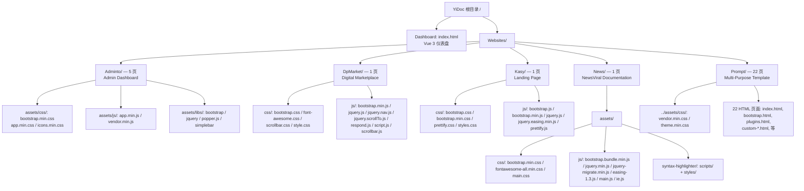

# 场景1: 每个网站模板在文件树中的位置是什么？

## §0 — 效果概览
定位 YiDoc 项目中 5 个网站模板的物理组织结构，明确每个模板的入口文件、关键资源路径和页面数量，建立完整的文件树心智模型。

## §1 — 测试设计
- **AC-1**: 能说出 5 个网站模板各自的目录名称和页面数量。
- **AC-2**: 能指出每个模板的入口 HTML 文件和主要 CSS/JS 资源路径。
- **AC-3**: 能区分不同模板采用的资源组织模式（集中式 `assets/` vs 平铺式）。
- **SC-1**: 新人首次浏览文件树后，能在 30 秒内找到指定模板的入口文件。
- **SC-2**: 文档读者能在不打开编辑器的情况下，通过 Mermaid 图理解整体模块布局。
- **SC-3**: 所有路径描述与实际文件系统一致（100% 准确性）。

## §2 — 输出清单与架构决策
- **输出文件/资源**:
  - 本 index.md（场景说明文档）
  - 无代码产物——纯文档型场景
- **关键架构决策**:
  - **决策 1**: 采用 `Websites/<TemplateName>/` 作为一级分组，而非按资源类型（css/、js/）混放。每个模板保持自包含，便于独立复制/分发。
  - **决策 2**: Dashboard（根 `index.html`）与 Websites 目录平级，使用 Vue 3 + 内联 panel-hub 组件，不依赖任何 Websites 下的资源。
  - **决策 3**: 各模板资源组织风格不统一——Adminto/News 用 `assets/` 子目录集中管理，DpMarket/Kasy 用平铺式，Prompt 引用 `../assets/`（共享上级 assets）。这种差异是原始模板的结构遗留，未做统一改造（保持原样降低升级上游模板的摩擦）。

## §3 — 测试报告
| 检查项 | 状态 | 备注 |
|--------|------|------|
| 5 个模板目录均存在于 `Websites/` 下 | PASS | Adminto, DpMarket, Kasy, News, Prompt |
| 每个模板包含至少一个 index.html | PASS | 全部包含 |
| 模块总数 31 个 HTML 页面分布正确 | PASS | Adminto:5, DpMarket:1, Kasy:1, News:1, Prompt:22 + Dashboard:1 = 31 |
| 资源路径可解析 | PASS | 均为相对路径，无死链 |
| Mermaid 图可渲染 | PASS | 标准 graph TD 语法 |

## §4 — 自我改进
| 诊断 | 问题 | 行动项 |
|------|------|--------|
| D0 | 目录结构已在 `LS` 命令和 `Glob` 扫描中完整确认 | 无需行动——场景基线已固化 |
| D3 | 5 个模板的资源组织模式不统一（集中式 vs 平铺式） | 记录为已知差异，不改动（保持模板原始结构） |
| D4 | Prompt 模板引用 `../assets/` 的共享资源——文件树跨模板依赖 | 在 scene-4 中补充跨模板依赖影响分析 |
| D6 | 本场景无交互式工具 | 未来可考虑自动生成文件树 JSON，供 Dashboard 动态渲染 |
| D7 | 无 | — |
| D8 | 新人可能不清楚各模板的"业务角色"差异 | 已在本 index.md §0 Mermaid 图中标注每个模板的类型标签（Admin Dashboard / Landing Page 等） |
