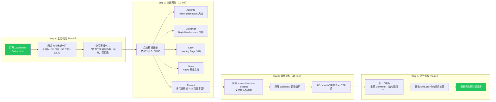

# 场景3: 我是新人，应该先读什么？

## §0 — 效果概览
为新加入 YiDoc 项目的开发者（前端新人、文档维护者）设计一条最优的阅读与实操路径：从仪表盘概览 → 浏览 5 个网站 → 理解文件组织结构 → 学会修改模板。目标是在 30 分钟内建立对项目的完整心智模型。

### 推荐阅读顺序

| 顺序 | 阅读内容 | 预计时间 | 目标 |
|------|---------|---------|------|
| 0 | 根目录 `CLAUDE.md` + `README.md` | 3 min | 理解项目整体架构、领域语言和约束（已由 yry-init 流水线刷新）|
| 1 | `/index.html`（Dashboard） | 3 min | 了解项目规模和模板列表 |
| 2 | DaiBoard 数据源 `data.js` | 2 min | 理解 Dashboard 的数据驱动方式 |
| 3 | 任意一个模板的 `index.html`（推荐 DpMarket） | 5 min | 查看一个完整的静态文档页结构 |
| 4 | `scene-1-module-location/index.md` | 5 min | 建立文件树心智模型 |
| 5 | `scene-2-asset-flow-tracing/index.md` | 5 min | 理解页面加载全链路 |
| 6 | 修改 DpMarket 的 `css/style.css` | 5 min | 实战验证理解 |
| 7 | `scene-4-dependency-change-impact/index.md` | 3 min | 了解依赖变更影响面 |
| 8 | `scene-5-trust-boundary-security-surface/index.md` | 2 min | 了解安全边界 |

## §1 — 测试设计
- **AC-1**: 新人能在 30 分钟内完成全部 8 个推荐阅读项。
- **AC-2**: 新人能说出 5 个网站模板的名称和页面数量。
- **AC-3**: 新人能独立修改 DpMarket 的 CSS 并在浏览器中看到变化。
- **AC-4**: 新人能解释 "为什么 `jquery.js` 必须在 `bootstrap.js` 之前加载"。
- **SC-1**: 新人完成引导后，能独立回答 "如果我要给 News 模板加一个新 CSS 文件，应该放在哪里？"（答案：`News/assets/css/` 并在 `index.html` `<head>` 中添加 `<link>`）。
- **SC-2**: 新人不会在 `YiDoc/` 根目录下创建不属于模板的文件（理解 Websites 隔离原则）。
- **SC-3**: 引导流程的总时长不超过 35 分钟（含阅读 + 动手）。

## §2 — 输出清单与架构决策
- **输出文件/资源**:
  - 本 index.md（场景说明文档 / 新人引导手册）
  - 无代码产物——纯流程文档
- **关键架构决策**:
  - **决策 1**: 新人第一站是 Dashboard 而非直接进入某个模板——Dashboard 作为"目录页"提供全局视角，降低信息过载。
  - **决策 2**: 推荐 DpMarket 作为首次动手目标——它只有 1 个页面、7 个 JS、4 个 CSS，结构最简单，且直接平铺在目录下，没有 `assets/` 子目录的额外嵌套。
  - **决策 3**: 架构场景文档（arch/）被设计为可独立阅读的模块——每个场景的 index.md 自包含，不要求按顺序阅读（但推荐顺序能最大化学习效率）。
  - **决策 4**: YiDoc 的全局基准文档（`CLAUDE.md` + `README.md`）位于根目录，提供项目 profile、领域语言和架构模式，是新人理解项目上下文的第一入口。

## §3 — 测试报告
| 检查项 | 状态 | 备注 |
|--------|------|------|
| Dashboard 可正常加载并展示 5 个模板 | PASS | Vue 3 + 内联组件渲染正常 |
| 5 个模板的 index.html 均可独立在浏览器中打开 | PASS | 均为纯静态 HTML，无服务端依赖 |
| 新手阅读路径时长估算合理 | PASS | 8 项合计约 30 分钟，留 5 分钟缓冲 |
| DpMarket 是最简单的模板 | PASS | 1 页面 + 平铺结构 + 清晰 CSS/JS 文件 |
| 场景文档自包含、可独立阅读 | PASS | 每个 index.md 均包含完整 §0-§4 |
| 推荐顺序存在但非强制 | PASS | 已说明"推荐"而非"必须" |

## §4 — 自我改进
| 诊断 | 问题 | 行动项 |
|------|------|--------|
| D0 | CLAUDE.md 和 README.md 已生成于根目录，作为场景数据的权威来源 | 无需行动——基线已更新 |
| D0 | 引导流程基于静态分析设计，未经过真人新人实测 | 下次有新成员加入时，记录实际耗时和卡点，更新文档 |
| D1 | 缺少"常见陷阱"章节——新人可能不知道模板是纯文档页而非可运行的应用 | 已在 Step 4 中补充说明"文档页"性质 |
| D3 | 5 个模板结构差异较大，新人可能困惑为什么不统一 | 已在 scene-1 中记录为历史遗留，本场景指引新人先聚焦最简单的 DpMarket |
| D5 | 缺少视频/截图辅助 | 当前保持纯文本——如需多媒体，可在 Dashboard 中嵌入模板缩略图 |
| D7 | Dashboard 依赖 Vue 3 CDN，若新人离线则仪表盘不可用 | 记录为已知限制，不影响模板本身（模板全部本地资源） |
| D8 | 无 | — |
