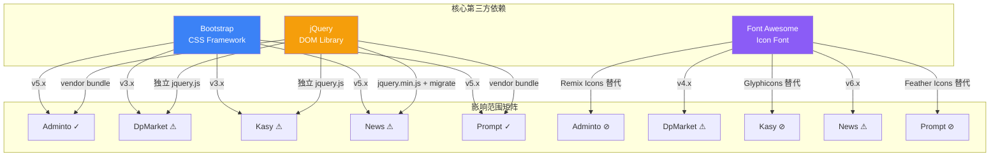

# 场景4: 如果升级 Bootstrap 或替换 jQuery 会影响哪些网站？

## §0 — 效果概览
分析 5 个网站模板中 Bootstrap、jQuery、Font Awesome 三大核心依赖的使用情况，评估升级/替换任一依赖的影响范围（哪些页面受影响、潜在兼容性风险、需要的回归测试量）。

### 依赖版本矩阵

| 模板 | Bootstrap | jQuery | Font Awesome / 图标方案 | 其他关键依赖 |
|------|-----------|--------|------------------------|-------------|
| **Adminto** | 5.x (bundle) | ✓ (vendor.min.js bundle) | Remix Icons (替代 FA) | Popper.js, SimpleBar |
| **DpMarket** | **3.x** (bootstrap.css) | ✓ (独立 jquery.js) | **Font Awesome 4.x** | jQuery.nav, jQuery.scrollTo |
| **Kasy** | **3.x** (bootstrap.min.css) | ✓ (独立 jquery.js) | Glyphicons (Bootstrap 3 内置) | jQuery.easing, prettify.js |
| **News** | 5.x (bootstrap.min.css) | ✓ (jquery.min.js + jquery-migrate) | **Font Awesome 6.x** | Syntax Highlighter, easing |
| **Prompt** | 5.x (vendor bundle) | ✓ (vendor.min.js bundle) | Feather Icons (替代 FA) | AOS, Swiper, Jarallax, CountUp |
| **Dashboard** | — (无) | — (无) | — (无) | Vue 3 (CDN) |

### 变更影响分析

#### 场景 A: 升级 Bootstrap（3.x → 5.x）
| 受影响模板 | 风险等级 | 影响说明 |
|-----------|---------|---------|
| DpMarket | 🔴 高 | Bootstrap 3 → 5 是破坏性升级：类名变更（`panel`→`card`、`pull-right`→`float-right`→`ms-auto`）、Glyphicons 移除、Grid 系统改为 Flexbox。需重写大量 HTML 和 CSS。 |
| Kasy | 🔴 高 | 同 DpMarket。此外 Kasy 使用 Bootstrap 3 的 Glyphicons 图标，迁移需替换为其他图标方案。 |
| Adminto | 🟢 低 | 已使用 Bootstrap 5，仅需小版本升级。注意 `data-*` 属性变更（如 `data-bs-toggle` 替代 `data-toggle`）——Adminto 已使用新命名。 |
| News | 🟢 低 | 已使用 Bootstrap 5，bundle 版本（含 Popper）。 |
| Prompt | 🟢 低 | 已使用 Bootstrap 5，vendor bundle。 |

#### 场景 B: 替换/移除 jQuery
| 受影响模板 | 风险等级 | 影响说明 |
|-----------|---------|---------|
| DpMarket | 🟡 中 | 使用 jQuery 选择器（`$()`）、`.nav()` 插件、`.scrollTo()` 插件。移除 jQuery 需重写所有 DOM 操作和插件调用为原生 JS，或替换插件。 |
| Kasy | 🟡 中 | 使用 `jquery.easing.min.js`（jQuery 插件）、`prettify.js` 可能不依赖 jQuery 但需验证。 |
| News | 🟡 中 | 使用 `jquery-migrate.min.js`（暗示有旧版 jQuery 插件依赖）。Syntax Highlighter 通过 jQuery 初始化。 |
| Adminto | 🟡 中 | jQuery 打包在 `vendor.min.js` 中，需解包确认实际使用情况。Bootstrap 5 原生不依赖 jQuery，但 SimpleBar 等第三方库可能依赖。 |
| Prompt | 🟡 中 | 类似 Adminto，vendor bundle 内含 jQuery。AOS、Swiper 等现代库不依赖 jQuery，但需确认 bundle 中其他组件。 |

#### 场景 C: 升级/替换 Font Awesome
| 受影响模板 | 风险等级 | 影响说明 |
|-----------|---------|---------|
| DpMarket | 🟡 中 | 使用 FA 4.x（`fa fa-arrow-right` 等）。FA 5/6 类名变化（`fas`/`far`/`fab` 前缀）。需全局替换所有图标类名。 |
| News | 🟢 低 | 已使用 FA 6.x（`fa-light`/`fa-regular`/`fa-solid`/`fa-brands`），小版本升级风险低。 |
| Adminto | 🟢 — | 不依赖 FA，使用 Remix Icons。 |
| Kasy | 🟢 — | 不依赖 FA，使用 Bootstrap 3 Glyphicons。 |
| Prompt | 🟢 — | 不依赖 FA，使用 Feather Icons。 |

## §1 — 测试设计
- **AC-1**: 能列出 5 个模板各自使用的 Bootstrap 版本（3.x vs 5.x）。
- **AC-2**: 能列出哪些模板依赖 Font Awesome（DpMarket v4, News v6）。
- **AC-3**: 能评估 Bootstrap 3→5 升级的影响模板数量和风险等级。
- **AC-4**: 能评估 jQuery 移除的影响模板数量和风险等级。
- **SC-1**: 当提出"升级 Bootstrap"时，团队能在 5 分钟内通过此文档了解全部影响面。
- **SC-2**: 依赖变更决策有量化依据（受影响页面数、风险等级），而非凭感觉。
- **SC-3**: 文档中版本信息与实际 HTML/CSS 引用一致（100% 准确）。

## §2 — 输出清单与架构决策
- **输出文件/资源**:
  - 本 index.md（场景说明文档）
  - 无代码产物
- **关键架构决策**:
  - **决策 1**: 不对各模板的依赖版本进行统一——每个模板保持其原始依赖版本，避免破坏性变更。升级由模板的原始上游作者负责，YiDoc 仅作为展示/文档聚合。
  - **决策 2**: 版本矩阵不深入 vendor bundle 内部——Adminto 和 Prompt 的 `vendor.min.js` 是压缩打包文件，解包分析成本高且收益低。仅基于 HTML 引用和文件命名推断。
  - **决策 3**: DpMarket 和 Kasy 使用 Bootstrap 3 是主要技术债——若未来需要统一技术栈，这两个模板需要最大改造投入。

## §3 — 测试报告
| 检查项 | 状态 | 备注 |
|--------|------|------|
| Bootstrap 版本识别准确 | PASS | BS3: DpMarket, Kasy; BS5: Adminto, News, Prompt |
| jQuery 依赖识别准确 | PASS | 全部 5 模板均依赖 jQuery（Dashboard 除外） |
| Font Awesome 映射正确 | PASS | DpMarket: FA4; News: FA6; 其余使用替代方案 |
| 风险等级评估合理 | PASS | BS3→5 标记为高风险的 DpMarket/Kasy 确实面临类名全面变更 |
| Dashboard 无 Bootstrap/jQuery 依赖 | PASS | 使用 Vue 3，独立于模板生态 |

## §4 — 自我改进
| 诊断 | 问题 | 行动项 |
|------|------|--------|
| D0 | 依赖版本通过阅读 HTML 源码和 CSS/JS 文件命名确认 | 无需行动 |
| D1 | vendor bundle 内部依赖未展开分析（Adminto, Prompt） | 可接受——bundle 内容在模板原始仓库中有独立文件，YiDoc 仅分发已构建的产物 |
| D2 | 未评估 Popper.js 的依赖关系——News 使用 `bootstrap.bundle.min.js`（含 Popper），Adminto 独立引入 Popper | 记录在矩阵中，Popper 通常随 Bootstrap 5 一起升级 |
| D4 | Kasy 同时引用 `bootstrap.css` 和 `bootstrap.min.css`——重复依赖 | 在 scene-2 D3 已记录，属于上游模板问题 |
| D5 | 未来若替换 Vue（Dashboard）为其他框架，影响面仅限 Dashboard | 简单——Dashboard 是独立应用，不影响任何模板 |
| D8 | 无 | — |
