# §0 Effect Sketch — Module Location

**What this scene demonstrates**: The Websites project is a flat collection of 14 independent static HTML template websites, each living in its own top-level directory under `/Users/yi/YrY/Websites/`. Every website is a self-contained module with its own HTML pages, CSS stylesheets, JavaScript scripts, and image assets. There is no shared build system, no cross-module imports, and no runtime coupling between websites — each one can be opened directly in a browser via its `index.html` entry point.

```mermaid
graph TD
    ROOT[Websites/ · 14 个独立网站模板] --> TIER1

    subgraph "复杂度分级 📊"
        TIER1[简单 · 无依赖] --> CARDS[Cards<br/>1页 · 纯 CSS + Vanilla JS]
        TIER1 --> BLOGEZ[Blogez<br/>1页 · 极简排版]
        TIER1 --> SOCIALITE[Socialite<br/>31页 · 纯 CSS]

        TIER2[中等 · 多插件] --> ARTER[Arter<br/>14页 · Bootstrap4 + Swiper + Isotope]
        TIER2 --> BLOG[Blog<br/>12页 · jQuery + Fancybox]
        TIER2 --> CORPORATO[Corporato<br/>Landing · Bootstrap3 + Owl Carousel]
        TIER2 --> DPMARKET[DpMarket<br/>26页 · SASS + ApexCharts]
        TIER2 --> NEWS[News<br/>20页 · Slick + WOW.js]
        TIER2 --> MORTAL[Mortal<br/>18页 · Tailwind + Bootstrap5]
        TIER2 --> PROMPT[Prompt<br/>30页 · Bootstrap5 + AOS + Leaflet]
        TIER2 --> KASY[Kasy<br/>2页 · Bootstrap5 + Swiper]

        TIER3[复杂 · 构建工具] --> ADM[Adminto<br/>29页 · Gulp + Tailwind + ApexCharts]
        TIER3 --> FLOW[Flow<br/>Vue3 + Vite + TypeScript + LogicFlow]
        TIER3 --> DUCK[Duck<br/>React16 CDN + TweenMax 动画]
    end

    style ROOT fill:#e1f5fe
    style TIER1 fill:#c8e6c9
    style TIER2 fill:#fff9c4
    style TIER3 fill:#ffcdd2
```

**Why it matters**: Understanding the module layout is the prerequisite for any maintenance task. When a developer needs to fix a bug in the "News" template or upgrade Bootstrap across all templates, they must know exactly which directories to touch and whether a change in one website has any cascading effect on others (it does not — each is independent). The flat architecture means operations can be parallelized: 14 websites can be inspected, updated, or deployed in isolation.

---

# §1 Test Design — Verification Steps

## Step 1: Confirm all 14 website directories exist
**Action**: List the top-level directories in `/Users/yi/YrY/Websites/` (excluding `.git` and hidden files).
**Expected**: Exactly 14 directories are present: `Adminto`, `Arter`, `Blog`, `Blogez`, `Cards`, `Corporato`, `DpMarket`, `Duck`, `Flow`, `Kasy`, `Mortal`, `News`, `Prompt`, `Socialite`.
**File**: `/Users/yi/YrY/Websites/`

## Step 2: Verify each website has an HTML entry point
**Action**: For each of the 14 website directories, confirm an `index.html` exists at the expected path (e.g., `Adminto/Admin/dist/index.html`, `Arter/index.html`, `Prompt/index.html`).
**Expected**: All 14 websites have at least one reachable `index.html`.
**File**: `/Users/yi/YrY/Websites/<website>/index.html` (or equivalent)

## Step 3: Confirm each website is self-contained (no cross-site imports)
**Action**: For each website, verify that all `<script>`, `<link>`, and `` references resolve within its own directory tree (or to CDN URLs). Cross-site references (e.g., `../Adminto/assets/...` from `Arter/`) should not exist.
**Expected**: Zero cross-website path references found. All references are local (`./css/...`, `assets/js/...`) or external CDN URLs.
**File**: All `*.html` files under `/Users/yi/YrY/Websites/`

## Step 4: Identify websites with build tooling (package.json / gulpfile / vite.config)
**Action**: Scan each website directory for `package.json`, `gulpfile.js`, or `vite.config.ts`.
**Expected**: Three websites have build tooling: `Adminto/Admin/` (gulp), `Prompt/` (http-server), and `Flow/` (Vite + TypeScript). The remaining 11 are pure static files.
**File**: `/Users/yi/YrY/Websites/*/package.json`

---

# §2 Output Inventory

| File/Directory | Type | Description |
|---------------|------|-------------|
| `Adminto/Admin/` | dir | Tailwind CSS admin dashboard. Gulp build pipeline, 29 dist HTML pages, ApexCharts + Chart.js, Tailwind v3 |
| `Arter/` | dir | Creative portfolio template. 14 HTML pages, Bootstrap, Swiper, Fancybox, isotope filtering, SCSS source |
| `Blog/` | dir | Chinese-style blog theme. 12 HTML pages, jQuery, Fancybox, custom photo-text viewer |
| `Blogez/` | dir | Single-page minimal blog. Pure CSS, clean typography design |
| `Cards/` | dir | Single-page card UI. Custom CSS + vanilla JS, minimalist |
| `Corporato/` | dir | Corporate landing page. Bootstrap, jQuery, Owl Carousel, video lightbox |
| `DpMarket/` | dir | Digital marketplace. 26 HTML pages, SASS, ApexCharts, Slick carousel, cart + dashboard |
| `Duck/` | dir | React CDN animation demo. React + TweenMax via CDN, single-page interactive |
| `Flow/` | dir | Vue 3 flow designer. Vite + TypeScript, LogicFlow, Element Plus, Ant Design Vue |
| `Kasy/` | dir | Mobile app landing. 2 HTML pages, Bootstrap, Swiper, ApexCharts, SCSS source |
| `Mortal/` | dir | AI/startup template. 18 HTML pages, Tailwind CSS + Bootstrap, auth + blog + pricing |
| `News/` | dir | News magazine portal. 20 HTML pages, Slick carousel, WOW.js animations |
| `Prompt/` | dir | Multi-purpose landing pages. 30 HTML pages, Bootstrap, AOS, Leaflet maps, http-server |
| `Socialite/` | dir | Social network UI template. 31 HTML pages, custom CSS + vanilla JS |

---

# §3 Test Report — 2026-07-21

| Step | Result | Notes |
|------|:---:|-------|
| 1 | ✅ | All 14 website directories confirmed via `ls /Users/yi/YrY/Websites/` |
| 2 | ✅ | Each website has at least one `index.html` entry point |
| 3 | ✅ | All references are local (`./` relative paths) or external CDN URLs; no cross-website path references found |
| 4 | ✅ | Three websites have build tooling: Adminto (gulp), Prompt (http-server), Flow (Vite) |

**Overall**: pass — 4/4 steps passed

---

# §4 Self-Improvement

## Edge Cases Found
- The `Adminto` website has both a `src/` (source) and `dist/` (compiled) directory; the entry point is `Admin/dist/index.html`, not `Admin/index.html`. Tooling must account for this nested structure.
- The `Flow` website is a Vue 3 + Vite project (not purely static), while all others are plain HTML/CSS/JS. It's the only module requiring a build step (`npm run dev` or `npm run build`) before it can be served.
- The `Duck` website loads React and TweenMax from CDN (`dist/` contains pre-built bundles), making it technically static but dependent on external CDN availability.

## Suggested Improvements
- Add a root-level `README.md` listing all 14 websites with one-line descriptions and screenshots for visual navigation.
- Consider adding a root-level `package.json` with npm scripts to `npx http-server` each website individually for quick local preview.
- For the three websites with build tooling, document the exact `npm install && npm run dev` steps in a per-website `README.md`.

## Limitations
- This module map captures only top-level directory structure; internal file-level mapping (e.g., all 29 HTML pages inside `Adminto/Admin/dist/`) is not exhaustively listed here.
- CDN-based dependencies (e.g., Bootstrap loaded from a CDN URL in an HTML `<link>` tag) are not tracked in any manifest and require HTML source scanning to detect changes.
