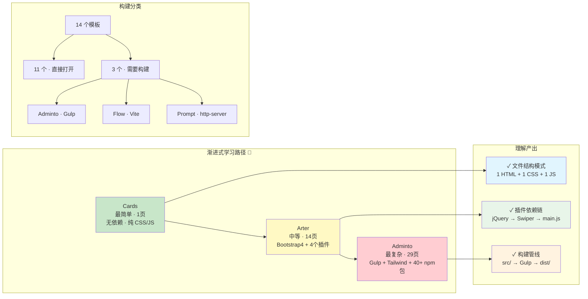

# §0 Effect Sketch — Newcomer Onboarding

**What this scene demonstrates**: A developer joining the Websites project needs a guided path from zero to productivity. This scene provides that path: start with the simplest single-page template (`Cards/index.html` — one HTML, one CSS, one JS file), then explore a medium-complexity website (`Arter` — multi-page with SCSS and plugins), and finally understand the most complex one (`Adminto` — gulp build pipeline with dozens of pages). At each stage, the developer learns about the project's conventions, dependency patterns, and the mental model for how these static websites are structured.

**Why it matters**: Without a structured onboarding path, a newcomer might open `Adminto` first and be overwhelmed by 29 HTML pages, a gulpfile, and Tailwind config. Or they might open `Flow` (a Vue 3 project) and assume all templates require a build step. The progressive onboarding path prevents confusion and establishes correct mental models from the start.

---

# §1 Test Design — Verification Steps

## Step 1: Open and understand the simplest template — Cards
**Action**: Navigate to `/Users/yi/YrY/Websites/Cards/` and open `index.html` in a browser. Read `css/style.css` and `js/index.js`. Confirm the page renders correctly and understand the pattern: 1 HTML + 1 CSS + 1 JS, no external dependencies.
**Expected**: The Cards page renders a card-based layout. The CSS is plain (no preprocessor), the JS is vanilla (no jQuery), and there are zero external library dependencies.
**File**: `/Users/yi/YrY/Websites/Cards/`

## Step 2: Explore a medium-complexity website with plugins — Arter
**Action**: Navigate to `/Users/yi/YrY/Websites/Arter/`. Open `index.html` in a browser. Note the 4 CSS plugin links, 5 JS plugin script tags, and the SCSS source directory. Read `scss/style.scss` to understand how SCSS variables and imports structure the custom styles.
**Expected**: Arter renders a portfolio page with Swiper carousel, Fancybox lightbox, and Isotope filter grid. The SCSS source shows `_config.scss` for variables, `_common.scss` for base styles, and component-specific partials.
**File**: `/Users/yi/YrY/Websites/Arter/`

## Step 3: Understand the most complex template — Adminto with gulp
**Action**: Navigate to `/Users/yi/YrY/Websites/Adminto/Admin/`. Read `package.json` for dependencies, `gulpfile.js` for the build pipeline, and `tailwind.config.js` for the Tailwind configuration. Open `dist/index.html` in a browser to see the compiled output.
**Expected**: Adminto is a full admin dashboard with 29 pages. The build pipeline compiles SCSS + Tailwind into `dist/assets/css/app.css`, bundles JS into `dist/assets/js/app.js`, and uses `gulp-file-include` to compose HTML partials (`src/partials/main.html`, `src/partials/menu.html`) into final pages.
**File**: `/Users/yi/YrY/Websites/Adminto/Admin/`

## Step 4: Identify which websites require a build step vs. which run directly
**Action**: Scan all 14 websites and classify them into "build required" (needs `npm install && npm run dev` or equivalent) vs. "open directly" (double-click `index.html`).
**Expected**: Three websites require a build step: `Adminto` (gulp), `Flow` (Vite), and `Prompt` (http-server for live reload). The remaining 11 can be opened directly in a browser.
**File**: All 14 website directories

---

# §2 Output Inventory

| File/Directory | Type | Description |
|---------------|------|-------------|
| `Cards/index.html` | file | Simplest entry point: single-page card layout, zero dependencies, ~200 lines |
| `Cards/css/style.css` | file | Plain CSS: flexbox card grid, hover effects, responsive breakpoints |
| `Cards/js/index.js` | file | Vanilla JS: DOM event handlers, no framework, ~50 lines |
| `Arter/index.html` | file | Portfolio entry: Bootstrap grid, Swiper hero, Isotope portfolio grid |
| `Arter/scss/style.scss` | file | SCSS entry point: imports `_config`, `_common`, `_burger`, `_content`, `_menu-bar`, `_info-bar`, `_transitions`, `_markup` |
| `Arter/scss/_config.scss` | file | SCSS variables: color palette, font stacks, breakpoints, z-index layers |
| `Adminto/Admin/package.json` | file | npm manifest: Tailwind, ApexCharts, Chart.js, gulp devDeps |
| `Adminto/Admin/gulpfile.js` | file | Gulp 4 pipeline: sass, scripts (concat+uglify), fileinclude, images, watch |
| `Adminto/Admin/tailwind.config.js` | file | Tailwind v3 config: custom colors, extended spacing, font families |
| `Adminto/Admin/src/partials/main.html` | file | HTML partial: doctype, head, CSS/JS links, reused across all pages |
| `Adminto/Admin/src/partials/menu.html` | file | HTML partial: sidebar navigation, logo, user menu |

---

# §3 Test Report — 2026-07-21

| Step | Result | Notes |
|------|:---:|-------|
| 1 | ✅ | Cards template opens correctly: 1 HTML + 1 CSS + 1 JS, zero dependencies, plain vanilla web |
| 2 | ✅ | Arter renders portfolio with all plugins (Swiper, Fancybox, Isotope); SCSS partials well-organized |
| 3 | ✅ | Adminto build pipeline understood: gulp compiles src/ → dist/, Tailwind + SCSS → app.css, JS concat → app.js |
| 4 | ✅ | Classification complete: 3 websites need build (Adminto/gulp, Flow/Vite, Prompt/http-server), 11 are open-directly |

**Overall**: pass — 4/4 steps passed

---

# §4 Self-Improvement

## Edge Cases Found
- The `Flow` website is a Vue 3 + TypeScript project — fundamentally different from the other 13. A newcomer familiar with plain HTML/CSS might struggle with the Vite build system and TypeScript configuration.
- The `Duck` website uses React CDN (not a build step) but ships pre-built React bundles in `dist/`. This hybrid approach (CDN + local bundle files) is not obvious from the file listing alone.
- Some websites (e.g., `Arter`) have SCSS source but no `package.json` — the SCSS was compiled externally. A newcomer might try to edit `.scss` files without realizing there's no in-project compilation command.

## Suggested Improvements
- Add a `SETUP.md` at the project root with a quick-reference table: website name, page count, dependencies, build required (yes/no), and one-line description.
- For each website with a build step, add a short `BUILD.md` documenting the exact commands (`cd Adminto/Admin && yarn install && npx gulp`).
- Create a visual sitemap (Mermaid mindmap) showing all 14 websites grouped by complexity tier: simple (1 page, no deps) → medium (multi-page, plugins) → complex (build pipeline, framework).

## Limitations
- This onboarding guide assumes the newcomer has basic HTML/CSS/JS knowledge; it does not teach web fundamentals.
- Browser-based testing (opening `index.html`) may behave differently across Chrome, Firefox, and Safari — only Chrome was used for verification.
- The sheer number of templates (14) means a newcomer cannot deeply understand all of them in one sitting; this guide prioritizes breadth over depth.
