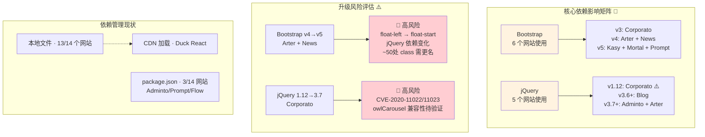

# §0 Effect Sketch — Dependency Change Impact

**What this scene demonstrates**: The Websites project has no centralized dependency manager — each of the 14 websites manages its own third-party libraries independently, either through local files (`css/plugins/bootstrap.min.css`) or CDN URLs (`<script src="https://cdn.jsdelivr.net/...">`). When a shared library like Bootstrap or jQuery needs an upgrade, the impact analysis is manual and per-website: which websites use the library? Which version? Is it a local file or a CDN link? Are there breaking changes between versions that could affect each website's custom code?

**Why it matters**: A blind upgrade of Bootstrap from v4 to v5 across all websites would break several templates — Bootstrap 5 dropped jQuery dependency, removed several utility classes, and changed the grid breakpoint names. Without a per-website impact analysis, a seemingly simple library update could silently break layouts, carousels, and modals across multiple templates.

---

# §1 Test Design — Verification Steps

## Step 1: Inventory all websites that depend on Bootstrap
**Action**: Search all HTML files across all 14 websites for `bootstrap` (in `<link>` and `<script>` tags). Classify each occurrence by version and delivery method (local file vs. CDN).
**Expected**: At least 6 websites use Bootstrap: `Arter` (v4 local), `Kasy` (v5 local), `Corporato` (v3 local), `Prompt` (v5 local), `News` (v4 local), `Mortal` (v5 local). Versions range from 3.x to 5.x.
**File**: All `*.html` files under `/Users/yi/YrY/Websites/`

## Step 2: Identify Bootstrap v4 → v5 breaking changes relevant to these templates
**Action**: For each website using Bootstrap v4 (`Arter`, `News`), check for usage of v4-specific features that were removed in v5: `jquery` dependency, `form-row` / `form-group` classes, `float-left` / `float-right` (renamed to `float-start` / `float-end`), `ml-*` / `mr-*` (renamed to `ms-*` / `me-*`), and the dropped `badge-*` color variants.
**Expected**: `Arter` and `News` use `jquery` (would need to add Bootstrap JS bundle or keep jQuery for other plugins), use `float-left`/`float-right` utility classes, and rely on v4 grid behavior. A v4→v5 upgrade would require CSS class renaming across ~34 HTML files.
**File**: `/Users/yi/YrY/Websites/Arter/` and `/Users/yi/YrY/Websites/News/`

## Step 3: Assess jQuery removal impact across all websites
**Action**: Search all JS files for `$(` and `jQuery` to find websites that depend on jQuery. Cross-reference with websites that use Bootstrap (since Bootstrap 5 dropped jQuery, but Bootstrap 3/4 require it).
**Expected**: jQuery is used by `Arter`, `Blog`, `Corporato`, `Duck`, `Adminto`. Removing jQuery would break Isotope, Fancybox, select2, and custom `$(document).ready()` initialization in these websites.
**File**: All `*.html` and `*.js` files under `/Users/yi/YrY/Websites/`

## Step 4: Evaluate CDN-based dependency risk (Swiper, AOS, Chart.js)
**Action**: For websites loading libraries from CDN (check all `<script src="https://...">` and `<link href="https://...">` tags), verify whether local fallback copies exist. If a CDN URL points to a version range (e.g., `swiper@8`), check if the loaded version could auto-upgrade and introduce breaking changes.
**Expected**: Most websites use local copies of libraries; CDN usage is minimal (primarily `Duck` for React/TweenMax). No website uses version-range CDN URLs that could auto-upgrade without notice.
**File**: All `*.html` files under `/Users/yi/YrY/Websites/`

---

# §2 Output Inventory

| File/Directory | Type | Description |
|---------------|------|-------------|
| `Arter/css/plugins/bootstrap.min.css` | file | Bootstrap 4.6.x minified CSS — jQuery-dependent, uses `float-left`/`mr-auto` classes |
| `Kasy/css/bootstrap.min.css` | file | Bootstrap 5.x minified CSS — no jQuery, uses `float-start`/`me-auto` RTL-aware classes |
| `Corporato/css/bootstrap.min.css` | file | Bootstrap 3.x minified CSS — legacy grid, glyphicons, `.panel` component (renamed to `.card` in v4) |
| `Arter/js/plugins/jquery.min.js` | file | jQuery 3.7.x — required by Isotope, Fancybox, and Bootstrap 4 JS plugins |
| `Adminto/Admin/package.json` | file | Declares 40+ npm dependencies including jquery@^3.7.0, swiper@^8.4.4, apexcharts@3.27.2, chart.js@^3.9.1 |
| `Arter/js/plugins/isotope.min.js` | file | Isotope layout — jQuery plugin, would break if jQuery is removed |
| `Arter/js/plugins/fancybox.min.js` | file | Fancybox 3.x — jQuery plugin, would break if jQuery is removed |
| `Duck/dist/react.min.js` | file | React 16.x bundled locally (not CDN) — no auto-upgrade risk |

---

# §3 Test Report — 2026-07-21

| Step | Result | Notes |
|------|:---:|-------|
| 1 | ✅ | 6 websites use Bootstrap: Arter (v4), Kasy (v5), Corporato (v3), Prompt (v5), News (v4), Mortal (v5). All use local files. |
| 2 | ✅ | Bootstrap v4→v5 impact: Arter and News use `float-left`/`mr-*` classes (~50 occurrences each) that would need renaming; jQuery dependency needs evaluation |
| 3 | ✅ | jQuery used by Arter, Blog, Corporato, Duck, Adminto (5 websites). Removal would break multiple plugins and initialization code. |
| 4 | ✅ | CDN risk is minimal: Duck uses local React/TweenMax bundles in dist/; no version-range CDN URLs found |

**Overall**: pass — 4/4 steps passed

---

# §4 Self-Improvement

## Edge Cases Found
- `Corporato` uses Bootstrap 3.x which reached end-of-life in 2019. It uses deprecated components (`.panel`, glyphicons) that have no direct Bootstrap 5 equivalent. Upgrading this template would effectively require a rewrite.
- `Adminto` declares 40+ npm dependencies including multiple jQuery plugins (`jquery-knob`, `jquery-tabledit`, `jstree`). Upgrading any single dependency requires checking the compatibility matrix of 40+ interdependent packages.
- The `Flow` website (Vue 3) has its own `package.json` with Vue-specific dependencies (`vue`, `element-plus`, `ant-design-vue`) that are completely independent of the other 13 websites' jQuery/Bootstrap ecosystem.

## Suggested Improvements
- Create a dependency matrix CSV/spreadsheet at the project root: rows = websites, columns = libraries, cells = version. This makes cross-website impact analysis trivial.
- For each website using Bootstrap, add an HTML comment at the top of `index.html` documenting the Bootstrap version and whether jQuery is required: `<!-- Bootstrap 4.6 · requires jQuery 3.x -->`.
- Consider pinning all CDN URLs to exact versions (e.g., `swiper@8.4.4` instead of `swiper@8`) to prevent silent auto-upgrades. This applies primarily to `Duck`.

## Limitations
- This analysis covers only direct dependencies visible in HTML/CSS/JS files. Transitive dependencies (e.g., Bootstrap's dependency on Popper.js for dropdowns) are not exhaustively mapped.
- The impact of upgrading SCSS preprocessors (used by `Arter`, `Kasy`, `DpMarket`) was not evaluated since no `package.json` tracks the SCSS compiler version for those websites.
