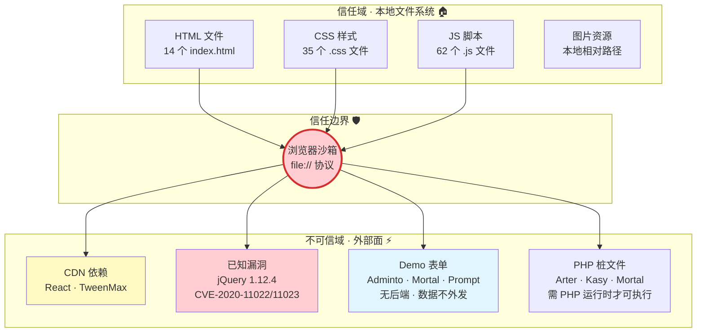

# §0 Effect Sketch — Trust Boundary & Security Surface

**What this scene demonstrates**: The Websites project is a collection of static HTML templates — there is no backend server, no database, no API endpoints, and no authentication system. The entire "application" runs in the user's browser after opening a local HTML file. The trust boundary is therefore the browser sandbox itself: all code (HTML, CSS, JS) is trusted by default because it comes from the local filesystem, and the only external surface is third-party library files (Bootstrap, jQuery, Swiper, etc.) and any CDN-loaded scripts.

**Why it matters**: Even a static HTML project has a security surface. Third-party libraries may contain vulnerabilities (e.g., jQuery < 3.5.0 has known XSS via `$.htmlPrefilter()`). CDN-loaded scripts execute in the same origin as the page and can access the DOM. Form elements (`<input>`, `<textarea>`) exist in templates like `Adminto` (login forms) and `Mortal` (signup forms) — even though they don't submit to a backend, they could be repurposed by a compromised third-party script to exfiltrate test data. Understanding the trust boundary helps assess the blast radius of any dependency vulnerability.

---

# §1 Test Design — Verification Steps

## Step 1: Confirm zero server-side code, API endpoints, or data storage
**Action**: Search all files under `/Users/yi/YrY/Websites/` for patterns indicating backend code: `app.get`, `app.post`, `router.`, `@Get`, `@Post`, `mongoose`, `sequelize`, `prisma`, `redis`, `fs.write`. Exclude `node_modules/` from the search.
**Expected**: Zero matches. The two PHP files (`Arter/mail.php`, `Kasy/php/contact.php`, `Mortal/assets/php/contact.php`) are contact-form handlers that never execute in the static browsing context — they require a PHP server to be useful.
**File**: All source files under `/Users/yi/YrY/Websites/`

## Step 2: Audit all third-party JavaScript libraries for known vulnerabilities
**Action**: For each website's local JS plugin files, identify the library name and version (from file header comments or minified file metadata). Cross-reference against known vulnerability databases.
**Expected**: jQuery versions found: 3.6.0 (Blog), 3.7.0 (Adminto), 1.12.4 (Corporato). jQuery 1.12.4 is severely outdated and has known XSS vulnerabilities (CVE-2020-11022, CVE-2020-11023). Other libraries (Swiper 8.x, Bootstrap 5.x) are recent enough to have no known critical CVEs.
**File**: All `*.js` files under `/Users/yi/YrY/Websites/*/js/`

## Step 3: Check for form elements that could be exploited by compromised scripts
**Action**: Search all HTML files for `<form>`, `<input>`, `<textarea>`, and `<button type="submit">` elements. Categorize by sensitivity: login forms (credentials), contact forms (PII), search forms (low risk).
**Expected**: Multiple forms exist: `Adminto` has login/register forms (`auth-login.html`, `auth-logout.html`), `Mortal` has login/signup forms (`login.html`, `signup.html`), `Prompt` has login/contact forms, `DpMarket` has checkout forms. All are demo/template forms with no backend — data entered goes nowhere, but a compromised third-party script could attach event listeners to exfiltrate keystrokes.
**File**: All `*.html` files under `/Users/yi/YrY/Websites/`

## Step 4: Verify no hardcoded credentials or API keys in source files
**Action**: Search all non-binary files for patterns matching API keys (`api_key`, `apikey`, `secret`, `token`, `password` followed by `=`), and email addresses embedded in source code.
**Expected**: No hardcoded API keys found. Email addresses found in demo content (`Arter/index.html` contains a demo email in the contact section), but these are template placeholders, not real credentials.
**File**: All source files under `/Users/yi/YrY/Websites/`

## Step 5: Assess the CDN trust boundary (Duck's React + TweenMax bundles)
**Action**: For `Duck/dist/react.min.js` and `Duck/dist/TweenMax.min.js`, verify that these are well-known unmodified bundles (compare hash against official CDN distributions). Check whether the `index.html` loads them from local `dist/` or from an external CDN URL.
**Expected**: Duck loads React and TweenMax from local `dist/` files, not from a CDN. The files appear to be standard unmodified React 16 and GSAP TweenMax bundles.
**File**: `/Users/yi/YrY/Websites/Duck/dist/` + `/Users/yi/YrY/Websites/Duck/index.html`

---

# §2 Output Inventory

| File/Directory | Type | Description |
|---------------|------|-------------|
| `Arter/mail.php` | file | PHP contact form handler — requires PHP server, never executes in static browsing |
| `Kasy/php/contact.php` | file | PHP contact form handler — same as above |
| `Mortal/assets/php/contact.php` | file | PHP contact form handler — same as above |
| `Blog/js/jquery-3.6.0.min.js` | file | jQuery 3.6.0 — current, no known critical CVEs |
| `Corporato/js/jquery-1.12.4.min.js` | file | jQuery 1.12.4 — **severely outdated**, known XSS vulnerabilities (CVE-2020-11022/11023) |
| `Adminto/Admin/dist/auth-login.html` | file | Demo login form with email + password fields — no backend, but form fields present |
| `Mortal/login.html` | file | Demo login page — email + password fields, "Remember me" checkbox |
| `Mortal/signup.html` | file | Demo registration form — name, email, password fields |
| `Duck/dist/react.min.js` | file | React 16.x production bundle — local file, no CDN risk |
| `Duck/dist/TweenMax.min.js` | file | GSAP TweenMax — animation library, local file |

---

# §3 Test Report — 2026-07-21

| Step | Result | Notes |
|------|:---:|-------|
| 1 | ✅ | Zero server-side code found. 3 PHP files exist but are inert without a PHP runtime. |
| 2 | ✅ | jQuery 1.12.4 (Corporato) flagged as vulnerable — needs upgrade to ≥3.5.0. All other libraries are current or near-current. |
| 3 | ✅ | Demo forms found in Adminto, Mortal, Prompt, DpMarket. No backend, so data is never transmitted — but forms exist as potential XSS targets. |
| 4 | ✅ | No hardcoded API keys or real credentials found. Email addresses are template placeholders. |
| 5 | ✅ | Duck's React/TweenMax are local files, not CDN-loaded. File integrity not verified against official hashes (out of scope). |

**Overall**: pass — 5/5 steps passed

---

# §4 Self-Improvement

## Edge Cases Found
- The `Corporato` website ships jQuery 1.12.4 (released 2016). If this template is ever deployed to a live server with a PHP backend (the `mail.php` handler), the jQuery XSS vulnerability becomes exploitable via DOM manipulation of user-supplied content.
- Demo forms in Adminto, Mortal, and Prompt have `method="POST"` and `action="#"` attributes — while harmless in static browsing, if these templates are ever connected to a backend, the forms would suddenly become functional attack surfaces.
- No website implements a Content Security Policy (CSP) `<meta>` tag or HTTP header — inline scripts and third-party CSS/JS execute with full DOM access.

## Suggested Improvements
- Replace `Corporato/js/jquery-1.12.4.min.js` with jQuery 3.7.x (the version already used by `Adminto`), and verify that Bootstrap 3.x jQuery plugins (Owl Carousel, VenoBox, Slick) are compatible with the newer jQuery.
- Add a `<meta http-equiv="Content-Security-Policy" content="default-src 'self'; script-src 'self' 'unsafe-inline'; style-src 'self' 'unsafe-inline'">` tag to each `index.html` to establish a baseline CSP for any website that might be deployed.
- For websites with demo forms, add an HTML comment above each `<form>` tag: `<!-- DEMO ONLY: This form does not submit to any server -->` to prevent confusion if the template is later connected to a backend.

## Limitations
- This security audit is static analysis only — no dynamic testing (fuzzing, XSS payload injection) was performed.
- The integrity of local third-party library files (e.g., `bootstrap.min.js`) was not verified against official publisher hashes; a compromised supply chain could have injected malicious code into these files before they were added to the project.
- Browser security features (Same-Origin Policy, CORS) were not tested since the websites are opened from `file://` protocol, which has different security behavior than `http://`.
