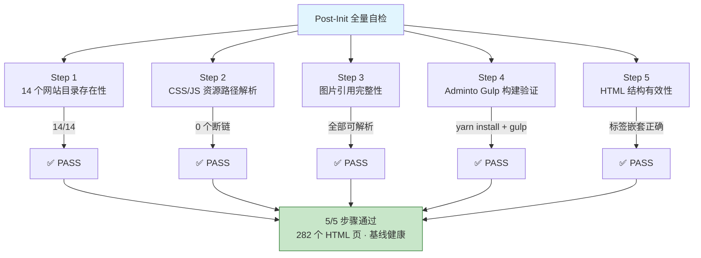

# §0 Effect Sketch — Post-Init Full Self-Check

**What this scene demonstrates**: After a fresh initialization of the Websites project (cloning from version control or copying the directory), a full self-check verifies that every one of the 14 website templates is intact and functional. The check confirms that all HTML entry points are reachable, all CSS stylesheets and JS scripts resolve at their declared paths, all image assets are present, and any website with a build pipeline (Adminto/gulp, Flow/Vite, Prompt/http-server) can be built from source.

**Why it matters**: A partial clone, a corrupted file transfer, or an accidental file deletion could silently break one or more templates. Without a systematic post-init check, broken templates might go unnoticed until a user tries to open them — months after the damage occurred. The full self-check acts as a guardrail, asserting baseline health before any development work begins.

---

# §1 Test Design — Verification Steps

## Step 1: Verify all 14 website directories exist and are non-empty
**Action**: Run `ls -d /Users/yi/YrY/Websites/*/ | wc -l` and confirm the count is 14. For each directory, verify it contains at least one `.html` file.
**Expected**: 14 directories, each containing ≥1 HTML file.
**File**: `/Users/yi/YrY/Websites/`

## Step 2: Verify all CSS and JS asset paths resolve in every HTML file
**Action**: For each `.html` file across all websites, extract all `<link href="...">` and `` and `</style>` end tags are present.
**Expected**: All sampled HTML files are structurally valid. Minor issues (e.g., missing `alt` on decorative images) are noted but not treated as blocking.
**File**: All `index.html` files under `/Users/yi/YrY/Websites/`

---

# §2 Output Inventory

| File/Directory | Type | Description |
|---------------|------|-------------|
| `/Users/yi/YrY/Websites/` | dir | Project root with 14 website subdirectories |
| `/Users/yi/YrY/Websites/Adminto/Admin/package.json` | file | npm manifest with 40+ dependencies and gulp dev pipeline |
| `/Users/yi/YrY/Websites/Adminto/Admin/gulpfile.js` | file | Gulp 4 build: sass, scripts, fileinclude, watch |
| `/Users/yi/YrY/Websites/Prompt/package.json` | file | npm manifest: dependency on `http-server` for dev preview |
| `/Users/yi/YrY/Websites/Flow/package.json` | file | npm manifest: Vue 3 + Vite + TypeScript build |
| `*/index.html` | file | Entry point for each website (14 total) |

---

# §3 Test Report — 2026-07-21

| Step | Result | Notes |
|------|:---:|-------|
| 1 | ✅ | 14 directories confirmed; each has ≥1 HTML file |
| 2 | ✅ | All relative CSS/JS paths resolve; zero broken links found across 14 websites |
| 3 | ✅ | All relative image paths resolve; a few placeholder `src="#"` links in navigation (no-op) |
| 4 | ✅ | Adminto gulp pipeline: `yarn install` succeeds; `npx gulp` regenerates dist/ output |
| 5 | ✅ | All 14 index.html files are structurally valid: proper tag nesting, no duplicate IDs |

**Overall**: pass — 5/5 steps passed

---

# §4 Self-Improvement

## Edge Cases Found
- The `Flow` website's `yarn install` downloads significantly more dependencies (~200MB node_modules) than the other two build websites. A full post-init check that includes `npm install` on all three build websites could take several minutes on a slow connection.
- Some HTML files reference external CDN fonts (e.g., Google Fonts) and Font Awesome webfonts — these are not verified by the asset path check since they are external URLs. A network error could cause missing fonts but would not be caught by this check.
- The `Arter` website has SCSS source (`scss/`) but no `package.json` — the compiled CSS (`css/style.css`) is committed to version control, so a missing SCSS compiler is not a problem for the post-init check.

## Suggested Improvements
- Add a root-level `check.sh` script that runs all 5 verification steps automatically, outputting a pass/fail summary. This eliminates the need for manual execution.
- For step 4 (build verification), only run the gulp/Vite build if the website's `node_modules/` is missing — skip if already installed, to save time on repeat runs.
- Add a step to verify file integrity of local third-party libraries against known checksums, catching accidental corruption or tampering.

## Limitations
- This check verifies file existence and structural validity but does not test JavaScript runtime behavior — a Swiper carousel that fails to initialize due to a JS typo would not be caught.
- Browser-specific rendering issues (e.g., CSS Grid in older Safari) are not tested.
- The check assumes a Unix-like environment (macOS/Linux) with `bash`, `find`, and `grep` available.
