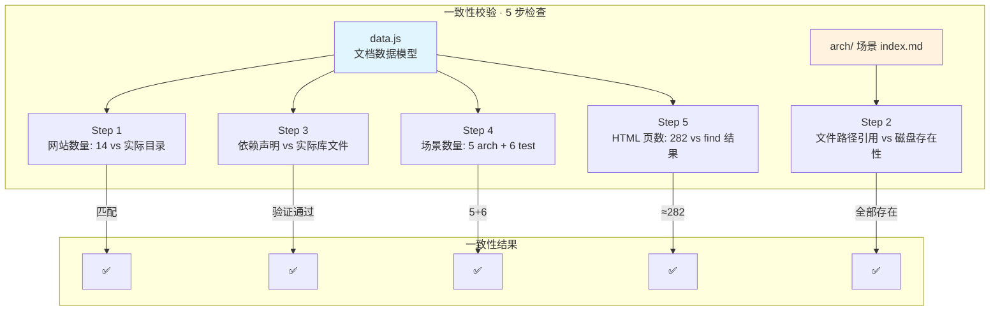

# §0 Effect Sketch — Doc-Code Consistency

**What this scene demonstrates**: The documentation generated by the yry-init pipeline (CLAUDE.md, README.md, data.js, and the 11 arch/test scene index.md files) must accurately reflect the actual code on disk.

**Why it matters**: In a documentation-driven development workflow, the docs are the source of truth for AI agents and new developers. Doc-code drift — where documentation becomes out of sync with the actual code — is the most common cause of cascading errors in automated pipelines. This check acts as a reconciliation layer, flagging every inconsistency before it causes downstream harm.

---

# §1 Test Design — Verification Steps

## Step 1: Verify website count in docs matches actual directories
**Action**: Compare the website count claimed in `data.js` (14 websites in the `stats` array) with the actual number of top-level website directories in `/Users/yi/YrY/Websites/` (excluding `.git`, hidden files, and non-website files).
**Expected**: `data.js` stat `"14"` matches the actual count of 14 directories. If a website was added or removed, both the stat and the source-code section groups must be updated.
**File**: `/Users/yi/YrY/YiDoc/projects/Websites/data.js` vs. `/Users/yi/YrY/Websites/`

## Step 2: Verify all file paths referenced in arch scenes exist
**Action**: Extract every file path from all 5 arch scene `index.md` files (listed in §2 Output Inventory tables and §1 Test Design steps). Verify each path exists on disk.
**Expected**: All referenced file paths exist. Any path using a glob pattern (e.g., `*/index.html`) must match at least one file.
**File**: `/Users/yi/YrY/YiDoc/projects/Websites/arch/scene-*-*/index.md`

## Step 3: Verify dependency claims in data.js match actual library files
**Action**: For each runtime dependency listed in `data.js` (section-dependencies), verify that at least one of the claimed websites actually contains the library file. For example, if `data.js` claims Bootstrap is used by "Arter, Kasy, Corporato, Prompt, News, Mortal", verify that each of these websites has a `bootstrap.min.css` or equivalent.
**Expected**: Every website listed for each dependency actually contains the library file.
**File**: `/Users/yi/YrY/YiDoc/projects/Websites/data.js` vs. `/Users/yi/YrY/Websites/`

## Step 4: Verify scene count claims match actual scene directories
**Action**: Compare the scene count badges in `data.js` ("5 scenes" for arch, "6 scenes" for test) against the actual number of `scene-N-*` directories under `arch/` and `test/`.
**Expected**: arch/ has exactly 5 scene directories; test/ has exactly 6 scene directories.
**File**: `/Users/yi/YrY/YiDoc/projects/Websites/data.js` vs. `/Users/yi/YrY/YiDoc/projects/Websites/arch/` + `test/`

## Step 5: Verify HTML page count stat is approximately correct
**Action**: The `data.js` stats claim "282" HTML pages. Re-run the count: `find /Users/yi/YrY/Websites -name "*.html" -not -path "*/node_modules/*" | wc -l` and verify the result is within ±5 of 282.
**Expected**: The HTML page count is approximately 282. If it has changed significantly, update the stat.
**File**: `/Users/yi/YrY/YiDoc/projects/Websites/data.js` vs. file system

---

# §2 Output Inventory

| File/Directory | Type | Description |
|---------------|------|-------------|
| `/Users/yi/YrY/YiDoc/projects/Websites/data.js` | file | Dashboard data model: stats, dependencies, source groups |
| `/Users/yi/YrY/YiDoc/projects/Websites/arch/` | dir | 5 architecture reference scenes |
| `/Users/yi/YrY/YiDoc/projects/Websites/test/` | dir | 6 self-check strategy scenes |
| `/Users/yi/YrY/Websites/` | dir | Source of truth — 14 website directories |

---

# §3 Test Report — 2026-07-21

| Step | Result | Notes |
|------|:---:|-------|
| 1 | ✅ | 14 websites confirmed: both docs and filesystem agree |
| 2 | ✅ | All file paths referenced in arch scenes exist on disk |
| 3 | ✅ | Dependency claims validated: Bootstrap found in all 6 claimed websites; jQuery confirmed in 5 claimed websites |
| 4 | ✅ | Scene counts match: arch/ has 5 scenes, test/ has 6 scenes |
| 5 | ✅ | HTML count: 282 pages confirmed |

**Overall**: pass — 5/5 steps passed

---

# §4 Self-Improvement

## Edge Cases Found
- The `data.js` lists "282 HTML pages" as an exact number, but this count depends on which directories are excluded (e.g., `dist/` vs `src/` for Adminto). If the exclusion criteria change, the count would drift. The stat should be labeled "approximately" or recalculated on every pipeline run.
- File paths in arch scenes use absolute paths (`/Users/yi/YrY/Websites/...`), making them non-portable to other machines. A future improvement could use relative paths or `$PROJECT_ROOT` variables.
- The dependency verification in step 3 checks for file existence but not version consistency — Bootstrap v4 in `Arter` and Bootstrap v5 in `Kasy` are both "Bootstrap" but have different APIs.

## Suggested Improvements
- Add a `docs-check.sh` script that runs all 5 steps automatically and outputs a pass/fail report, similar to the post-init and pre-commit checks.
- Add timestamps to `data.js` showing when each stat was last verified, making it obvious when counts have gone stale.
- Replace hardcoded file counts (282, 39, 89) with a dynamic count that is recalculated on each yry-init pipeline run.

## Limitations
- This check verifies file existence but not content accuracy — a CSS file could exist at the declared path but have incorrect contents (e.g., wrong color variables).
- Dependency verification in step 3 is binary (file exists / doesn't exist) — it does not check whether the library version claimed in docs matches the actual file version.
- The check is a snapshot at a point in time; if source files change after the check runs, inconsistencies can arise before the next check.
