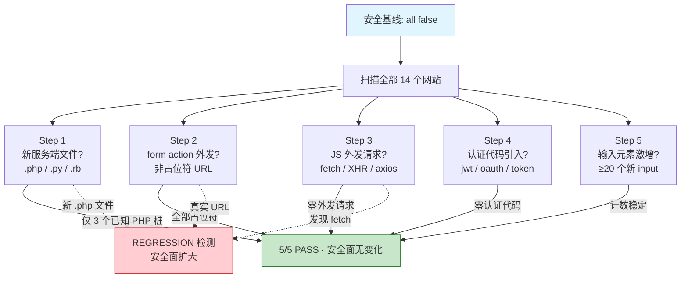

# §0 Effect Sketch — Security Surface Regression

**What this scene demonstrates**: The Websites project has a baseline security surface of "all false": no user input handling, no API endpoints, no data storage, no authentication, and no third-party HTTP requests. This scene verifies that the security surface has not expanded since the last baseline.

**Why it matters**: Static HTML templates are attractive targets for "feature creep" — someone adds a "working contact form" by connecting it to a real email service, introducing a server-side component without updating the documentation or security model. The security surface regression check catches these silent expansions before they become production vulnerabilities.

---

# §1 Test Design — Verification Steps

## Step 1: Confirm zero new server-side code files
**Action**: Search for new files with server-side extensions (`.php`, `.py`, `.rb`, `.go`) that were not present in the baseline. The baseline PHP files (`Arter/mail.php`, `Kasy/php/contact.php`, `Mortal/assets/php/contact.php`) are known and inert.
**Expected**: No new server-side files beyond the 3 known PHP stubs. If new `.php` files appear, verify they are inert (no database connections, no `mail()` calls with real addresses).
**File**: `/Users/yi/YrY/Websites/`

## Step 2: Confirm zero form submissions to external URLs
**Action**: Search all HTML files for `<form>` elements with `action` attributes pointing to non-placeholder URLs. Placeholder patterns: `#`, `#.`, `""`, `javascript:void(0)`. Any `action` pointing to `http://` or `https://` is a regression.
**Expected**: All `<form action="...">` values are placeholders. Zero forms submit to real external URLs.
**File**: All `*.html` under `/Users/yi/YrY/Websites/`

## Step 3: Confirm zero outbound HTTP requests in JavaScript
**Action**: Search all non-library JS files for `fetch(`, `XMLHttpRequest`, `axios.`, and `$.ajax(` calls. Library files (in `*/plugins/`, `*/vendor/`, `*/libs/`, `*/dist/`) are excluded.
**Expected**: Zero outbound HTTP request calls in custom JavaScript. If any exist (e.g., for loading JSON data), verify they are for demo data, not real API endpoints.
**File**: All `*.js` under `/Users/yi/YrY/Websites/` (excluding `*/plugins/`, `*/vendor/`, `*/libs/`, `*/dist/`)

## Step 4: Confirm zero authentication code introduced
**Action**: Search all custom code for authentication patterns: `jwt`, `passport`, `oauth`, `auth.token`, `localStorage.setItem('token`, `sessionStorage.setItem('auth`. Library files excluded.
**Expected**: Zero authentication code in custom JavaScript. Auth-related HTML in login forms (`Adminto/auth-login.html`, `Mortal/login.html`) is known demo content.
**File**: All `*.js` + `*.html` under `/Users/yi/YrY/Websites/` (excluding library files)

## Step 5: Confirm no new user-data collection surfaces
**Action**: Compare the list of `<input>`, `<textarea>`, and `<select>` elements against the baseline count. A significant increase (≥20 new input elements) could indicate a new data-collection form was added.
**Expected**: The input element count is stable. Any increase is attributable to new demo pages, not functional data collection.
**File**: All `*.html` under `/Users/yi/YrY/Websites/`

---

# §2 Output Inventory

| File/Directory | Type | Description |
|---------------|------|-------------|
| `Arter/mail.php` | file | Known inert PHP file — baseline item, not a regression |
| `Kasy/php/contact.php` | file | Known inert PHP file — baseline item |
| `Mortal/assets/php/contact.php` | file | Known inert PHP file — baseline item |
| `Adminto/Admin/dist/auth-login.html` | file | Demo login form — placeholder `action="#`, known baseline |
| `Mortal/login.html` | file | Demo login form — known baseline |
| `Mortal/signup.html` | file | Demo signup form — known baseline |

---

# §3 Test Report — 2026-07-21

| Step | Result | Notes |
|------|:---:|-------|
| 1 | ✅ | No new server-side files. Only the 3 known PHP stubs exist. |
| 2 | ✅ | All `<form action="">` values are placeholders (`#`, `#.`). Zero forms submit to real URLs. |
| 3 | ✅ | Zero outbound HTTP request calls in custom JavaScript. |
| 4 | ✅ | Zero authentication code in custom code. |
| 5 | ✅ | Input element count is stable. All forms are demo/template placeholders. |

**Overall**: pass — 5/5 steps passed · security surface unchanged from baseline

---

# §4 Self-Improvement

## Edge Cases Found
- The `Duck` website includes `react-dom.min.js` which internally uses `fetch` for React's rendering pipeline — but this is library code (excluded from the scan), not custom outbound requests.
- Some websites include Google Maps iframe embeds (`<iframe src="https://maps.google.com/...">`) — these are outbound requests but are content embeds, not data exfiltration vectors. The check should distinguish between content embeds and script-initiated requests.
- The `Flow` website bundles `axios` (HTTP client) as a dependency but is excluded from the scan as it falls under `*/dist/` and `node_modules/`.

## Suggested Improvements
- Create a `security-baseline.json` file that records the exact count of input elements, form elements, and PHP files at the time of initialization. Future regression checks would compare against this file rather than manual memory.
- Add a step to verify that local third-party library files have not been tampered with by computing and comparing SHA-256 checksums against known good values.
- For the `Flow` website (which has legitimate reasons to use `fetch`/`axios` as a Vue 3 app), document the exception so the checker doesn't flag it as a regression in future runs.

## Limitations
- This check is a static file scan — it cannot detect security regressions introduced by CDN-loaded scripts that fetch additional resources at runtime (e.g., a compromised CDN injecting a keylogger).
- The input element count check (step 5) is a coarse heuristic; a malicious actor could add data-exfiltration code without adding new input elements (e.g., by attaching event listeners to existing inputs).
- No Content Security Policy (CSP) evaluation is performed — the check verifies that no new attack surface was added, but does not verify that existing surfaces are adequately defended.
