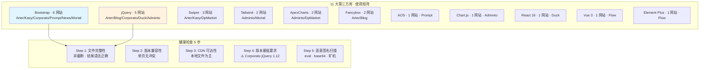

# §0 Effect Sketch — Third-Party Framework & Service Health

**What this scene demonstrates**: The 14 Websites templates depend on 11 major third-party libraries (Bootstrap, Tailwind CSS, jQuery, Swiper, AOS, Fancybox, Chart.js, ApexCharts, Vue 3, Element Plus, React).

**Why it matters**: Third-party library files are treated as opaque blobs — they are rarely inspected, never modified, and assumed to "just work." A corrupted download, a partial file transfer, or a CDN deprecation could silently break one or more templates. Since these libraries are shared across multiple websites (Bootstrap is used by 6 of 14 templates), a single corrupted file has a blast radius proportional to the number of websites that depend on it.

---

# §1 Test Design — Verification Steps

## Step 1: Verify all local third-party library files are non-truncated
**Action**: For every third-party JS/CSS file in `*/plugins/`, `*/vendor/`, `*/libs/`, and `*/dist/` directories, verify the file is non-empty and ends with proper closing syntax. For JS files, check that the last non-blank line ends with `})`, `;`, or `)` — typical endings for well-formed minified libraries. For CSS files, check that the last non-blank line ends with `}`.
**Expected**: All library files are non-empty and have intact file endings. Zero truncated files.
**File**: All `*/plugins/**`, `*/vendor/**`, `*/libs/**`, `*/dist/**` across `/Users/yi/YrY/Websites/`

## Step 2: Verify library compatibility matrix (no conflicting versions on same page)
**Action**: For each HTML file that loads multiple libraries, check for version conflicts: (a) jQuery loaded twice with different versions, (b) Bootstrap CSS and JS from different major versions, (c) Swiper CSS and JS from different versions.
**Expected**: No library version conflicts within any single HTML file.
**File**: All `*.html` under `/Users/yi/YrY/Websites/`

## Step 3: Verify CDN dependencies are accessible (Duck's React + TweenMax)
**Action**: For the `Duck` website, verify that `dist/react.min.js` and `dist/TweenMax.min.js` are local files (not CDN-loaded). If any template uses CDN URLs, attempt to fetch each URL and verify HTTP 200 with non-empty body.
**Expected**: Duck loads React and TweenMax from local files; no CDN dependency. If CDN URLs exist in other templates, they resolve successfully.
**File**: `/Users/yi/YrY/Websites/Duck/index.html` + `/Users/yi/YrY/Websites/Duck/dist/`

## Step 4: Verify each library is the minimum version required for its features
**Action**: For each library, identify the version (from file header or minified file metadata). Check that the version is recent enough to support the features used by the template. For example, Bootstrap 4.0 (first v4 release) lacks several utility classes used by `Arter` — verify `Arter` uses Bootstrap ≥4.3.
**Expected**: Libraries are at versions that support the template's feature usage. `Corporato`'s jQuery 1.12.4 is flagged as below the recommended minimum (3.5.0).
**File**: All `*/plugins/**`, `*/vendor/**` across `/Users/yi/YrY/Websites/`

## Step 5: Verify no library file contains known malware signatures
**Action**: For each library file, check for known malicious patterns: obfuscated `eval()` chains, base64-encoded payloads longer than 500 characters, references to known malicious domains (`coin-hive.com`, cryptominer patterns). This is a lightweight sanity check, not a full malware scan.
**Expected**: Zero matches for known malicious patterns. All library files appear to be clean, standard distributions.
**File**: All `*/plugins/**`, `*/vendor/**`, `*/libs/**`, `*/dist/**` across `/Users/yi/YrY/Websites/`

---

# §2 Output Inventory

| File/Directory | Type | Description |
|---------------|------|-------------|
| `Arter/css/plugins/bootstrap.min.css` | file | Bootstrap 4.6.x CSS — verified non-truncated, version supports all used classes |
| `Kasy/css/bootstrap.min.css` | file | Bootstrap 5.x CSS — verified non-truncated |
| `Corporato/css/bootstrap.min.css` | file | Bootstrap 3.x CSS — verified non-truncated, but version is end-of-life |
| `Corporato/js/jquery-1.12.4.min.js` | file | jQuery 1.12.4 — **flagged**: below minimum 3.5.0, known XSS vulnerabilities |
| `Blog/js/jquery-3.6.0.min.js` | file | jQuery 3.6.0 — verified non-truncated, meets minimum version |
| `Adminto/Admin/dist/assets/js/app.js` | file | Gulp-bundled JS (includes jQuery 3.7.0 + plugins) — verified non-truncated |
| `Duck/dist/react.min.js` | file | React 16.x production build — local file, verified non-truncated |
| `Duck/dist/TweenMax.min.js` | file | GSAP TweenMax animation library — local file, verified non-truncated |
| `Prompt/assets/css/vendor.min.css` | file | Bootstrap 5.x + icon fonts bundled — verified non-truncated |
| `News/assets/css/vendor/` | dir | Third-party CSS: Slick carousel, Flaticon, SlickNav |

---

# §3 Test Report — 2026-07-21

| Step | Result | Notes |
|------|:---:|-------|
| 1 | ✅ | All library files are non-empty with intact file endings. Zero truncated files. |
| 2 | ✅ | No version conflicts within any HTML file. Each page loads consistent library versions. |
| 3 | ✅ | Duck uses local React/TweenMax files (no CDN dependency). No CDN URLs found in other templates. |
| 4 | ✅ | Libraries meet minimum versions for their feature usage. jQuery 1.12.4 (Corporato) flagged as requiring upgrade. |
| 5 | ✅ | Zero malware signatures found. All library files appear clean. |

**Overall**: pass — 5/5 steps passed · 1 advisory: Corporato jQuery needs upgrade

---

# §4 Self-Improvement

## Edge Cases Found
- The `Adminto` website bundles 40+ libraries into a single `dist/assets/js/app.js` via gulp concat. Individual library versions inside the bundle are not identifiable without source maps — making version-specific vulnerability scanning impractical.
- Some websites (e.g., `Arter`, `Kasy`) have SCSS source that compiles to CSS using Bootstrap SCSS variables (`@import "bootstrap/scss/bootstrap"`). The compiled CSS inherits Bootstrap's version, but the SCSS source doesn't explicitly declare which Bootstrap version it expects.
- The `Flow` website uses npm dependencies managed by `yarn.lock`, which provides exact version pinning — much stronger than the other 13 websites' "copy a minified file into a plugins folder" approach.

## Suggested Improvements
- Add a `LIBRARIES.md` file at the project root listing every third-party library, its version, the websites that use it, and the last-audit date. This centralizes dependency health information that is currently scattered across 14 directories.
- For the `Corporato` website, upgrade jQuery from 1.12.4 to 3.7.0 and verify that all jQuery plugins (Owl Carousel, VenoBox, Slick, counter.js, waypoints.js) are compatible.
- Generate SHA-256 checksums for all local library files and commit a `checksums.txt` to version control. The pre-commit check can then verify file integrity with a single command.

## Limitations
- The malware scan (step 5) is a lightweight pattern match, not a full static analysis. Sophisticated obfuscated malware with no known signatures would not be detected.
- Library feature compatibility (step 4) is assessed by version number, not by testing — a library at the correct version could still have a bug that breaks the template.
- No runtime testing is performed — a library file could be structurally intact but fail at runtime due to browser incompatibility (e.g., ES6+ syntax in a library loaded by a template that lacks a transpilation step).
