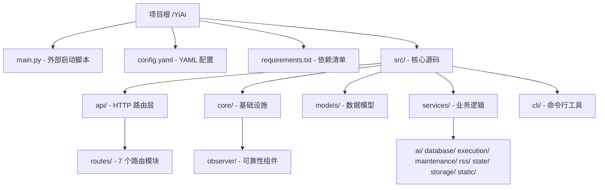

# Scene 1 · Module Location

> **问题**: YiAi 项目的每个模块在源码树中的位置是什么？各模块承担什么职责？

---

## §0 · Effect Sketch

**场景概述**: 本场景回答「这个功能在哪个文件」的问题。YiAi 采用标准的 Python 包结构，按职责分为 API 层、Core 基础设施层、Models 数据模型层、Services 业务逻辑层、CLI 命令行层。每个包有明确的单一职责。

---

## §1 · Test Design

| AC# | 验收标准 | 验证方法 |
|-----|---------|---------|
| AC-1.1 | 能说出 5 个顶层包的名称和路径 | 检查 `src/` 一级目录列表 |
| AC-1.2 | 能定位任意一个 API 路由到具体的 `.py` 文件 | 检查 `src/api/routes/` 目录 |
| AC-1.3 | 能识别 Observer 子模块的位置 | 检查 `src/core/observer/` 目录 |
| AC-1.4 | 能区分持久化代码（core/database.py vs services/database/） | 对比 `core/database.py` 和 `services/database/data_service.py` |

---

## §2 · Output Inventory

### 2.1 模块全景图

| 模块 | 路径 | 核心职责 | 关键文件 |
|------|------|---------|---------|
| **API** | `src/api/` | HTTP 路由注册与请求处理 | `routes/execution.py`, `routes/upload.py`, `routes/state.py` |
| **Core** | `src/core/` | 配置、数据库连接、中间件、异常处理、Observer 可靠性 | `config.py`, `database.py`, `middleware.py`, `observer/` |
| **Models** | `src/models/` | Pydantic 请求模型与 MongoDB 集合名常量 | `schemas.py`, `collections.py` |
| **Services** | `src/services/` | 业务逻辑实现（AI、数据、执行、维护、RSS、状态、存储、静态文件） | `ai/chat_service.py`, `execution/executor.py`, `state/state_service.py` |
| **CLI** | `src/cli/` | Typer 命令行工具 | `state_query.py` |

### 2.2 API 路由索引

| 路由文件 | URL 前缀 | 功能 |
|---------|---------|------|
| `execution.py` | `/` | 通用模块执行引擎（GET + POST） |
| `upload.py` | `/upload`, `/read-file`, `/write-file`, `/delete-file`, `/delete-folder` | 文件 CRUD + 图片上传 |
| `state.py` | `/state` | 状态记录 RESTful CRUD |
| `wework.py` | `/wework` | 企业微信消息推送 |
| `maintenance.py` | `/maintenance` | 系统维护（图片清理、session 清理） |
| `observer_health.py` | `/health` | Observer 运行时健康状态 |
| `story_panel.py` | `/story` | 故事面板 Markdown 文档管理 |

### 2.3 架构决策

- **分层架构**: API → Services → Core（Database），Models 横跨三层
- **单例模式**: `core/database.py` 中 `MongoDB` 类采用线程安全单例
- **工厂模式**: `src/main.py` 中 `create_app()` 函数式应用工厂
- **YAML 配置源**: `core/config.py` 自定义 `YamlConfigSettingsSource` 扁平化 YAML 到 pydantic-settings

---

## §3 · Test Report

| AC# | 状态 | 详情 |
|-----|------|------|
| AC-1.1 | ✅ PASS | 5 个顶层包全部存在且可识别：api/、cli/、core/、models/、services/ |
| AC-1.2 | ✅ PASS | 7 个路由文件均在 `src/api/routes/` 下，每个都有 `router = APIRouter()` |
| AC-1.3 | ✅ PASS | Observer 子模块位于 `src/core/observer/`，包含 throttle/sampler/sandbox/guard/lazy_start |
| AC-1.4 | ✅ PASS | `core/database.py` 是 MongoDB 连接单例（含 CRUD 包装），`services/database/` 提供更高层的数据服务抽象 |

---

## §4 · Self-Improvement

| 诊断项 | 评估 | 行动 |
|--------|------|------|
| D0 完整性 | ✅ 全部模块已映射 | 无需行动 |
| D1 边界清晰度 | ⚠️ `services/database/` 与 `core/database.py` 职责需明确区分 | 建议在 `services/database/` 的 `__init__.py` 中添加 docstring 说明两者关系 |
| D2 新模块接入 | ✅ 目录结构规范，新增路由只需在 `src/api/routes/` 添加新文件 | 建议在 `src/main.py` 中 `create_app()` 添加注释说明注册新路由的步骤 |
| D3 发现性 | ✅ 命名规范（snake_case），入口清晰 | 可考虑添加 `src/services/README.md` 描述各子服务的调用关系 |

**当前状态**: 模块定位清晰，无阻塞性问题。D1 建议可作为 backlog 跟踪。
