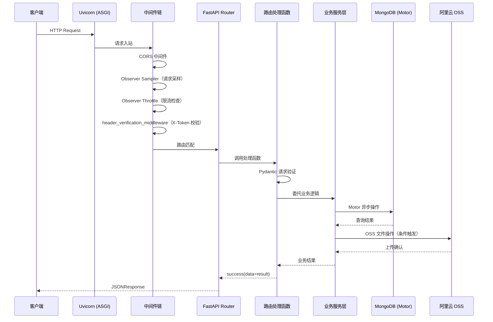

# Scene 2 · Data Flow Tracing

> **问题**: 一个请求从 HTTP 入口到持久化层的完整数据流是怎样的？调用链经过哪些关键节点？

---

## §0 · Effect Sketch



**场景概述**: 本场景追踪 YiAi 后端一条完整请求的生命周期。以「通用模块执行」接口（`POST /` 调用 `services.ai.chat_service.chat`）为例，展示从 Uvicorn 入站到模型推理返回的完整数据流。

---

## §1 · Test Design

| AC# | 验收标准 | 验证方法 |
|-----|---------|---------|
| AC-2.1 | 能列出请求经过的所有中间件（按顺序） | 检查 `src/main.py` 中 `create_app()` 的中间件注册顺序 |
| AC-2.2 | 能追踪 execute_module 的完整调用链 | 检查 `execution.py` → `executor.py` → 目标模块函数的代码路径 |
| AC-2.3 | 能说明 Pydantic 验证在哪个环节执行 | 检查 `ExecuteRequest` 模型定义和路由参数声明 |
| AC-2.4 | 能描述异常如何被全局处理器捕获 | 检查 `core/exception_handler.py` 和 `BusinessException` 的抛出点 |
| AC-2.5 | 能说明 SSE 流式响应的完整路径 | 检查 `execution.py` 中 `_stream_async` / `_stream_sync` 和 `chat_service.py` 的 `chat()` 流式实现 |

---

## §2 · Output Inventory

### 2.1 请求生命周期（以模块执行为例）

| 阶段 | 节点 | 文件 | 关键动作 |
|------|------|------|---------|
| 1. ASGI 入口 | Uvicorn | `main.py` (根), `src/main.py` | `uvicorn.run("main:app")` |
| 2. CORS 处理 | CORSMiddleware | `src/main.py:121-129` | 允许所有来源，最大缓存 3600s |
| 3. Observer 采样 | SamplerMiddleware | `src/main.py:94-100` | TailSampler 记录慢请求（>5000ms） |
| 4. Observer 限流 | ThrottleMiddleware | `src/main.py:102-109` | 滑动窗口限流（默认 100 req/60s） |
| 5. 认证校验 | header_verification_middleware | `src/core/middleware.py:42-111` | X-Token 校验 + 白名单路径跳过 |
| 6. 路由匹配 | FastAPI Router | `src/api/routes/execution.py:42-64` | POST `/` → `execute_module_via_post` |
| 7. 参数验证 | Pydantic | `src/models/schemas.py:9-28` | `ExecuteRequest` 模型自动验证 |
| 8. 模块执行 | executor | `src/services/execution/executor.py` | 白名单校验 → importlib 加载 → 调用目标函数 |
| 9. 业务执行 | OllamaService | `src/services/ai/chat_service.py:90-159` | `ollama.Client.chat()` 调用本地模型 |
| 10. 响应封装 | response | `src/core/response.py` | `success(data=result)` 统一 JSON 格式 |

### 2.2 SSE 流式响应路径（特殊路径）

当目标函数返回 `AsyncIterator` 时：

```
Handler → inspect.isasyncgen(result) → StreamingResponse(media_type="text/event-stream")
  → _stream_async(gen) → async for item in gen → _format_sse(item)
  → "data: {json}\n\n" 字节流
```

### 2.3 异常处理路径

```
任何层抛出 BusinessException → register_exception_handlers 捕获
  → 返回 fail(error=ErrorCode.XXX, message=...)
  → JSONResponse with CORS headers
```

### 2.4 架构决策

- **中间件顺序固定**: CORS → Observer 组件 → 认证 → 路由。这是有意为之，确保 CORS 预检请求优先处理。
- **模块执行是动态调用**: 不是硬编码路由，而是通过 `importlib` + 白名单动态解析 `module_name.method_name`，这使得 AI 对话、RSS 解析、文件操作等能力统一通过执行引擎暴露。
- **MongoDB 连接是懒初始化**: `LazyStartManager` 和 `db.initialize()` 按需触发，避免启动时强制数据库可用。

---

## §3 · Test Report

| AC# | 状态 | 详情 |
|-----|------|------|
| AC-2.1 | ✅ PASS | 中间件顺序：CORS → Sampler → Throttle → Auth → Router。源代码可验证。 |
| AC-2.2 | ✅ PASS | 完整调用链可追踪：`execution.py:66-74` → `executor.py` → `importlib.import_module` → 目标函数。 |
| AC-2.3 | ✅ PASS | Pydantic 验证在 FastAPI 框架层自动完成（`ExecuteRequest` 作为类型注解）。 |
| AC-2.4 | ✅ PASS | 全局异常处理器注册于 `src/main.py:88`，`BusinessException` 定义于 `core/exceptions.py`。 |
| AC-2.5 | ✅ PASS | SSE 流路径已验证：`execution.py:_stream_async` → `_format_sse` → `chat_service.chat()` 返回 `AsyncGenerator`。 |

---

## §4 · Self-Improvement

| 诊断项 | 评估 | 行动 |
|--------|------|------|
| D0 完整性 | ✅ 全链路可追踪 | 无需行动 |
| D1 中间件可观测性 | ⚠️ 缺少请求 ID 追踪（trace-id） | 建议在中间件层添加 `X-Request-ID` 生成与传递 |
| D2 流式响应错误处理 | ⚠️ SSE 流中如果目标函数抛异常，前端接收的是无格式错误 | 建议 `_stream_async` 增加 try/except 包装，以 SSE `event: error` 格式发送异常 |
| D3 超时控制 | ⚠️ 没有统一的请求超时机制 | 建议在 executor 层增加 `asyncio.wait_for` 超时保护 |
| D4 日志完整性 | ✅ 中间件层有请求日志 | 建议在执行引擎层增加耗时日志（当前仅在 chat_service 中有重试日志） |

**当前状态**: 数据流清晰完整。D1/D2/D3 建议为增强项，不影响当前功能正确性。
