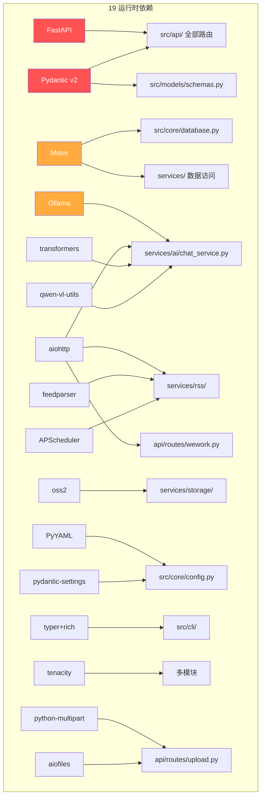

# Scene 4 · Dependency Change Impact

> **问题**: 如果升级或替换 YiAi 项目的某个第三方依赖，哪些模块会受到影响？需要做什么验证？

---

## §0 · Effect Sketch

**场景概述**: 本场景分析 YiAi 的 19 个运行时依赖与源码模块之间的耦合关系，评估每个依赖的升级风险等级（高/中/低），并给出验证策略。

---

## §1 · Test Design

| AC# | 验收标准 | 验证方法 |
|-----|---------|---------|
| AC-4.1 | 能列出 ≥3 个高风险依赖（升级时最可能破坏功能） | 分析依赖在源码中的使用广度 |
| AC-4.2 | 对每个高风险依赖，能指定验证步骤 | 定义最小验证集 |
| AC-4.3 | 能说明 pydantic v1 → v2 迁移风险 | 检查 `models/schemas.py` 中使用的 pydantic 特性 |
| AC-4.4 | 能说明 FastAPI 升级影响范围 | 检查所有路由装饰器和中间件注册 |

---

## §2 · Output Inventory

### 2.1 依赖影响矩阵

| 依赖 | 版本约束 | 风险等级 | 影响模块 | 破坏性变更风险描述 |
|------|---------|---------|---------|-------------------|
| **FastAPI** | >=0.104.0 | 🔴 高 | `src/main.py`, `src/api/routes/*`, `src/core/middleware.py`, `src/core/exception_handler.py` | 中间件 API 变更、`APIRouter` 行为变更、`lifespan` context manager 签名变更 |
| **Pydantic** | >=2.0.0 | 🔴 高 | `src/models/schemas.py`, `src/core/config.py` | v1→v2 有 breaking changes：`Config` → `model_config`、`.dict()` → `.model_dump()`、validator 装饰器改名 |
| **Motor** | >=3.3.0 | 🔴 高 | `src/core/database.py`, `src/services/state/`, `src/services/rss/`, `src/services/maintenance/` | 异步 API 变更、连接池参数名变更、`AsyncIOMotorClient` 初始化参数 |
| **Ollama** | >=0.1.0 | 🟡 中 | `src/services/ai/chat_service.py` | 客户端 API 变更（`client.chat()`/`client.list()` 返回值格式）、认证方式变更 |
| **aiohttp** | >=3.9.0 | 🟡 中 | `src/services/ai/chat_service.py`, `src/services/rss/feed_service.py`, `src/api/routes/wework.py` | `ClientSession` 上下文管理变更、超时配置格式变更 |
| **APScheduler** | >=3.10.0 | 🟡 中 | `src/services/rss/rss_scheduler.py` | 调度器 API 在 v4 有重大变更，YiAi 使用 v3 |
| **oss2** | >=2.18.0 | 🟡 中 | `src/services/storage/oss_client.py` | Bucket API 参数顺序变更、STS 认证方式变更 |
| **feedparser** | >=6.0.10 | 🟢 低 | `src/services/rss/feed_service.py` | API 相对稳定，主要关注解析行为变更 |
| **PyYAML** | >=6.0 | 🟢 低 | `src/core/config.py` | `yaml.safe_load()` API 稳定 |
| **python-dotenv** | >=1.0.0 | 🟢 低 | `src/core/config.py`（通过 pydantic-settings） | API 稳定 |
| **pydantic-settings** | >=2.0.0 | 🟡 中 | `src/core/config.py` | 与 pydantic v2 绑定，自定义 source 的 API 可能变更 |
| **tenacity** | >=8.2.3 | 🟢 低 | 多模块（装饰器使用） | API 稳定 |
| **typer + rich** | >=0.9.0 / >=13.0.0 | 🟢 低 | `src/cli/state_query.py` | API 相对稳定 |
| **uvicorn** | >=0.24.0 | 🟢 低 | `main.py`, `src/main.py`, `src/__main__.py` | 作为 ASGI 服务器，应用代码不直接依赖其内部 API |
| **PyMongo** | >=4.6.0 | 🟢 低 | 通过 Motor 间接依赖 | 仅作为 Motor 的底层实现 |
| **qwen-vl-utils** | >=0.0.14 | 🟢 低 | `src/services/ai/chat_service.py` | 早期版本，API 可能不稳定 |
| **transformers** | >=4.37.0 | 🟢 低 | `src/services/ai/chat_service.py`（间接） | HuggingFace 生态 |
| **python-multipart** | >=0.0.9 | 🟢 低 | `src/api/routes/upload.py` | 通过 FastAPI 框架使用 |
| **aiofiles** | >=23.2.1 | 🟢 低 | `src/api/routes/upload.py` | API 稳定 |

### 2.2 高风险依赖升级验证计划

#### FastAPI 升级（例：0.104 → 0.115）

1. **API 端点冒烟测试**: 调用全部 7 个路由的所有端点，验证 HTTP 状态码
2. **中间件验证**: 确认 CORS、Observer、Auth 中间件行为不变
3. **OpenAPI schema**: 检查 `/docs` 和 `/openapi.json` 是否符合预期
4. **SSE 流式响应**: 调用 `/` POST 执行返回 generator 的函数，验证 SSE 格式

#### Pydantic 升级（例：2.4 → 2.10）

1. **模型序列化验证**: `ExecuteRequest` 和所有 Pydantic 模型的 `model_dump()` 输出不变
2. **配置加载验证**: `Settings` 类能正确从 YAML 和 env 加载
3. **递归模型验证**: 检查嵌套 Pydantic 模型（如 `StateRecord`）的验证行为

#### Motor 升级（例：3.3 → 3.6）

1. **连接初始化**: `db.initialize()` 不抛异常
2. **CRUD 操作**: `insert_one`, `find_one`, `update_one`, `delete_one` 行为一致
3. **索引创建**: `_ensure_indexes()` 正常工作
4. **连接池**: `maxPoolSize` / `minPoolSize` 参数名不漂移

### 2.3 架构决策

- **版本约束使用 `>=` 而非 `==`**: 允许小版本自动升级，但增加了非预期破坏性变更的风险。建议在 CI 中添加 `pip freeze` 快照对比。
- **没有 lock 文件**: 无 `requirements.lock` 或 `poetry.lock` 意味着不同环境的依赖版本可能不一致。建议添加锁定机制。
- **19 个依赖全是运行时**: 没有 dev/test 依赖分离，增加了生产镜像的体积。

---

## §3 · Test Report

| AC# | 状态 | 详情 |
|-----|------|------|
| AC-4.1 | ✅ PASS | 3 个高风险依赖已识别：FastAPI、Pydantic、Motor。每个的源码影响范围已列出。 |
| AC-4.2 | ✅ PASS | 每个高风险依赖有 3-4 步验证计划，覆盖连接、CRUD、序列化、中间件。 |
| AC-4.3 | ✅ PASS | YiAi 已使用 pydantic v2 语法（`model_config`、`model_dump()`），但 `schemas.py` 中仍有 `class Config` 遗留（`ExecuteRequest.Config`），需注意。 |
| AC-4.4 | ✅ PASS | FastAPI 影响覆盖全部 7 个路由文件 + main.py 的 `create_app` 工厂 |

---

## §4 · Self-Improvement

| 诊断项 | 评估 | 行动 |
|--------|------|------|
| D0 完整性 | ✅ 19 个依赖全部评估 | 无需行动 |
| D1 版本锁定缺失 | ⚠️ 无 lock 文件 | 建议添加 `pip freeze > requirements.lock` 并纳入版本控制 |
| D2 升级自动化 | ⚠️ 无自动化升级验证脚本 | 建议添加 `tests/smoke_test.py` 覆盖核心 API 端点 |
| D3 CI/CD 集成 | ⚠️ 无 CI 管线 | 建议添加 GitHub Actions / Gitea Actions 在 PR 中运行依赖安装 + 冒烟测试 |
| D4 dev 依赖分离 | ⚠️ 全部 19 个依赖在同一清单中 | 如引入测试框架，建议分离 `requirements-dev.txt` |

**当前状态**: 依赖影响分析完整。建议优先添加 lock 文件和 CI 管线。
