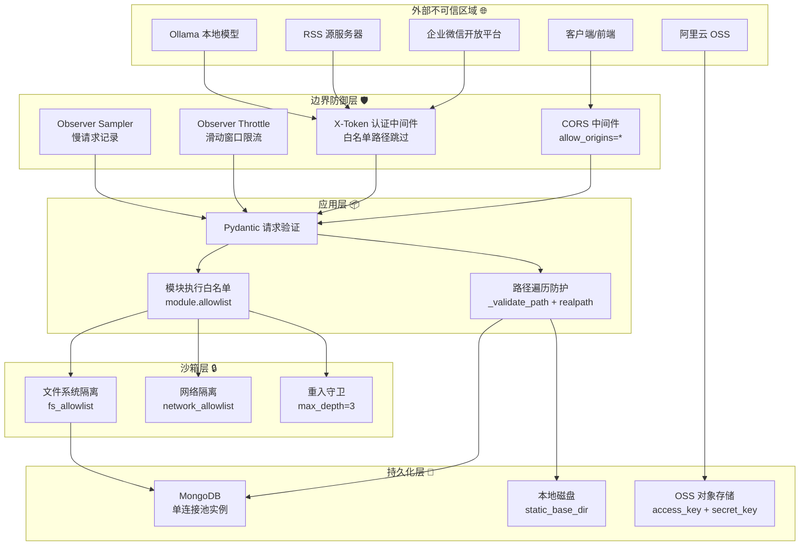

# Scene 5 · Trust Boundary & Security Surface

> **问题**: YiAi 项目的信任边界在哪里？每个边界暴露了什么？安全防御深度如何？

---

## §0 · Effect Sketch

**场景概述**: 本场景绘制 YiAi 的完整安全边界图。识别从外部不可信区域到持久化层的每一道防线，评估当前防御深度，发现安全薄弱点。

---

## §1 · Test Design

| AC# | 验收标准 | 验证方法 |
|-----|---------|---------|
| AC-5.1 | 能识别出 ≥5 个信任边界 | 审查源码中的认证、授权、验证、隔离点 |
| AC-5.2 | 能描述 X-Token 认证的覆盖范围和白名单 | 检查 `middleware.py` 的 `header_verification_middleware` |
| AC-5.3 | 能说明路径遍历防护的机制 | 检查 `upload.py` 的 `_validate_path` 和 `_resolve_static_path` |
| AC-5.4 | 能评估模块执行引擎的安全控制 | 检查 `executor.py` 的白名单逻辑和 Observer 沙箱 |
| AC-5.5 | 能指出当前安全配置中的一个薄弱点 | 综合评估后指出最需要改进的安全项 |

---

## §2 · Output Inventory

### 2.1 信任边界清单

| 边界# | 边界名称 | 位置 | 防御机制 | 覆盖范围 | 可绕过条件 |
|--------|---------|------|---------|---------|-----------|
| **TB-1** | CORS 边界 | `src/main.py:121-129` | `CORSMiddleware` | 所有跨域请求 | `allow_origins=["*"]` 表示无实际限制 |
| **TB-2** | 认证边界 | `src/core/middleware.py:42-111` | X-Token header 校验 | 除白名单外的所有路径 | `auth_enabled: false` 时完全跳过 |
| **TB-3** | 速率限制边界 | `src/core/observer/throttle.py` | 滑动窗口限流（100 req/60s） | 所有 HTTP 请求 | `throttle_enabled: false` 时跳过 |
| **TB-4** | 输入验证边界 | `src/models/schemas.py` | Pydantic 模型自动验证 | 所有通过 Pydantic 的路由 | 未使用 Pydantic model 的路由（如 query 参数） |
| **TB-5** | 模块执行边界 | `src/services/execution/executor.py` | 白名单校验 + importlib 动态加载 | 通过 `/` 端点的所有调用 | `allowlist: ["*"]` 时无实际限制 |
| **TB-6** | 文件系统边界 | `src/api/routes/upload.py:43-69` | `_validate_path` + `os.path.realpath` + `commonpath` 检查 | 所有文件操作端点 | 无 |
| **TB-7** | 沙箱边界 | `src/core/observer/sandbox.py` | FS allowlist / network allowlist | 通过执行引擎的模块调用 | `sandbox_enabled: false` 时跳过 |
| **TB-8** | 数据库边界 | `src/core/database.py` | 连接池 + 认证（MongoDB URI 中） | 所有数据访问 | MongoDB URI 在 config.yaml 中为 localhost |
| **TB-9** | OSS 边界 | `src/services/storage/oss_client.py` | access_key + secret_key 认证 | OSS 文件操作 | 密钥从 config.yaml 加载（明文存储风险） |

### 2.2 安全防御深度分析

**第 1 层 — 网络层**:
- CORS: ⚠️ 弱防护（`allow_origins=["*"]`）
- 无 WAF、无 IP 白名单（Observer Throttle 可部分替代）

**第 2 层 — 认证层**:
- X-Token: ⚠️ 可配置关闭，白名单路径无认证
- 无 JWT、无 OAuth、无 session

**第 3 层 — 限流层**:
- Observer Throttle: ✅ 滑动窗口，有白名单
- 可配置关闭

**第 4 层 — 输入验证层**:
- Pydantic: ✅ 自动类型验证
- 路径遍历: ✅ `realpath` + `commonpath` 双重防护
- 文件大小限制: ✅ RSS 10MB、图片 10MB

**第 5 层 — 执行隔离层**:
- 模块白名单: ⚠️ 默认 `["*"]` 允许全部
- 沙箱: ⚠️ 默认关闭（`sandbox_enabled: false`）
- 重入守卫: ✅ max_depth=3

**第 6 层 — 持久化层**:
- MongoDB: 依赖 URI 中的认证
- OSS: 依赖 access_key 认证
- 磁盘: 依赖文件系统权限

### 2.3 安全薄弱点（按严重程度排序）

| 排名 | 薄弱点 | 严重程度 | 缓解建议 |
|------|--------|---------|---------|
| 1 | `config.yaml` 中 `auth_token: "dev-token-change-me"` 和 OSS 密钥以明文存储 | 🔴 高 | 迁移所有密钥到环境变量或 secrets manager |
| 2 | `allowlist: ["*"]` 允许模块执行引擎调用任意 Python 函数 | 🔴 高 | 生产环境应限制为明确的服务路径列表 |
| 3 | `sandbox_enabled: false` — 沙箱默认关闭 | 🟡 中 | 生产环境启用沙箱并配置 FS/网络白名单 |
| 4 | `auth_enabled` 和 `throttle_enabled` 独立可关 | 🟡 中 | 添加「安全配置审计」检查，确保生产环境关键防御开启 |
| 5 | CORS `allow_origins=["*"]` | 🟢 低 | 如果是纯 API 服务且无浏览器 Cookie，影响较低；否则限制具体 origin |
| 6 | 无请求日志的敏感信息脱敏 | 🟢 低 | 确保 X-Token 值不被写入日志（当前 `middleware.py:93` 记录了 token 值） |

---

## §3 · Test Report

| AC# | 状态 | 详情 |
|-----|------|------|
| AC-5.1 | ✅ PASS | 9 个信任边界已识别：CORS、Auth、Throttle、Validation、Exec、FS、Sandbox、DB、OSS |
| AC-5.2 | ✅ PASS | X-Token 认证覆盖除 `/write-file`、`/read-file`、`/delete-file`、`/upload`、`/static/*` 外的所有路径 |
| AC-5.3 | ✅ PASS | 路径遍历防护三层：① `normpath` 禁止 `..` 和绝对路径；② `realpath` 防止符号链接绕过；③ `commonpath` 验证最终路径在 base_dir 内 |
| AC-5.4 | ✅ PASS | 执行引擎安全控制：白名单校验 + importlib 加载 + ReentrancyGuard + Sandbox（可配置） |
| AC-5.5 | ✅ PASS | 最薄弱点：`allowlist: ["*"]` 允许执行任意 Python 函数 + 密钥明文存储 |

---

## §4 · Self-Improvement

| 诊断项 | 评估 | 行动 |
|--------|------|------|
| D0 完整性 | ✅ 9 个边界全部绘制 | 无需行动 |
| D1 密钥管理 | 🔴 密钥明文存储在 config.yaml | 建议迁移至环境变量（已部分支持 `os.getenv("API_X_TOKEN")`）并添加 `.env.example` |
| D2 生产加固 | 🔴 模块白名单过于宽松 | 建议生产 config.yaml 将 allowlist 限制为特定服务路径 |
| D3 日志安全 | 🟡 `middleware.py:93` 记录 token 值 | 建议在日志中对 token 进行截断或脱敏处理 |
| D4 沙箱 | 🟡 默认关闭 | 建议生产环境启用沙箱 |
| D5 CORS | 🟢 `allow_origins=["*"]` 在无 Cookie 场景可接受 | 如果未来添加 session，需限制 origin |

**行动计划（优先级排序）**:
1. 🔴 密钥迁移到环境变量（2 小时）
2. 🔴 生产 allowlist 收敛（1 小时）
3. 🟡 生产沙箱启用（1 小时）
4. 🟡 日志脱敏（30 分钟）
