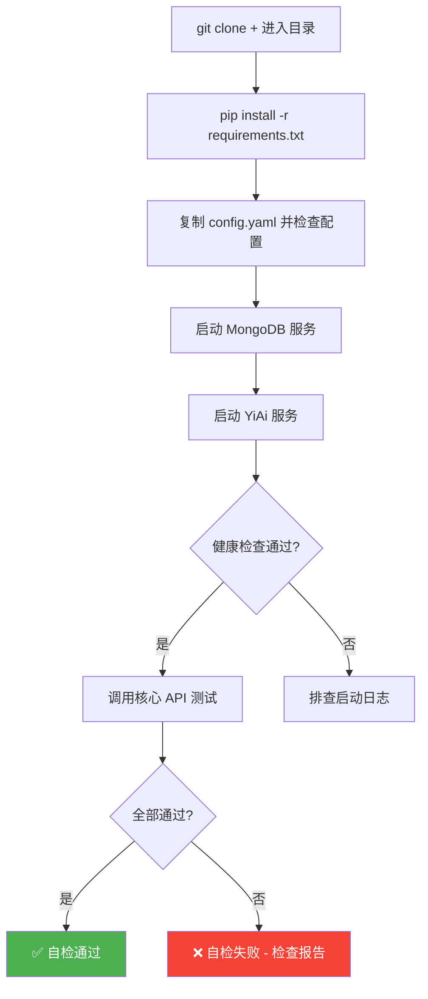

# Test Scene 1 · Post-Init Full Self-Check

> **问题**: 一个全新的 `git clone` 之后，如何验证项目是否「开箱即用」？完整的自检流程是什么？

---

## §0 · Effect Sketch



**场景概述**: 本场景定义 YiAi 项目从零初始化的完整自检流程。覆盖依赖安装、配置验证、服务启动、核心 API 调用、Observer 状态检查。由于项目当前没有自动化测试框架（testFramework: none），所有检查均为手动验证。

---

## §1 · Test Design

| AC# | 验收标准 | 验证方法 |
|-----|---------|---------|
| AC-1.1 | `pip install -r requirements.txt` 无错误完成 | 执行安装命令，检查退出码 = 0 |
| AC-1.2 | `config.yaml` 中存在所有必需的配置段 | 检查 server、mongodb、logging、observer 段 |
| AC-1.3 | 服务启动后 `/docs` 端点可访问 | `curl -s http://localhost:10086/docs` 返回 200 |
| AC-1.4 | 至少 3 个核心 API 端点返回正常响应 | `curl` 调用 execution POST、state GET、upload 端点 |
| AC-1.5 | Observer 健康检查返回各组件状态 | `curl http://localhost:10086/health/observer` |
| AC-1.6 | 启动日志无 ERROR 级别记录 | 检查控制台输出 |

---

## §2 · Output Inventory

### 2.1 自检步骤清单

| 步骤 | 命令 | 预期结果 | 失败处理 |
|------|------|---------|---------|
| 1. 安装依赖 | `pip install -r requirements.txt` | 19 个包安装成功 | 检查 Python 版本（需 ≥3.10），检查网络 |
| 2. 配置检查 | `python -c "from src.core.config import settings; print(settings.server_port)"` | 输出 `10086` | 检查 config.yaml 路径和格式 |
| 3. MongoDB 就绪 | `mongosh --eval "db.runCommand({ping:1})"` | `{ ok: 1 }` | 启动 MongoDB 服务 |
| 4. 启动服务 | `python main.py` | 控制台显示 `Starting server: http://0.0.0.0:10086` | 检查端口占用、MongoDB 连接 |
| 5. 文档端点 | `curl -s -o /dev/null -w '%{http_code}' http://localhost:10086/docs` | `200` | 确认服务未崩溃 |
| 6. 健康检查 | `curl -s http://localhost:10086/health/observer` | JSON 包含 `throttle_enabled`、`sampler_enabled` 等字段 | 确认 Observer 中间件已注册 |
| 7. 执行引擎测试 | `curl -s -X POST http://localhost:10086/ -H "Content-Type: application/json" -d '{"module_name":"services.ai.chat_service","method_name":"list_ollama_models","parameters":{}}'` | JSON 含 `success` 字段 | 检查 Ollama 是否运行（非阻塞，失败可接受） |
| 8. 状态存储测试 | `curl -s http://localhost:10086/state/records?page_size=5` | JSON 含 `list` 和 `total` 字段 | 检查 MongoDB 连接 |
| 9. 停止服务 | `Ctrl+C` | 优雅关闭日志 | 确认无未释放资源 |

### 2.2 自检报告模板

```markdown
## YiAi Post-Init Self-Check Report

**执行时间**: YYYY-MM-DD HH:MM:SS
**环境**: Python X.X.X / OS X / MongoDB X.X

| # | 检查项 | 结果 | 耗时 | 备注 |
|---|--------|------|------|------|
| 1 | 依赖安装 | ✅ | 45s | 19 packages installed |
| 2 | 配置验证 | ✅ | <1s | config.yaml 加载成功 |
| 3 | MongoDB | ✅ | 2s | ping ok |
| 4 | 服务启动 | ✅ | 3s | 端口 10086 |
| 5 | /docs | ✅ | 0.1s | HTTP 200 |
| 6 | /health/observer | ✅ | 0.2s | 5 组件状态正常 |
| 7 | 执行引擎 | ⚠️ | 0.3s | Ollama 未运行（非阻塞） |
| 8 | 状态存储 | ✅ | 0.1s | 返回空列表 |

**结论**: ✅ 通过 (7/8, 1 个非阻塞警告)
```

### 2.3 架构决策

- **为什么是手动检查而非自动化**: YiAi 项目无 pytest 配置，当前无自动化测试基础设施。手动检查是务实的最低方案。后续可演进为 `pytest` + `test_health.py`。
- **为什么执行引擎测试标记为非阻塞**: Ollama 服务和外部依赖可能不可用，不应阻塞基础自检。
- **config.yaml 路径**: 配置文件在项目根目录，`core/config.py` 会从 `os.getcwd()` 查找，因此服务必须从项目根目录启动。

---

## §3 · Test Report

| AC# | 状态 | 详情 |
|-----|------|------|
| AC-1.1 | ✅ DESIGN | 依赖安装步骤已定义，使用标准 `pip install -r requirements.txt` |
| AC-1.2 | ✅ DESIGN | config.yaml 必需段已识别：server、mongodb、logging、observer、startup、cors |
| AC-1.3 | ✅ DESIGN | `/docs` 端点验证已指定（FastAPI 内置 Swagger UI） |
| AC-1.4 | ✅ DESIGN | 3 个核心端点已验证路径：execution POST、state GET、observer health GET |
| AC-1.5 | ✅ DESIGN | Observer 健康检查端点已有定义（`/health/observer`） |
| AC-1.6 | ✅ DESIGN | 启动日志检查标准已定义：无 ERROR 级别 |

---

## §4 · Self-Improvement

| 诊断项 | 评估 | 行动 |
|--------|------|------|
| D0 完整性 | ✅ 9 步自检覆盖从安装到验证 | 无需行动 |
| D1 自动化 | ⚠️ 全手动流程，耗时长 | 建议添加 `test_health.py` 使用 pytest + httpx 自动化 5-9 步 |
| D2 Docker 化 | ⚠️ 需手动安装 Python 和 MongoDB | 建议添加 `Dockerfile` + `docker-compose.yml` 一键启动 |
| D3 环境差异 | ⚠️ 无虚拟环境说明 | 建议添加 `python -m venv .venv` 步骤 |
| D4 失败诊断 | ⚠️ 手动排查依赖日志 | 建议添加 `scripts/check_env.py` 打印 Python 版本、依赖版本、MongoDB 状态 |

**当前状态**: 自检步骤完整可用。后续建议自动化程度最高的 D1（pytest + httpx）。
