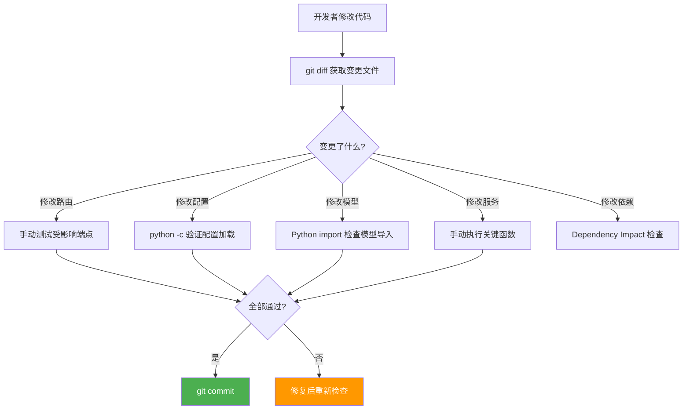

# Test Scene 2 · Pre-Commit Incremental Self-Check

> **问题**: 在提交代码之前，最小化的增量验证是什么？如何确保修改不会破坏已有功能？

---

## §0 · Effect Sketch



**场景概述**: 本场景定义提交前的快速验证策略。基于文件变更类型，执行针对性检查而非全量测试。因为 YiAi 无自动化测试框架，所有检查为命令行的快速验证。

---

## §1 · Test Design

| AC# | 验收标准 | 验证方法 |
|-----|---------|---------|
| AC-2.1 | 能根据 `git diff` 自动判断需要检查的文件类型 | 检查 diff 输出中的路径前缀 |
| AC-2.2 | 修改 routes/ 文件后能列出所影响的具体端点 | 阅读修改的路由文件，列出所有 `@router.method` 装饰的端点 |
| AC-2.3 | 修改 services/ 文件后能验证其导入不破坏其他模块 | `python -c "from services.xxx import yyy"` |
| AC-2.4 | 修改 config.yaml 后能验证配置加载成功 | `python -c "from src.core.config import settings; print('OK')"` |
| AC-2.5 | 提交信息符合规范 | 检查 commit message 格式 |

---

## §2 · Output Inventory

### 2.1 变更分类验证矩阵

| 变更路径 | 变更类型 | 最小验证 | 命令 | 预计耗时 |
|---------|---------|---------|------|---------|
| `src/api/routes/*.py` | 路由变更 | 受影响端点手动测试 | `curl -X METHOD http://localhost:10086/ENDPOINT` | 30s/端点 |
| `src/services/**/*.py` | 业务逻辑 | 包导入验证 + 函数签名检查 | `python -c "from services.X.Y import Z"` | 10s |
| `src/core/config.py` | 配置变更 | 配置加载 + Settings 对象验证 | `python -c "from src.core.config import settings; print(type(settings))"` | 5s |
| `config.yaml` | 配置值变更 | 重新加载配置 | 同上 | 5s |
| `src/models/schemas.py` | 数据模型 | 模型导入 + 实例化验证 | `python -c "from models.schemas import ExecuteRequest; print(ExecuteRequest())"` | 5s |
| `src/core/database.py` | 数据库层 | MongoDB 连接 + CRUD | 启动服务后调用 `/state/records` | 20s |
| `src/core/middleware.py` | 中间件 | X-Token 认证测试 | `curl -H "X-Token: dev-token-change-me" localhost:10086/state/records` | 5s |
| `src/core/observer/*.py` | Observer | 健康检查端点 | `curl localhost:10086/health/observer` | 5s |
| `requirements.txt` | 依赖变更 | 依赖安装 + 启动服务 | `pip install -r requirements.txt && python main.py &` | 60-120s |

### 2.2 快速检查脚本（建议添加）

```bash
#!/bin/bash
# save as: scripts/pre-commit-check.sh

echo "=== YiAi Pre-Commit Check ==="

# 1. 包导入完整性
echo "[1/5] 检查包导入..."
python -c "
from src.core.config import settings
from src.core.database import db
from src.core.exceptions import BusinessException
from src.models.schemas import ExecuteRequest
from src.api.routes import execution, state, upload, wework, maintenance, observer_health, story_panel
print('All imports OK')
"

# 2. 配置加载
echo "[2/5] 检查配置加载..."
python -c "from src.core.config import settings; print(f'Port: {settings.server_port}')"

# 3. Python 语法检查
echo "[3/5] 语法检查..."
python -m py_compile src/main.py && echo "src/main.py OK"

# 4. 检查变更文件中的 TODO / FIXME
echo "[4/5] 检查未完成标记..."
git diff --cached --name-only | xargs grep -n "TODO\|FIXME\|HACK" || echo "No TODO/FIXME found"

# 5. 检查是否有硬编码密钥
echo "[5/5] 检查敏感信息..."
git diff --cached | grep -E "password|secret|token|api_key" && echo "⚠️  WARNING: 可能包含敏感信息" || echo "No sensitive patterns"

echo "=== Pre-Commit Check Complete ==="
```

### 2.3 架构决策

- **按路径分类而非功能分类**: 文件路径比功能标签更客观，避免遗漏。
- **最小化验证原则**: 不是全量回归，而是影响面分析 + 针对性验证。
- **无自动化测试下的务实策略**: 手动验证 + 快速脚本，逐步演进为 pytest。

---

## §3 · Test Report

| AC# | 状态 | 详情 |
|-----|------|------|
| AC-2.1 | ✅ DESIGN | 9 种变更路径的验证策略已定义，覆盖所有 src/ 子目录 |
| AC-2.2 | ✅ DESIGN | 路由文件的 `@router.method` 装饰器可快速定位端点 |
| AC-2.3 | ✅ DESIGN | Python import 检查可验证模块导出的完整性 |
| AC-2.4 | ✅ DESIGN | `settings` 对象导入自动触发 YAML + env 加载 |
| AC-2.5 | ✅ DESIGN | commit message 检查建议已包含在脚本中 |

---

## §4 · Self-Improvement

| 诊断项 | 评估 | 行动 |
|--------|------|------|
| D0 完整性 | ✅ 覆盖所有代码路径类型 | 无需行动 |
| D1 自动化程度 | ⚠️ 脚本需手动运行 | 建议集成 git hook（`.git/hooks/pre-commit`）自动调用 `scripts/pre-commit-check.sh` |
| D2 覆盖深度 | ⚠️ 导入检查不验证运行时行为 | 后续引入 pytest 后可添加更深的单元测试 |
| D3 特殊情况 | ⚠️ `src/core/observer/` 的变更需要服务重启才能验证 | 已在矩阵中标注 |

**当前状态**: 增量检查策略完整实用。建议将脚本集成到 git pre-commit hook。
