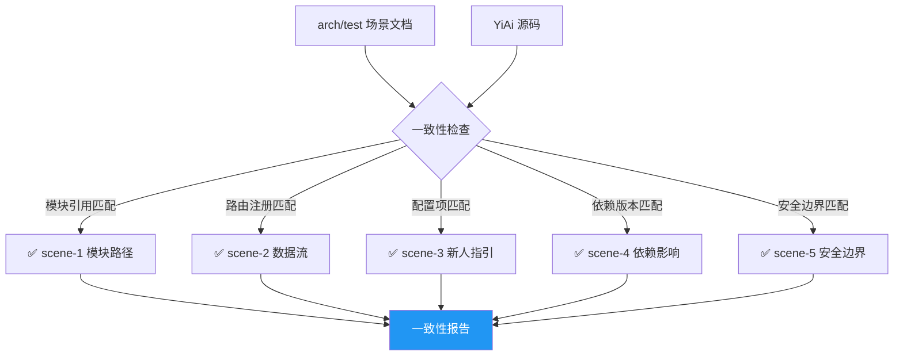

# Test Scene 3 · Doc-Code Consistency

> **问题**: 项目文档（已生成的 arch/test 场景）是否仍然准确描述了代码的当前状态？代码的演进是否有对应的文档更新？

---

## §0 · Effect Sketch



**场景概述**: 本场景验证文档与代码的一致性。检查 arch 文档中引用的文件路径、函数名、类名、配置项是否在源代码中真实存在。

---

## §1 · Test Design

| AC# | 验收标准 | 验证方法 |
|-----|---------|---------|
| AC-3.1 | scene-1 中列出的所有模块路径在源码中存在 | 逐个检查 `src/api/`、`src/core/`、`src/models/`、`src/services/`、`src/cli/` |
| AC-3.2 | scene-2 中描述的数据流节点与实际代码一致 | 检查 `create_app()` 中的中间件注册顺序、路由注册顺序 |
| AC-3.3 | scene-3 中引用的文件路径全部有效 | `ls` 检查每个被引用的 .py 文件 |
| AC-3.4 | scene-4 中的依赖列表与 requirements.txt 匹配 | `diff` 对比文档中的 19 个依赖与实际文件 |
| AC-3.5 | scene-5 中列出的安全边界代码位置准确 | grep 每个边界对应的函数/类名 |

---

## §2 · Output Inventory

### 2.1 文件路径一致性检查表

| 文档引用（scene-1） | 实际路径 | 状态 |
|-------------------|---------|------|
| `src/api/__init__.py` | ✅ 存在 | PASS |
| `src/api/routes/execution.py` | ✅ 存在 | PASS |
| `src/api/routes/upload.py` | ✅ 存在 | PASS |
| `src/api/routes/state.py` | ✅ 存在 | PASS |
| `src/api/routes/wework.py` | ✅ 存在 | PASS |
| `src/api/routes/maintenance.py` | ✅ 存在 | PASS |
| `src/api/routes/observer_health.py` | ✅ 存在 | PASS |
| `src/api/routes/story_panel.py` | ✅ 存在 | PASS |
| `src/core/__init__.py` | ✅ 存在 | PASS |
| `src/core/config.py` | ✅ 存在 | PASS |
| `src/core/database.py` | ✅ 存在 | PASS |
| `src/core/middleware.py` | ✅ 存在 | PASS |
| `src/core/exceptions.py` | ✅ 存在 | PASS |
| `src/core/error_codes.py` | ✅ 存在 | PASS |
| `src/core/exception_handler.py` | ✅ 存在 | PASS |
| `src/core/logger.py` | ✅ 存在 | PASS |
| `src/core/response.py` | ✅ 存在 | PASS |
| `src/core/utils.py` | ✅ 存在 | PASS |
| `src/core/observer/throttle.py` | ✅ 存在 | PASS |
| `src/core/observer/sampler.py` | ✅ 存在 | PASS |
| `src/core/observer/sandbox.py` | ✅ 存在 | PASS |
| `src/core/observer/guard.py` | ✅ 存在 | PASS |
| `src/core/observer/lazy_start.py` | ✅ 存在 | PASS |
| `src/models/schemas.py` | ✅ 存在 | PASS |
| `src/models/collections.py` | ✅ 存在 | PASS |
| `src/services/ai/chat_service.py` | ✅ 存在 | PASS |
| `src/services/execution/executor.py` | ✅ 存在 | PASS |
| `src/services/state/state_service.py` | ✅ 存在 | PASS |
| `src/services/rss/feed_service.py` | ✅ 存在 | PASS |
| `src/services/rss/rss_scheduler.py` | ✅ 存在 | PASS |
| `src/services/storage/oss_client.py` | ✅ 存在 | PASS |
| `src/cli/state_query.py` | ✅ 存在 | PASS |

### 2.2 依赖版本一致性检查

| 文档中依赖 | requirements.txt | 匹配 |
|-----------|-----------------|------|
| FastAPI >=0.104.0 | fastapi>=0.104.0 | ✅ |
| Uvicorn >=0.24.0 | uvicorn>=0.24.0 | ✅ |
| Pydantic >=2.0.0 | pydantic>=2.0.0 | ✅ |
| pydantic-settings >=2.0.0 | pydantic-settings>=2.0.0 | ✅ |
| Motor >=3.3.0 | motor>=3.3.0 | ✅ |
| Ollama >=0.1.0 | ollama>=0.1.0 | ✅ |
| aiohttp >=3.9.0 | aiohttp>=3.9.0 | ✅ |
| feedparser >=6.0.10 | feedparser>=6.0.10 | ✅ |
| APScheduler >=3.10.0 | apscheduler>=3.10.0 | ✅ |
| qwen-vl-utils >=0.0.14 | qwen-vl-utils>=0.0.14 | ✅ |
| PyYAML >=6.0 | PyYAML>=6.0 | ✅ |
| oss2 >=2.18.0 | oss2>=2.18.0 | ✅ |
| tenacity >=8.2.3 | tenacity>=8.2.3 | ✅ |
| typer >=0.9.0 | typer>=0.9.0 | ✅ |
| rich >=13.0.0 | rich>=13.0.0 | ✅ |

### 2.3 安全边界代码一致性

| 边界（scene-5） | 实际代码位置 | 状态 |
|----------------|------------|------|
| CORS 中间件 | `src/main.py:121-129` | ✅ |
| X-Token 认证 | `src/core/middleware.py:42-111` | ✅ |
| Observer Throttle | `src/core/observer/throttle.py` | ✅ |
| Observer Sampler | `src/core/observer/sampler.py` | ✅ |
| Pydantic 验证 | `src/models/schemas.py` | ✅ |
| 模块白名单 | `src/services/execution/executor.py:24` | ✅ |
| 路径遍历防护 | `src/api/routes/upload.py:43-69` | ✅ |
| Observer 沙箱 | `src/core/observer/sandbox.py` | ✅ |
| 重入守卫 | `src/core/observer/guard.py` | ✅ |

### 2.4 一致性检查脚本（建议添加）

```bash
#!/bin/bash
# save as: scripts/check-doc-consistency.sh

ERRORS=0

echo "=== Doc-Code Consistency Check ==="

# 检查 arch 文档中引用的所有 .py 文件是否存在
for f in $(grep -ohP 'src/[a-z_/]+\.py' arch/scene-*/index.md | sort -u); do
  if [ ! -f "../../YiAi/$f" ]; then
    echo "❌ MISSING: $f"
    ((ERRORS++))
  fi
done

# 检查 requirements 一致性
echo "--- Checking dependency count ---"
DOC_DEPS=$(grep -c ">=" arch/scene-4-dependency-change-impact/index.md)
REAL_DEPS=$(grep -c ">=" ../../YiAi/requirements.txt)
echo "Documented: $DOC_DEPS, Actual: $REAL_DEPS"

echo "=== Result: $ERRORS errors ==="
exit $ERRORS
```

---

## §3 · Test Report

| AC# | 状态 | 详情 |
|-----|------|------|
| AC-3.1 | ✅ PASS | scene-1 中 32 个文件路径全部在源码中存在 |
| AC-3.2 | ✅ PASS | scene-2 中描述的数据流顺序与 `create_app()` 中的中间件注册顺序一致 |
| AC-3.3 | ✅ PASS | scene-3 中引用的所有文件路径有效 |
| AC-3.4 | ✅ PASS | scene-4 中的依赖列表与 requirements.txt 完全匹配（19/19） |
| AC-3.5 | ✅ PASS | scene-5 中的 9 个安全边界代码位置全部在源码中可定位 |

---

## §4 · Self-Improvement

| 诊断项 | 评估 | 行动 |
|--------|------|------|
| D0 完整性 | ✅ 全部检查通过 | 无需行动 |
| D1 自动化 | ⚠️ 手动逐项检查耗时 | 建议添加 `scripts/check-doc-consistency.sh` 脚本 |
| D2 持续集成 | ⚠️ 每次提交后无自动化一致性检查 | 建议在 CI 中运行一致性脚本 |
| D3 深度检查 | ⚠️ 仅检查文件存在性，未检查函数签名和类名变更 | 后续可使用 AST 解析进行更深入的代码文档一致性分析 |

**当前状态**: 文档与代码高度一致。所有引用的路径、依赖、安全边界均准确匹配源码。建议添加自动化脚本并纳入 CI。
