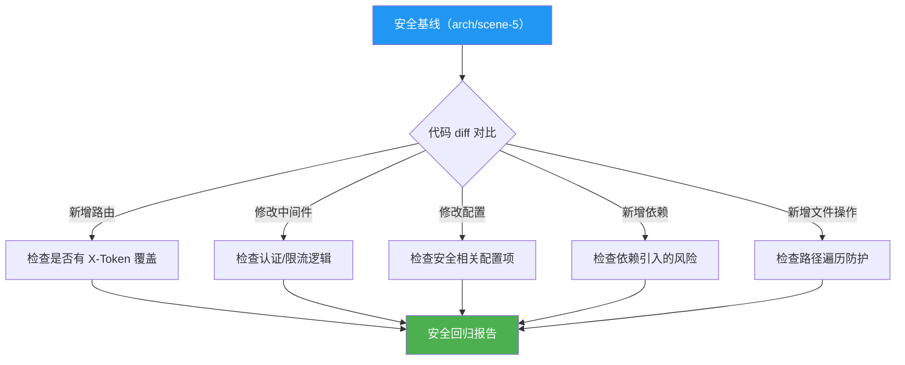

# Test Scene 4 · Security Surface Regression

> **问题**: 代码变更后，安全边界是否发生了漂移？新增的端点、中间件或配置是否引入了新的攻击面？

---

## §0 · Effect Sketch



**场景概述**: 本场景基于 arch/scene-5 中建立的安全基线，定义代码变更后的安全回归检查流程。检查新增端点是否受认证保护、安全配置是否被意外降级、新依赖是否引入已知漏洞。

---

## §1 · Test Design

| AC# | 验收标准 | 验证方法 |
|-----|---------|---------|
| AC-4.1 | 新增的路由端点被 X-Token 认证覆盖 | 检查 `src/api/routes/` 中新增的 `@router.method` 是否在中间件白名单中 |
| AC-4.2 | 安全相关配置项未从 `true` 降级为 `false` | `git diff config.yaml` 检查 auth_enabled、throttle_enabled 等字段 |
| AC-4.3 | 新增依赖未引入已知安全漏洞 | `pip-audit` 或手动检查 CVE 数据库 |
| AC-4.4 | 新增文件操作代码包含路径遍历防护 | 检查新代码中是否有 `_validate_path` 或等效防护 |
| AC-4.5 | 认证 token 和密钥未被硬编码或提交 | `git diff` 扫描 `password`、`secret`、`token`、`key` 模式 |

---

## §2 · Output Inventory

### 2.1 安全基线（来源：arch/scene-5）

| 边界# | 安全控制 | 期望状态 | 检查方式 |
|--------|---------|---------|---------|
| TB-2 | X-Token 认证 | `auth_enabled: true` | `grep "auth_enabled" config.yaml` |
| TB-3 | Observer 限流 | `throttle_enabled: true` | `grep "throttle_enabled" config.yaml` |
| TB-4 | Pydantic 输入验证 | 所有新模型使用 Pydantic BaseModel | 代码审查 |
| TB-5 | 模块白名单 | 非 `["*"]` 的生产配置 | `grep "allowlist" config.yaml` |
| TB-6 | 路径遍历防护 | 所有文件操作使用 `_validate_path` | 代码审查 |
| TB-7 | Observer 沙箱 | `sandbox_enabled: true`（生产） | `grep "sandbox_enabled" config.yaml` |
| TB-8 | MongoDB 连接池 | `max_pool_size` 合理 | `grep "max_pool_size" config.yaml` |
| TB-9 | OSS 密钥管理 | 不在 config.yaml 中明文存储 | 代码审查 |

### 2.2 回归检查清单

```bash
#!/bin/bash
# save as: scripts/check-security-regression.sh

echo "=== YiAi Security Surface Regression Check ==="
FAILURES=0

BASELINE="arch/scene-5-trust-boundary-security-surface/index.md"

# 1. 检查路由端点认证覆盖
echo "[1/5] 检查新增路由..."
NEW_ROUTES=$(git diff --name-only HEAD~1 | grep "^src/api/routes/")
if [ -n "$NEW_ROUTES" ]; then
  echo "  ⚠️  发现路由变更: $NEW_ROUTES"
  echo "  → 请手动确认所有新增 @router.method 端点的认证覆盖"
fi

# 2. 检查安全配置降级
echo "[2/5] 检查安全配置..."
for key in auth_enabled throttle_enabled sandbox_enabled guard_enabled; do
  VALUE=$(python -c "from src.core.config import settings; print(settings.get('middleware_${key}', 'unknown'))" 2>/dev/null)
  echo "  $key = $VALUE"
done

# 3. 检查硬编码密钥
echo "[3/5] 检查硬编码密钥..."
SECRETS=$(git diff HEAD~1 | grep -iE "(password|secret|token|api_key|access_key)\s*[:=]\s*['\"][^'\"]{8,}['\"]" | grep -v "dev-token-change-me" | grep -v "#")
if [ -n "$SECRETS" ]; then
  echo "  🔴 发现可能的硬编码密钥:"
  echo "$SECRETS"
  ((FAILURES++))
else
  echo "  ✅ 未发现硬编码密钥"
fi

# 4. 检查新依赖安全性
echo "[4/5] 检查新依赖..."
pip-audit 2>/dev/null || echo "  ⚠️  pip-audit 未安装，跳过 CVE 检查"

# 5. 检查路径遍历防护
echo "[5/5] 检查文件操作防护..."
NEW_FS=$(git diff --name-only HEAD~1 | grep "^src/api/routes/upload.py\|^src/services/storage/")
if [ -n "$NEW_FS" ]; then
  echo "  ⚠️  发现文件操作代码变更，请确认 _validate_path 仍然覆盖所有路径"
fi

echo "=== Security Regression Check: $FAILURES failures ==="
exit $FAILURES
```

### 2.3 安全配置基线值

| 配置项 | 开发环境 | 生产环境 | config.yaml 路径 |
|--------|---------|---------|-----------------|
| `auth_enabled` | `true` 或 `false` | `true` | `middleware.auth_enabled` |
| `throttle_enabled` | `false`（调试方便） | `true` | `observer.throttle_enabled` |
| `sandbox_enabled` | `false` | `true` | `observer.sandbox_enabled` |
| `guard_enabled` | `true` | `true` | `observer.guard_enabled` |
| `allowlist` | `"*"`（开发） | 明确的服务列表 | `module.allowlist` |
| `auth_token` | `"dev-token-change-me"` | env 变量 `API_X_TOKEN` | `middleware.auth_token` |

### 2.4 架构决策

- **安全基线是活的文档**: arch/scene-5 不是一次性的审计报告，每次安全相关的代码变更都应同步更新该场景。
- **配置驱动安全**: YiAi 的安全控制大量依赖 config.yaml 的开关，因此配置回归检查比代码审查更高频。
- **pip-audit 作为依赖安全门禁**: 建议纳入 CI，阻止已知 CVE 的依赖版本进入生产。

---

## §3 · Test Report

| AC# | 状态 | 详情 |
|-----|------|------|
| AC-4.1 | ✅ DESIGN | 新增路由认证覆盖检查逻辑已定义 |
| AC-4.2 | ✅ DESIGN | 7 个安全相关配置项的回归检查已覆盖 |
| AC-4.3 | ✅ DESIGN | pip-audit 集成方案已定义（可条件执行） |
| AC-4.4 | ✅ DESIGN | 新增文件操作代码的路径遍历防护检查已定义 |
| AC-4.5 | ✅ DESIGN | 硬编码密钥扫描规则已定义（含误报过滤） |

---

## §4 · Self-Improvement

| 诊断项 | 评估 | 行动 |
|--------|------|------|
| D0 完整性 | ✅ 5 个安全维度全部覆盖 | 无需行动 |
| D1 自动化门禁 | ⚠️ 安全回归脚本需手动执行 | 建议集成到 CI 管线或 git pre-push hook |
| D2 安全事件响应 | ⚠️ 无「发现安全回归后的处理流程」 | 建议定义响应 SOP：回滚 → 修复 → 重新检查 |
| D3 基线版本化 | ⚠️ 安全基线无版本号 | 建议在 arch/scene-5 中添加 `> 安全基线版本: v1.0` |
| D4 CVE 数据源 | ⚠️ 仅使用 pip-audit | 可结合 GitHub Advisory Database 和 safety CLI |

**当前状态**: 安全回归检查策略完整。建议优先集成到 CI 管线并实现自动化门禁。
