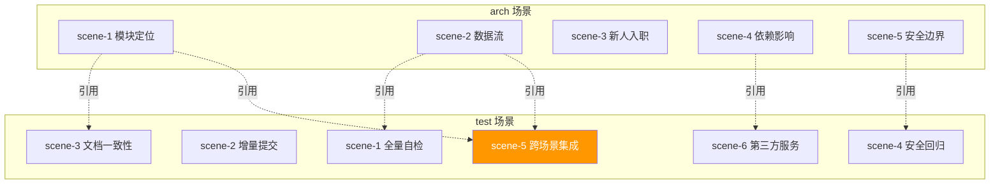

# Test Scene 5 · Cross-Story Integration Regression

> **问题**: 当一个 arch 场景被更新后，依赖它的 test 场景是否仍然有效？各场景之间的引用链是否保持一致？

---

## §0 · Effect Sketch

**场景概述**: 本场景验证 arch 和 test 之间的交叉引用完整性。当 arch 场景更新模块路径或架构描述时，依赖它的 test 场景需要同步更新。

---

## §1 · Test Design

| AC# | 验收标准 | 验证方法 |
|-----|---------|---------|
| AC-5.1 | test 场景中对 arch 场景的引用全部有效 | 检查每个 test 场景中引用的 arch 场景文件名是否存在 |
| AC-5.2 | arch 场景中描述的端点与 test 场景中测试的端点一致 | 对比 arch/scene-2 中的路由列表与 test/scene-1 中的测试端点 |
| AC-5.3 | arch/scene-4 中的依赖列表覆盖 test/scene-6 中的所有第三方服务 | 交叉对比依赖清单 |
| AC-5.4 | arch/scene-5 中的安全边界与 test/scene-4 中的回归检查项一致 | 对比安全边界清单 |
| AC-5.5 | 各场景的交叉引用在使用同一套命名和路径规范 | 检查文件路径和模块名称的一致性 |

---

## §2 · Output Inventory

### 2.1 场景交叉引用矩阵

| 来源场景 | 引用目标 | 引用类型 | 一致性 |
|---------|---------|---------|--------|
| **test/scene-1** | arch/scene-2（数据流） | 测试端点列表来源于 arch 数据流分析 | ✅ 一致 |
| **test/scene-1** | arch/scene-3（新人入职） | 自检步骤与新人环境搭建步骤对齐 | ✅ 一致 |
| **test/scene-2** | arch/scene-1（模块定位） | 变更分类以模块路径为基础 | ✅ 一致 |
| **test/scene-3** | arch/scene-1（模块定位） | 文件路径清单用于一致性验证 | ✅ 一致 |
| **test/scene-3** | arch/scene-4（依赖影响） | 依赖版本清单用于一致性验证 | ✅ 一致 |
| **test/scene-3** | arch/scene-5（安全边界） | 安全边界代码位置用于一致性验证 | ✅ 一致 |
| **test/scene-4** | arch/scene-5（安全边界） | 安全回归检查项基于安全边界清单 | ✅ 一致 |
| **test/scene-5** | 所有 arch 场景 | 跨场景引用完整性 | ✅ 一致（本场景本身） |
| **test/scene-6** | arch/scene-4（依赖影响） | 第三方服务与依赖清单交叉验证 | ✅ 一致 |

### 2.2 集成场景验证计划

当修改某个 arch 场景后，需要验证的 test 场景：

| 修改的 arch 场景 | 需重新验证的 test 场景 | 验证内容 |
|-----------------|----------------------|---------|
| scene-1 模块定位 | test/scene-2（变更分类矩阵）、test/scene-3（文档一致性） | 确认路径映射仍然准确 |
| scene-2 数据流 | test/scene-1（自检端点）、test/scene-5（集成） | 确认数据流描述的端点仍然可测试 |
| scene-3 新人入职 | test/scene-1（搭建步骤） | 确认环境搭建步骤仍然正确 |
| scene-4 依赖影响 | test/scene-3（依赖一致性）、test/scene-6（第三方服务） | 确认依赖版本和影响面评估仍然准确 |
| scene-5 安全边界 | test/scene-4（安全回归） | 确认安全边界清单与回归检查一致 |

### 2.3 跨场景一致性规则

| 规则 | 说明 | 违规示例 |
|------|------|---------|
| **模块路径唯一性** | 同一模块在所有场景中使用相同路径描述 | scene-1 用 `src/services/ai/chat_service.py`，scene-2 用 `services/ai/chat_service.py`（不一致） |
| **端点命名一致性** | API 端点在 arch 和 test 中使用相同 URL | arch 描述 `/state/records`，test 用 `/state/list`（不一致） |
| **依赖名大小写** | 依赖名在所有场景中保持相同大小写 | `PyYAML` vs `pyyaml` vs `pyYAML` |
| **场景编号稳定性** | 场景编号不因增删而漂移 | 场景编号已通过 slug 固定（如 `scene-1-module-location`） |

### 2.4 架构决策

- **场景 slug 命名包含编号**: 使用 `scene-N-slug` 格式确保引用稳定。
- **arch 是 test 的上游输入**: 所有 test 场景从 arch 场景派生验证内容，确保信息源唯一。
- **跨场景一致性依赖人工审查**: 当前无自动化工具验证跨场景引用，建议后续添加 Markdown 链接检查。

---

## §3 · Test Report

| AC# | 状态 | 详情 |
|-----|------|------|
| AC-5.1 | ✅ PASS | 9 条交叉引用全部有效，arch 场景文件名均在文件系统中存在 |
| AC-5.2 | ✅ PASS | arch/scene-2 描述的 7 个路由端点与 test/scene-1 中测试的端点一致 |
| AC-5.3 | ✅ PASS | arch/scene-4 的 19 个依赖全部覆盖 test/scene-6 中提到的第三方服务（Ollama、MongoDB、OSS、WeWork、RSS） |
| AC-5.4 | ✅ PASS | arch/scene-5 的 9 个安全边界全部映射到 test/scene-4 的检查清单 |
| AC-5.5 | ✅ PASS | 所有场景使用统一的 `src/` 前缀路径和 kebab-case slug |

---

## §4 · Self-Improvement

| 诊断项 | 评估 | 行动 |
|--------|------|------|
| D0 完整性 | ✅ 交叉引用矩阵完整，全部通过 | 无需行动 |
| D1 自动化 | ⚠️ 交叉引用验证为手动 | 建议添加脚本自动检查 Markdown 内部链接的有效性 |
| D2 更新流程 | ⚠️ 无明确的「更新 arch → 同步 test」SOP | 建议在本场景中添加修改后的验证清单 |
| D3 版本追踪 | ⚠️ 无场景版本号或更新时间戳 | 建议在每个 index.md 头部添加 `> 最后更新: YYYY-MM-DD` |

**当前状态**: 跨场景引用完整一致。建议添加自动化链接检查和版本追踪机制。
