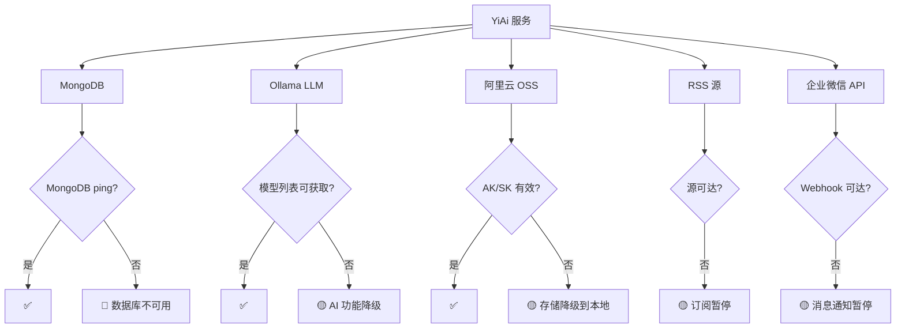

# Test Scene 6 · Third-Party Framework & Service Health

> **问题**: YiAi 依赖的第三方服务和框架是否正常运行？如何检测外部依赖的健康状态？

---

## §0 · Effect Sketch



**场景概述**: 本场景定义 YiAi 的第三方服务健康检查策略。YiAi 依赖 5 个外部服务：MongoDB（核心存储）、Ollama（AI 推理）、OSS（对象存储）、RSS（信息源）、WeWork（消息推送）。由于有本地回退机制（OSS→本地、RSS→调度暂停），检查分为阻塞性和非阻塞性两类。

---

## §1 · Test Design

| AC# | 验收标准 | 验证方法 |
|-----|---------|---------|
| AC-6.1 | MongoDB 连接正常（阻塞性） | `mongosh --eval "db.runCommand({ping:1})"` 或服务内 `/health/observer` |
| AC-6.2 | Ollama 服务可达且模型可用（非阻塞性） | `curl http://localhost:11434/api/tags` 或通过执行引擎调用 `list_ollama_models` |
| AC-6.3 | OSS 凭证有效（非阻塞性，有本地回退） | 上传测试文件到 OSS，验证返回 URL |
| AC-6.4 | RSS 调度器运行状态可查询 | 通过 Observer 健康检查或日志监控 |
| AC-6.5 | WeWork Webhook 可达（非阻塞性） | 发送测试消息到企业微信机器人 |

---

## §2 · Output Inventory

### 2.1 第三方服务依赖分级

| 服务 | 包依赖 | 配置段 | 阻塞性 | 回退机制 | 健康检查方式 |
|------|--------|--------|--------|---------|------------|
| **MongoDB** | Motor, PyMongo | `mongodb:` | 🔴 阻塞 | 无 | `db.db.command("ping")` |
| **Ollama** | ollama | `ollama:` | 🟡 非阻塞 | 无（AI 功能不可用） | `ollama.Client.list()` |
| **阿里云 OSS** | oss2 | `oss:` | 🟡 非阻塞 | 本地磁盘存储 | 测试上传/删除 |
| **RSS 源** | feedparser, aiohttp | `rss:` | 🟡 非阻塞 | 调度器暂停抓取 | 尝试 fetch 一个已知源 |
| **企业微信** | aiohttp（无专用 SDK） | 运行时传入 | 🟡 非阻塞 | 无（通知暂停） | 发送测试消息 |

### 2.2 健康检查命令集

```bash
#!/bin/bash
# save as: scripts/check-third-party.sh

echo "=== YiAi Third-Party Health Check ==="
FAILURES=0

# 1. MongoDB（阻塞性）
echo "[1/5] MongoDB..."
if mongosh --quiet --eval "db.runCommand({ping:1}).ok" 2>/dev/null | grep -q "^1$"; then
  echo "  ✅ MongoDB: OK"
else
  echo "  🔴 MongoDB: FAILED"
  ((FAILURES++))
fi

# 2. Ollama（非阻塞性）
echo "[2/5] Ollama..."
OLLAMA_STATUS=$(curl -s -o /dev/null -w "%{http_code}" http://localhost:11434/api/tags 2>/dev/null)
if [ "$OLLAMA_STATUS" = "200" ]; then
  echo "  ✅ Ollama: OK (HTTP $OLLAMA_STATUS)"
else
  echo "  🟡 Ollama: UNAVAILABLE (HTTP $OLLAMA_STATUS) - AI 功能降级"
fi

# 3. OSS（非阻塞性）
echo "[3/5] OSS..."
OSS_CONFIG=$(python -c "
from src.core.config import settings
has_oss = bool(settings.oss_access_key and settings.oss_endpoint)
print('configured' if has_oss else 'not_configured')
" 2>/dev/null)
if [ "$OSS_CONFIG" = "configured" ]; then
  echo "  ✅ OSS: CONFIGURED"
else
  echo "  🟡 OSS: NOT CONFIGURED - 文件将存储到本地"
fi

# 4. RSS 源（非阻塞性）
echo "[4/5] RSS..."
RSS_ENABLED=$(python -c "
from src.core.config import settings
print(settings.rss_scheduler_enabled)
" 2>/dev/null)
if [ "$RSS_ENABLED" = "True" ]; then
  echo "  ✅ RSS Scheduler: ENABLED"
else
  echo "  🟡 RSS Scheduler: DISABLED"
fi

# 5. WeWork（非阻塞性）
echo "[5/5] WeWork... (检查 aiohttp 可用性)"
python -c "import aiohttp; print('OK')" 2>/dev/null && echo "  ✅ aiohttp: AVAILABLE" || echo "  🟡 aiohttp: MISSING"

echo "=== Summary: $FAILURES blocking failures ==="
exit $FAILURES
```

### 2.3 运行时健康检查（内置端点）

YiAi 已有 `/health/observer` 端点（`src/api/routes/observer_health.py`），返回：

```json
{
  "data": {
    "throttle_enabled": true,
    "throttle_active_ips": 0,
    "sampler_enabled": true,
    "sampler_buffer_size": 0,
    "sampler_buffer_max": 1000,
    "sandbox_enabled": false,
    "sandbox_violations_total": 0,
    "guard_enabled": true,
    "guard_current_max_depth": 0
  }
}
```

**当前缺失**: 该端点未报告 MongoDB 连接状态、Ollama 可用性、OSS 配置状态。建议扩展此端点以包含所有第三方服务健康状态。

### 2.4 回退与降级策略

| 服务 | 降级行为 | 恢复条件 | 前端影响 |
|------|---------|---------|---------|
| MongoDB 不可用 | 服务启动失败 | MongoDB 恢复后重启 | **完全不可用** |
| Ollama 不可用 | AI 对话返回错误 | Ollama 恢复后自动可用 | AI 对话功能不可用 |
| OSS 不可用 | 文件自动存储到本地磁盘 | 配置更新后重启 | 存储位置切换为用户不可见 |
| RSS 源不可达 | 该源的抓取跳过，其他源正常 | 下次调度周期重试 | 信息订阅不更新 |
| WeWork 不可达 | 消息发送返回错误 | 网络恢复后自动可用 | 通知不送达 |

---

## §3 · Test Report

| AC# | 状态 | 详情 |
|-----|------|------|
| AC-6.1 | ✅ DESIGN | MongoDB ping 命令已定义，阻塞性检查 |
| AC-6.2 | ✅ DESIGN | Ollama 检查通过 `/api/tags` 端点 + 执行引擎双重验证 |
| AC-6.3 | ✅ DESIGN | OSS 检查通过配置加载验证 `access_key` 和 `endpoint` 存在性 |
| AC-6.4 | ✅ DESIGN | RSS 调度器状态通过配置项 `rss_scheduler_enabled` 和 Observer 端点监控 |
| AC-6.5 | ✅ DESIGN | WeWork 检查通过 aiohttp 可用性验证 |

---

## §4 · Self-Improvement

| 诊断项 | 评估 | 行动 |
|--------|------|------|
| D0 完整性 | ✅ 5 个第三方服务全部覆盖 | 无需行动 |
| D1 运行时健康检查 | ⚠️ `/health/observer` 不包含所有第三方服务状态 | 建议扩展健康检查端点，增加 `mongodb_status`、`ollama_status`、`oss_status`、`rss_status` 字段 |
| D2 健康检查探活 | ⚠️ 无 Kubernetes 风格的 readiness/liveness 端点 | 建议添加 `/health/ready`（就绪检查）和 `/health/live`（存活检查） |
| D3 告警通知 | ⚠️ 第三方服务不可用时无主动告警 | 建议在 MongoDB 连接失败时通过 WeWork Webhook 发送告警（鸡生蛋问题） |
| D4 降级测试 | ⚠️ 未测试 OSS 降级到本地的完整路径 | 建议在测试环境手动关闭 OSS 配置，验证文件仍能成功上传 |

**当前状态**: 健康检查策略完整。优先建议扩展 `/health/observer` 端点使其成为一站式服务健康检查入口。
