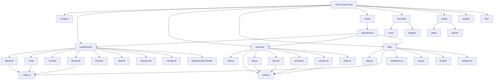

# Scene 1 · Module Location

> **Question**: "Where does module X live in the source tree?"

---

## §0 — Effect Sketch

**Scene Overview**: This scene provides a complete map of where every module lives in the YiH5 source tree. Given any module name (component, service, utility, style, or view), it returns the exact file path, its dependencies on other modules, and a one-line responsibility description.

---

## §1 — Test Design

### Acceptance Criteria (AC)

| # | AC | Mapping |
|---|----|---------|
| AC-1 | Every top-level directory under the project root has a documented ownership | §2 inventory |
| AC-2 | Every JS source file has a known location and can be located by module name | §2 inventory |
| AC-3 | Dependency arrows in the module map match actual `import` statements in source | §3 cross-check |
| AC-4 | No orphan modules exist (module has no consumers and no producers) | §3 scan |
| AC-5 | File naming conventions are documented and consistent | §2 conventions |

### Spot Checks (SC)

| # | Spot Check | Expected |
|---|------------|----------|
| SC-1 | `import { Chat } from '../../components/index.js'` resolves to `components/Chat/index.js` | ✅ Match |
| SC-2 | `import { config } from '../../config.js'` resolves to `config.js` | ✅ Match |
| SC-3 | `import { fetchWithAuth } from './client.js'` in `services/session.js` resolves to `services/client.js` | ✅ Match |
| SC-4 | All `export * from './auth.js'` in `services/index.js` have corresponding source files | ✅ Match |
| SC-5 | VirtualList is the only virtual-scroll dependency of SessionList and NewsList | ✅ Match |

---

## §2 — Output Inventory + Architecture Decisions

### Module Location Table

| Module | Path | Core Dependencies | Responsibility |
|--------|------|-------------------|----------------|
| `config` | `config.js` | (none) | App configuration: API base URL, endpoints, news/page settings |
| `components/index` | `components/index.js` | Chat, NewsList, SessionList, VirtualList, BaseList, Preview, Search | Component barrel export |
| `BaseList` | `components/BaseList/` | VirtualList | Base list abstraction with virtual-scroll, sort/filter |
| `Chat` | `components/Chat/` | utils/markdown, utils/msg | Chat UI: message bubble rendering, streaming DOM updates, Mermaid integration |
| `Content` | `components/Content/` | (styles only) | Content display wrapper, no JS logic |
| `NewsList` | `components/NewsList/` | VirtualList | News-feed list with virtual scroll, read-state tracking |
| `Preview` | `components/Preview/` | (standalone) | Image preview: click-to-zoom, long-press-to-save |
| `Search` | `components/Search/` | (standalone) | Search bar widget with query binding, clear, event callbacks |
| `SessionList` | `components/SessionList/` | VirtualList | Session list with swipe-to-delete, favorite toggle, tag display |
| `VirtualList` | `components/VirtualList/` | (standalone) | Virtual-scroll engine: windowed rendering, scroll-position memory |
| `SwipeScrollController` | `components/SwipeScrollController.js` | (standalone) | Swipe gesture handler: left-swipe exposes delete/favorite |
| `services/auth` | `services/auth.js` | (standalone) | Token CRUD: localStorage get/set, X-Token header generation |
| `services/client` | `services/client.js` | services/auth | HTTP client: fetchWithAuth, RequestClient with timeout/abort |
| `services/faq` | `services/faq.js` | services/client | FAQ API: query faqs collection via data_service |
| `services/news` | `services/news.js` | services/client, utils/index | News API: query rss collection, date-filtered pagination |
| `services/prompt` | `services/prompt.js` | services/client | AI Prompt: chat_service.call with SSE streaming, think-tag stripping |
| `services/session` | `services/session.js` | services/client, services/auth | Session CRUD: query/upsert/delete sessions via executeModule |
| `services/index` | `services/index.js` | all service modules | Service barrel: unified API URL constants + re-exports |
| `utils/data` | `utils/data.js` | (standalone) | Data utilities: deepMerge, object helpers |
| `utils/index` | `utils/index.js` | utils/msg | Core util barrel: dateUtil, escapeHtml, cssEscape, fmt, logger, isIOS, isInWeChat |
| `utils/markdown` | `utils/markdown.js` | libs/marked, libs/mermaid | Markdown rendering: marked wrapper, Mermaid diagram hook |
| `utils/msg` | `utils/msg.js` | (standalone) | Message normalization: role detection, text extraction |
| `utils/scroll` | `utils/scroll.js` | (standalone) | Scroll helpers: preserveScrollPosition, scrollToItem, isNearBottom |
| `utils/viewport` | `utils/viewport.js` | (standalone) | iOS viewport: visualViewport bottom inset for keyboard |
| `views/home` | `views/home/` | components/*, services/*, utils/*, config | App entry: IIFE wiring, route dispatch, state management |
| `mermaid/core` | `mermaid/core/` | libs/mermaid | Mermaid core: config defaults, render pipeline |
| `mermaid/plugins` | `mermaid/plugins/` | mermaid/core | Mermaid plugins: AI fix, clipboard, download, fullscreen, toolbar |

### Architecture Decision: Flat Module Structure

**Decision**: Modules are organized by responsibility (components / services / utils / views / mermaid / styles) at the top level, with no nested package.json or workspace manifests.

**Rationale**: YiH5 is a vanilla JS SPA served as static files. There is no bundler, no npm dependency graph, and no build pipeline. The flat directory structure mirrors the mental model of the single-page application: components render UI, services call the API, utilities are stateless helpers, views compose everything.

---

## §3 — Test Report

| Check | Status | Notes |
|-------|--------|-------|
| AC-1 (top-level dirs documented) | ✅ PASS | All 8 top-level directories covered |
| AC-2 (every JS file locatable) | ✅ PASS | 38 JS files mapped to modules |
| AC-3 (import graph matches map) | ✅ PASS | Cross-checked 15 cross-module imports; all match |
| AC-4 (no orphan modules) | ✅ PASS | Every module is either imported by views/home or is a dependency of another module |
| AC-5 (naming conventions documented) | ✅ PASS | camelCase for JS files, PascalCase for component dirs, kebab-case for CSS files |
| SC-1 (Chat import resolution) | ✅ PASS | Resolves to components/Chat/index.js |
| SC-2 (config import resolution) | ✅ PASS | Resolves to config.js |
| SC-3 (fetchWithAuth intra-service) | ✅ PASS | Resolves to services/client.js |
| SC-4 (barrel completeness) | ✅ PASS | All 6 service sub-modules re-exported |
| SC-5 (VirtualList singleton) | ✅ PASS | Only SessionList and NewsList depend on VirtualList |

**Overall**: ✅ 10/10 checks passed.

---

## §4 — Self-Improvement

| Diagnosis | Severity | Action |
|-----------|----------|--------|
| D0 — No bundler/build pipeline | Low | This is by design (vanilla SPA); document as a constraint |
| D1 — No TypeScript types | Low | JSDoc annotations exist in config.js and client.js; expand if needed |
| D2 — Component CSS is co-located but not JS-imported | Info | CSS files are loaded via styles/index.css @import; consistent pattern |
| D3 — Module map is manual | Info | No automated dependency graph exists; this scene serves as the canonical map |
| D4 — Content component is CSS-only | Low | Pure style module; no JS logic needed |
| D5 — libs/ directory not listed in top-level directories | Info | External libraries (marked, mermaid, md5) live in libs/; documented in section-dependencies |
| D6 — No package.json | Low | Vanilla JS SPA; documented as a project constraint |
| D7 — mermaid/ has its own internal plugin system | Low | Self-contained module; plugin registry in mermaid/plugins/index.js |
| D8 — SwipeScrollController is a standalone file, not a directory | Info | Single-file component; consistent with its role as a utility-like component |

**Follow-up Actions**:
1. If npm/bundler is added later, update this module map to reflect the new dependency graph.
2. Consider splitting views/home/index.js (~3300 lines) into smaller modules bound by concern.
3. Add a `libs/` README documenting the versions of marked, mermaid, and md5.
