# Scene 1 · Module Location

> **Question**: "Where does module X live in the source tree?"

---

## §0 — Effect Sketch

```mermaid
graph TD
    ROOT["YiH5/ (source root)"] --> CONFIG["config.js"]
    ROOT --> SHELL["index.html"]
    ROOT --> ASSETS["assets/"]
    ROOT --> SRC["src/"]
    SRC --> ENTRY["main.js"]
    SRC --> APP["App/"]
    SRC --> COMP["components/"]
    SRC --> VIEWS["views/"]
    SRC --> SVC["services/"]
    SRC --> COMP2["composables/"]
    SRC --> UTIL["utils/"]
    SRC --> STORE["store/index.js"]
    SRC --> ROUTER["router/index.js"]
    SRC --> STYLES["styles/style.css"]

    COMP --> C1["FilterBar"]
    COMP --> C2["ChatMessage"]
    COMP --> C3["AppFooter"]
    COMP --> C4["FaqPopup"]

    VIEWS --> V1["ChatView"]
    VIEWS --> V2["SessionList"]
    VIEWS --> V3["NewsList"]

    SVC --> S1["client.js"]
    SVC --> S2["auth.js"]
    SVC --> S3["faq.js"]
    SVC --> S4["news.js"]
    SVC --> S5["prompt.js"]
    SVC --> S6["session.js"]
    SVC --> S7["index.js (barrel)"]

    COMP2 --> CO1["useChat.js"]
    COMP2 --> CO2["useListPage.js"]

    UTIL --> U1["defineView.js"]
    UTIL --> U2["time.js"]
```

**What this scene demonstrates**: A reader can locate any module in the
H5 source tree (`/Users/ruiyi/Downloads/YrY/YiH5/`) in O(1) by
recognizing the responsibility-based directory grouping under `src/`.

**Why it matters**: New contributors waste their first 20 minutes
grep-ing for "where is X defined?". The 1:1 mapping between directory
name and responsibility (components → UI, views → pages, services →
API, composables → reusable state, utils → pure helpers) collapses
that search to a single `ls`.

---

## §1 Test Design — Verification Steps

### Step 1: Entry location
**Action**: `cat /Users/ruiyi/Downloads/YrY/YiH5/src/main.js`
**Expected**: ES-module entry that imports `App`, mounts `#app` with
Vue 3.
**File**: `src/main.js`

### Step 2: Service barrel location
**Action**: `cat /Users/ruiyi/Downloads/YrY/YiH5/src/services/index.js`
**Expected**: Re-exports `API_BASE`, `fetchWithAuth`,
`executeModule`, `extractList`, and the per-domain services (auth /
faq / news / prompt / session).
**File**: `src/services/index.js`

### Step 3: Component → View separation
**Action**: `ls src/components/ src/views/`
**Expected**: 4 components (FilterBar, ChatMessage, AppFooter,
FaqPopup) and 3 views (ChatView, SessionList, NewsList) — components
are presentational, views are route-bound.

---

## §2 Output Inventory

| File/Directory | Type | Description |
|---------------|------|-------------|
| `src/main.js` | file | ES-module entry — imports App, mounts Vue 3 on `#app` |
| `src/App/` | dir | Root app shell — `index.html` template + `index.js` logic |
| `src/components/` | dir | 4 presentational components (FilterBar, ChatMessage, AppFooter, FaqPopup) |
| `src/views/` | dir | 3 route-bound views (ChatView, SessionList, NewsList) |
| `src/services/` | dir | 7 API modules (client, auth, faq, news, prompt, session, index barrel) |
| `src/composables/` | dir | 2 stateful composables (useChat, useListPage) |
| `src/utils/` | dir | 2 pure helpers (defineView, time) |
| `src/store/index.js` | file | Global reactive store (session/news/filter/chat state) |
| `src/router/index.js` | file | Hash-based router (route table + view switch) |
| `src/styles/style.css` | file | Global stylesheet (layout / typography / theme) |
| `config.js` | file | App config (apiBase / endpoints / ui) |
| `index.html` | file | HTML shell (#app mount + viewport meta) |

---

## §3 Test Report — 2026-07-24

| Step | Result | Notes |
|------|:---:|-------|
| 1 | ✅ | `main.js` confirmed as ES-module entry |
| 2 | ✅ | `services/index.js` re-exports the documented surface |
| 3 | ✅ | 4 components + 3 views present |

**Overall**: pass — 3/3 steps passed

---

## §4 Self-Improvement

### Edge Cases Found
- The barrel `src/services/index.js` aggregates exports; importing
  directly from `src/services/auth.js` bypasses the barrel and can
  desync if the barrel is updated.
- `src/App/index.js` fetches its own template via `import.meta.url`
  — without a bundler, the file must be served over HTTP (not
  `file://`).

### Suggested Improvements
- Add a `src/components/index.js` barrel for symmetry with services.
- Move `config.js` under `src/` so all source is colocated.

### Limitations
- Module-location knowledge is based on the current refactor; if the
  tree is reorganized, this scene must be regenerated.
