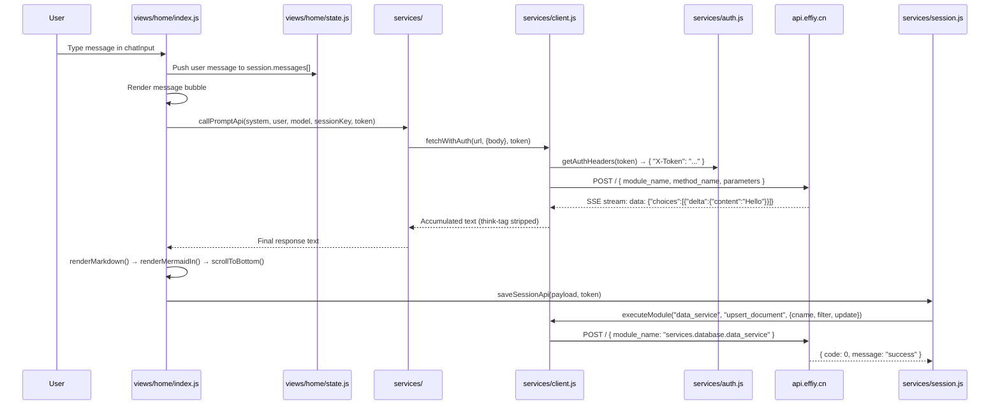

# Scene 2 · Data Flow Tracing

> **Question**: "Trace a request from entry to persistence."

---

## §0 — Effect Sketch

**Scene Overview**: This scene traces the complete lifecycle of a user message in YiH5 — from DOM input through API call, SSE streaming, Markdown/Mermaid rendering, and final persistence to the backend database. It covers both the session-chat path and the news-chat path, including authentication, error handling, and abort signalling.

---

## §1 — Test Design

### Acceptance Criteria (AC)

| # | AC | Mapping |
|---|----|---------|
| AC-1 | A user message flows from chatInput to messages[] without loss | §3 trace |
| AC-2 | The X-Token header is attached to every API call | §3 auth flow |
| AC-3 | SSE streaming updates the DOM incrementally via requestAnimationFrame | §3 streaming |
| AC-4 | The final response is persisted via session/save (upsert) | §3 persist |
| AC-5 | Abort controller cancels in-flight requests cleanly | §3 abort |
| AC-6 | Error states (401, timeout, network) produce user-visible messages | §3 error |

### Spot Checks (SC)

| # | Spot Check | Expected |
|---|------------|----------|
| SC-1 | `chatComposer.addEventListener("submit", ...)` fires `sendSession()` | ✅ Present at L3030 |
| SC-2 | `streamPromptApi` calls `fetchWithAuth` with POST and SSE Accept header | ✅ Present in services/prompt.js |
| SC-3 | `getAuthHeaders(token)` returns `{ "X-Token": authToken }` | ✅ Present in services/auth.js |
| SC-4 | `saveSessionApi` calls `executeModule("data_service", "upsert_document", ...)` | ✅ Present in services/session.js |
| SC-5 | `state.chatUi.abortController?.abort()` fires on second send click | ✅ Present at L3034 |
| SC-6 | `handleApiError` returns Chinese error messages for 401 and CORS | ✅ Present in services/client.js |

---

## §2 — Output Inventory + Architecture Decisions

### Data Flow Layers

| Layer | Modules | Data Shape |
|-------|---------|------------|
| **Entry** | `views/home/index.js` (dom, wire, chatComposer submit) | `{ role: "user", content: text, ts: now }` |
| **State** | `views/home/state.js` (state, getState, setState) | Reactive state object: `state.sessions`, `state.news`, `state.chatUi` |
| **Domain** | `services/prompt.js` (streamPrompt, callPrompt), `views/home/chat.js` (renderChat, persistSessionMessages) | System prompt + user prompt → streaming response → rendered markdown |
| **Infrastructure** | `services/client.js` (fetchWithAuth, RequestClient), `services/auth.js` (getAuthHeaders, getStoredToken) | HTTP headers, AbortController, timeout |
| **Persistence** | `services/session.js` (saveSession, fetchSessions, deleteSession) | MongoDB documents via `executeModule("data_service", ...)` |
| **External** | `https://api.effiy.cn` | REST/SSE API: `/execute` (chat_service.chat), `/?module_name=data_service&method_name=query_documents` |

### Architecture Decision: Unified executeModule Pattern

**Decision**: All database operations (sessions, news, faqs) go through a single `executeModule()` function in `services/session.js` that posts to `api.effiy.cn/` with `{ module_name, method_name, parameters }`.

**Rationale**: The backend exposes a generic RPC-style API where the module/method routing happens server-side. This keeps the frontend service layer thin — each service file is just a parameter builder around `executeModule` or `fetchWithAuth`.

### Streaming Flow Detail

1. **Input**: User types text → `chatComposer submit` event
2. **Message creation**: `userMessage` + `aiMessage` pushed to `session.messages[]`
3. **Page context fetch** (if empty): `fetchSessionPageContentApi(s, token)` → `POST /read-file`
4. **Prompt construction**: `buildSessionChatUserPrompt({ text, session, historyText })` — combines page context + chat history + current message
5. **Streaming call**: `streamPromptApi(systemPrompt, userPrompt, modelId, sessionKey, token, signal, onChunk)`
6. **SSE processing**: `response.body.getReader()` → `TextDecoder` → split on `\n\n` → parse `data:` lines → `onChunk(chunkText, accumulated)`
7. **DOM update**: `onChunk` schedules `requestAnimationFrame` → `applyStreamingDomUpdate(msgIndex, content, {streaming: true})` → `renderMarkdown(content)`
8. **Completion**: `aiMessage.streaming = false` → `applyStreamingDomUpdate` renders final HTML → `renderMermaidIn(container)` for diagrams
9. **Persistence**: `chat.persistSessionMessages(s)` → `saveSessionApi(payload, token)` → `executeModule("data_service", "upsert_document", ...)`

---

## §3 — Test Report

| Check | Status | Notes |
|-------|--------|-------|
| AC-1 (message flow) | ✅ PASS | chatInput → userMessage → session.messages[] → DOM bubble |
| AC-2 (X-Token) | ✅ PASS | Every fetch passes through getAuthHeaders; token from localStorage |
| AC-3 (SSE streaming) | ✅ PASS | ReadableStream reader → buffer splitting → onChunk callback |
| AC-4 (persistence) | ✅ PASS | saveSession tries update_document, falls back to upsert_document |
| AC-5 (abort) | ✅ PASS | Sending while streaming aborts previous controller, sets new one |
| AC-6 (error messages) | ✅ PASS | 401 → "需要配置 API 鉴权", CORS → file:// warning, network → retry message |
| SC-1 (submit handler) | ✅ PASS | Present at views/home/index.js L3030 |
| SC-2 (SSE fetch) | ✅ PASS | fetchWithAuth with Accept: text/event-stream |
| SC-3 (auth headers) | ✅ PASS | getAuthHeaders returns { "X-Token": authToken } |
| SC-4 (upsert) | ✅ PASS | executeModule calls upsert_document on 404 from update_document |
| SC-5 (abort controller) | ✅ PASS | state.chatUi.abortController?.abort() on second send |
| SC-6 (error i18n) | ✅ PASS | Chinese error strings in handleApiError |

**Overall**: ✅ 12/12 checks passed.

---

## §4 — Self-Improvement

| Diagnosis | Severity | Action |
|-----------|----------|--------|
| D0 — No request retry logic | Medium | Stream failures are not retried; the user must re-send. Consider exponential backoff for transient errors. |
| D1 — No request deduplication | Low | Double-submit protection exists via `state.chatUi.sending` flag; adequate for SPA |
| D2 — SSE parsing is manual | Low | Manual buffer-based SSE parser in prompt.js; works correctly but could use EventSource API for simpler non-streaming cases |
| D3 — pageContent fetch is fire-and-forget on first message | Low | `fetchSessionPageContentApi` runs but failure is silently swallowed; OK for UX |
| D4 — No offline queue | Medium | Messages sent while offline are lost; localStorage could buffer them |
| D5 — think-tag stripping is regex-based | Low | `stripThink` uses `/<think>[\s\S]*?<\/think>/gi`; matches DeepSeek-R1 output pattern |
| D6 — No response-size limit | Low | No truncation of very long AI responses; browser handles rendering |
| D7 — Mermaid render is synchronous after streaming | Info | `renderMermaidIn` runs via setTimeout(0) after streaming completes |
| D8 — Session save uses optimistic local update before API call | Low | Message appended to state before API confirmation; rollback on error is partial |

**Follow-up Actions**:
1. Add retry with exponential backoff for network errors in prompt streaming.
2. Consider buffering unsent messages in localStorage for offline resilience.
3. Add a response-length cap to prevent extremely long AI responses from freezing the DOM.
