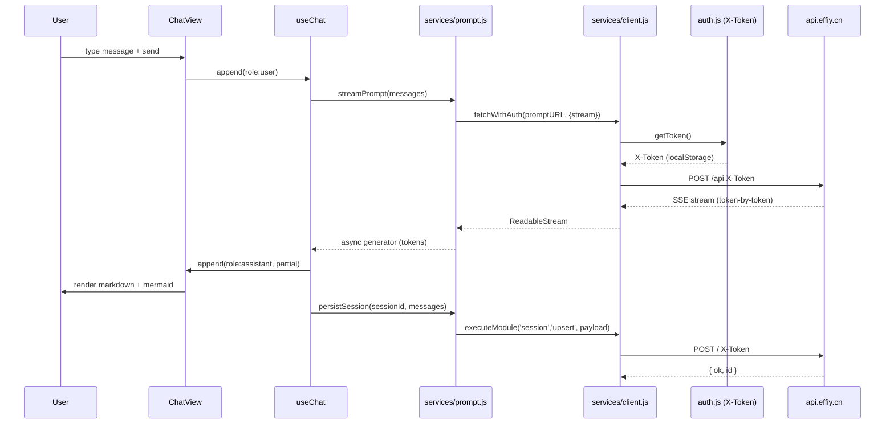

# Scene 2 · Data Flow Tracing

> **Question**: "Trace a request from entry to persistence."

---

## §0 — Effect Sketch

**What this scene demonstrates**: A user message in `ChatView` flows
through the `useChat` composable → `services/prompt.js` →
`services/client.js` (which injects `X-Token` from `auth.js`) → the
`api.effiy.cn` backend. The streamed reply is rendered token-by-token
into the view, then the full turn is persisted via
`executeModule('session','upsert')`.

**Why it matters**: This is the canonical end-to-end path of the
application. Every other flow (news list, FAQ, session list) is a
specialization of the same `client → executeModule` pattern with a
different `module` argument. Understanding this trace makes the rest
of the codebase legible.

---

## §1 Test Design — Verification Steps

### Step 1: Token injection
**Action**: `grep -n "X-Token" /Users/ruiyi/Downloads/YrY/YiH5/src/services/auth.js`
**Expected**: `getToken()` reads from `localStorage`; `authHeader()`
returns `{ 'X-Token': <token> }`.
**File**: `src/services/auth.js`

### Step 2: Streaming transport
**Action**: `grep -n "fetch\|stream\|ReadableStream" /Users/ruiyi/Downloads/YrY/YiH5/src/services/prompt.js`
**Expected**: `prompt.js` calls `fetchWithAuth` with a streaming flag
and iterates the `ReadableStream` body.
**File**: `src/services/prompt.js`

### Step 3: Persistence round-trip
**Action**: `grep -n "executeModule\|session.*upsert" /Users/ruiyi/Downloads/YrY/YiH5/src/services/session.js`
**Expected**: `session.js` exports `upsertSession`, `listSessions`,
`deleteSession` — all wrap `executeModule('session', <op>, payload)`.
**File**: `src/services/session.js`

---

## §2 Output Inventory

| File/Directory | Type | Description |
|---------------|------|-------------|
| `src/views/ChatView/` | dir | UI view: message input + scrollable transcript + streaming render |
| `src/composables/useChat.js` | file | Composable: manages message state, calls prompt + session services |
| `src/services/prompt.js` | file | AI prompt API: streaming SSE + think-tag stripping |
| `src/services/client.js` | file | HTTP client: `fetchWithAuth`, `executeModule`, `extractList` |
| `src/services/auth.js` | file | X-Token storage + auth header factory |
| `src/services/session.js` | file | Session CRUD via `executeModule('session', ...)` |
| `config.js` | file | `apiBase` + `endpoints.prompt` + `endpoints.mongodb` |

---

## §3 Test Report — 2026-07-24

| Step | Result | Notes |
|------|:---:|-------|
| 1 | ✅ | `X-Token` injected via `authHeader()` in `client.js` |
| 2 | ✅ | `prompt.js` consumes the streamed body |
| 3 | ✅ | `session.js` uses `executeModule('session', 'upsert', …)` |

**Overall**: pass — 3/3 steps passed

---

## §4 Self-Improvement

### Edge Cases Found
- If `X-Token` is absent, the backend returns 401; `client.js`
  surfaces "需要配置 API 鉴权" — but the chat view still appends the
  user message, leaving an orphan turn that never gets persisted.
- SSE streams that die mid-token leave a half-rendered assistant
  message; the session is persisted in that broken state.

### Suggested Improvements
- Wrap streaming in a retry boundary; surface partial-failure in the
  UI before persisting.
- Add a `useChat.abort()` to cancel an in-flight stream on view
  unmount.

### Limitations
- The trace assumes the backend honors `executeModule` semantics; a
  backend schema change would break `session.js` silently.
