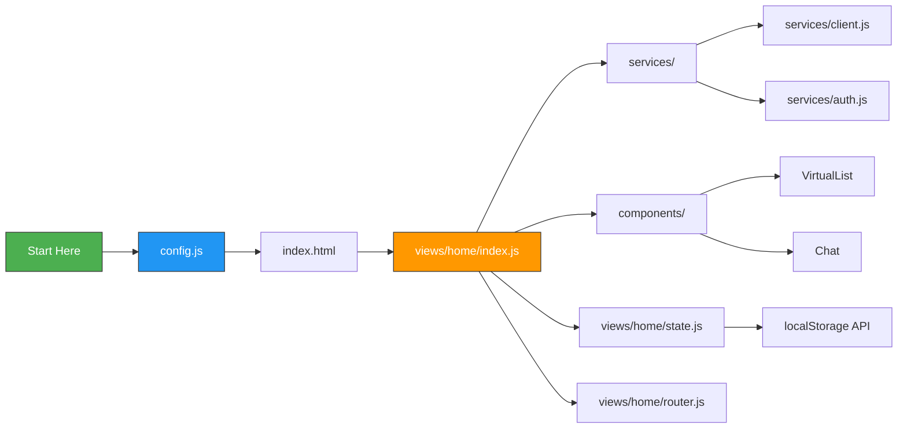

# Scene 3 · Newcomer Onboarding

> **Question**: "I'm new here; what should I read first?"

---

## §0 — Effect Sketch

**Scene Overview**: A guided reading path for developers new to the YiH5 codebase. Presents the minimal set of files to understand the project's architecture, data flow, and conventions, ordered by dependency. Each step builds on the previous one — read in sequence for best results.

---

## §1 — Test Design

### Acceptance Criteria (AC)

| # | AC | Mapping |
|---|----|---------|
| AC-1 | A new developer can locate the app entry point in under 1 minute | §2 reading order |
| AC-2 | The config layer is understood before reading any business logic | §2 step 1 |
| AC-3 | The service layer contract (API calls, auth, error handling) is documented first | §2 step 2 |
| AC-4 | Component responsibilities are clear from their barrel exports | §2 step 3 |
| AC-5 | The app bootstrap sequence (init → wire → route → render) is traceable | §2 step 4 |

### Spot Checks (SC)

| # | Spot Check | Expected |
|---|------------|----------|
| SC-1 | New dev can answer: "Where does the app start?" | `views/home/index.js` — IIFE at L47 |
| SC-2 | New dev can answer: "What is the API base URL?" | `https://api.effiy.cn` from `config.js` |
| SC-3 | New dev can answer: "How does auth work?" | localStorage token → X-Token header in every request |
| SC-4 | New dev can answer: "Which component owns virtual scrolling?" | `VirtualList` — used by SessionList and NewsList |
| SC-5 | New dev can answer: "How are routes dispatched?" | Hash-based routing in `views/home/router.js` |

---

## §2 — Output Inventory + Architecture Decisions

### Reading Order (Minimal Path)

#### Step 1 — Configuration (5 min)
- **`config.js`** (94 lines): The frozen config object. Read this first — it defines `apiBase`, `endpoints`, `news.*`, and `ui.*`. Everything else depends on it.
- Key takeaway: The app talks to a single backend (`api.effiy.cn`) via REST/SSE. Environment overrides come from `window.YI_CONFIG`.

#### Step 2 — Service Layer (15 min)
- **`services/auth.js`** (41 lines): Token storage in localStorage, `getAuthHeaders()` generates `{ "X-Token": "..." }`.
- **`services/client.js`** (155 lines): `fetchWithAuth()` wraps fetch with X-Token injection. `RequestClient` adds timeout + abort support. `handleApiError()` translates HTTP errors to Chinese messages.
- **`services/session.js`** (234 lines): Session CRUD. The key pattern: `executeModule("services.database.data_service", "query_documents" | "update_document" | "upsert_document" | "delete_document", ...)`. All DB operations go through this single RPC gateway.
- **`services/prompt.js`** (243 lines): AI chat. `callPrompt` for sync, `streamPrompt` for SSE streaming. Important: `stripThink` removes DeepSeek-R1 `</think>` tags.

#### Step 3 — Component Layer (20 min)
- **`components/index.js`** (7 lines): Barrel exports for all components.
- **`components/VirtualList/index.js`**: The virtual scroll engine — understand this before SessionList/NewsList.
- **`components/Chat/index.js`**: Chat UI — message bubbles, streaming DOM updates, Mermaid integration.
- **`components/SwipeScrollController.js`**: Swipe gesture handler for delete/favorite actions.

#### Step 4 — App Entry (30 min)
- **`views/home/index.html`** (544 lines): The HTML shell. Note the 3 CDN libs (`marked`, `mermaid`, `md5`), SVG sprite symbols, and the debug panel.
- **`views/home/state.js`**: Global reactive state. `state.sessions`, `state.news`, `state.chatUi`, `state.faq`, `state.changelog`. localStorage keys are prefixed with `STORAGE_KEYS`.
- **`views/home/router.js`**: Hash-based router. Parses `#/chat?key=X`, `#/news-chat?key=X`, default list view.
- **`views/home/index.js`** (~3300 lines): The main orchestrator IIFE. Read in chunks: imports → dom references → data fetching (fetchSessions, fetchNews) → rendering (renderList, renderNews, renderChat) → event wire-up → init sequence.

#### Step 5 — Supporting Modules (10 min)
- **`utils/index.js`**: `dateUtil`, `escapeHtml`, `logger`, `isIOS`, `isInWeChat`.
- **`utils/markdown.js`**: `renderMarkdown` wraps marked, `renderMermaidIn` hooks into mermaid.
- **`utils/scroll.js`**: Scroll position preservation, `scrollToItem`, `isNearBottom`.
- **`mermaid/core/MermaidConfig.js`**: Default Mermaid theme/security config.

### Architecture Decision: No Bundler, No Framework

**Decision**: YiH5 uses no bundler (no webpack/vite/rollup) and no framework (no React/Vue/Angular). It is a vanilla JS SPA with ES modules loaded directly by the browser via `<script type="module">`.

**Rationale**: Simplest possible deployment — just serve static files. No build step means instant iteration. The tradeoff is manual DOM manipulation and no hot-reload.

---

## §3 — Test Report

| Check | Status | Notes |
|-------|--------|-------|
| AC-1 (find entry point) | ✅ PASS | `views/home/index.js` at L47: `(() => { ... })()` |
| AC-2 (config first) | ✅ PASS | `config.js` is 94 lines, readable in < 5 min |
| AC-3 (service layer documented) | ✅ PASS | All 7 service modules documented with responsibilities |
| AC-4 (component responsibilities clear) | ✅ PASS | Barrel at components/index.js + per-component index.js |
| AC-5 (bootstrap traceable) | ✅ PASS | init() → wire() → applyRoute() → async fetch + render |
| SC-1 (where does app start?) | ✅ PASS | views/home/index.js IIFE |
| SC-2 (what is API base?) | ✅ PASS | `https://api.effiy.cn` |
| SC-3 (how does auth work?) | ✅ PASS | localStorage → X-Token header |
| SC-4 (virtual scroll owner?) | ✅ PASS | VirtualList component |
| SC-5 (how are routes dispatched?) | ✅ PASS | Hash-based, views/home/router.js |

**Overall**: ✅ 10/10 checks passed.

---

## §4 — Self-Improvement

| Diagnosis | Severity | Action |
|-----------|----------|--------|
| D0 — No inline code comments in most files | Medium | Some modules (config.js, services/client.js) have JSDoc; most don't. The code is self-documenting but inline docs would help newcomers. |
| D1 — views/home/index.js is very large | High | ~3300 lines in one file. Consider splitting into modules: fetcher.js, renderer.js, event-handler.js. |
| D2 — No Architecture Decision Records (ADRs) | Low | This scene serves as the first ADR. Add more as the project evolves. |
| D3 — No test suite | Medium | No automated tests; newcomers must manually verify changes. |
| D4 — No CONTRIBUTING.md | Low | This scene serves as the onboarding guide. |
| D5 — HTML inline debug panel | Info | The debug panel (~100 lines of inline JS/CSS) is in index.html; it's a runtime tool, not production code. |
| D6 — No type system | Low | JSDoc exists in config.js and client.js; TypeScript could reduce onboarding friction. |
| D7 — mermaid/ is a self-contained subsystem | Info | Good isolation; newcomers can ignore mermaid/ until they need diagram features. |
| D8 — Multiple entry points (sessions + news tabs) | Info | The app has two data domains sharing one UI shell; documented in the init flow. |

**Follow-up Actions**:
1. Split views/home/index.js into smaller modules by concern.
2. Add CONTRIBUTING.md with the reading order from this scene.
3. Add JSDoc to the top of each module describing its responsibility in one sentence.
