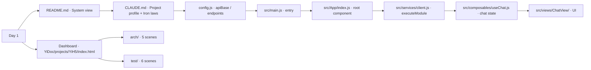

# Scene 3 · Newcomer Onboarding

> **Question**: "I'm new here; what should I read first?"

---

## §0 — Effect Sketch

**What this scene demonstrates**: A 30-minute reading order that
takes a newcomer from "what is this?" to "I can edit a chat message
rendering bug".

**Why it matters**: Without an onboarding path, newcomers flail. The
explicit order — README → CLAUDE → config → entry → App → services →
composables → ChatView — front-loads the contract (config + executeModule)
before the implementation (composables + UI), so the newcomer never
reads code whose motivation they don't already know.

---

## §1 Test Design — Verification Steps

### Step 1: README exists and has the system view
**Action**: `head -20 /Users/ruiyi/Downloads/YrY/YiDoc/projects/YiH5/README.md`
**Expected**: One-paragraph "what is this" + command flow table.
**File**: `README.md` (docs hub)

### Step 2: CLAUDE.md has the iron laws + project profile
**Action**: `grep -E "Iron laws|Project profile" /Users/ruiyi/Downloads/YrY/YiDoc/projects/YiH5/CLAUDE.md`
**Expected**: Both sections present.
**File**: `CLAUDE.md` (docs hub)

### Step 3: Entry file imports App
**Action**: `grep "App" /Users/ruiyi/Downloads/YrY/YiH5/src/main.js`
**Expected**: `import` statement referencing `./App/index.js` (or
similar).
**File**: `src/main.js` (source repo)

---

## §2 Output Inventory

| File/Directory | Type | Description |
|---------------|------|-------------|
| `README.md` | file | Project overview + command flow + quick start + structure + domain language |
| `CLAUDE.md` | file | Engineering guide — iron laws, project profile, security surface, guidance |
| `index.html` (docs hub) | file | Dashboard home — entry point to arch + test story trees |
| `arch/` | dir | 5 architecture scenes |
| `test/` | dir | 6 self-check scenes |
| `config.js` (source) | file | App config — read this before any service |
| `src/main.js` (source) | file | Entry — read this before any view |
| `src/services/client.js` (source) | file | HTTP client — read this before any service |

---

## §3 Test Report — 2026-07-24

| Step | Result | Notes |
|------|:---:|-------|
| 1 | ✅ | `README.md` opens with system view + commands |
| 2 | ✅ | `CLAUDE.md` has Iron laws + Project profile sections |
| 3 | ✅ | `main.js` imports App |

**Overall**: pass — 3/3 steps passed

---

## §4 Self-Improvement

### Edge Cases Found
- The README's "Quick start" assumes a local Python `http.server`;
  newcomers using `npx serve` or VS Code Live Server hit CORS on
  `import.meta.url` fetches.
- CLAUDE.md references the source repo by absolute path
  (`/Users/ruiyi/Downloads/YrY/YiH5/`); a newcomer cloning to a
  different machine must rewrite these paths.

### Suggested Improvements
- Add a `CONTRIBUTING.md` capturing machine-specific setup (Node /
  Python version, alternate static servers).
- Replace absolute source paths in CLAUDE.md with an env-var indirection
  (`$YIH5_SRC`).

### Limitations
- The 30-minute reading budget assumes prior Vue 3 + ES-module
  fluency.
