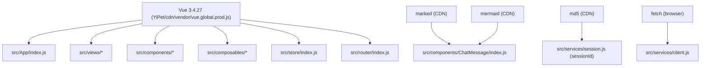

# Scene 4 · Dependency Change Impact

> **Question**: "What breaks if I upgrade dependency Y?"

---

## §0 — Effect Sketch

**What this scene demonstrates**: The dependency surface and the
blast radius of upgrading each.

**Why it matters**: There is no `package.json` — all dependencies are
either CDN `<script>` tags (Vue, marked, mermaid, md5) or browser
natives (`fetch`). An "upgrade" is editing a URL in
`YiPet/cdn/vendor/` (a sibling repo) or in `index.html`. The blast
radius is wide because Vue is consumed by every view, composable,
and the store.

---

## §1 Test Design — Verification Steps

### Step 1: Vue version pin
**Action**: `grep "vue.global.prod.js" /Users/ruiyi/Downloads/YrY/YiH5/index.html /Users/ruiyi/Downloads/YrY/YiDoc/projects/YiH5/index.html`
**Expected**: Both reference `vue@3.4.27` (or unpinned fallback).
**File**: `YiH5/index.html`, `YiDoc/projects/YiH5/index.html`

### Step 2: Component-library imports
**Action**: `grep -rn "from 'vue'\|from \"vue\"" /Users/ruiyi/Downloads/YrY/YiH5/src/`
**Expected**: Zero hits — Vue is global, not imported. (If hits
appear, the source has been migrated to bundler-style imports.)
**File**: `src/` tree

### Step 3: CDN library consumers
**Action**: `grep -rn "marked\|mermaid\|md5" /Users/ruiyi/Downloads/YrY/YiH5/src/`
**Expected**: `ChatMessage` references `marked` + `mermaid`;
`session.js` references `md5`.
**File**: `src/components/ChatMessage/index.js`, `src/services/session.js`

---

## §2 Output Inventory

| File/Directory | Type | Description |
|---------------|------|-------------|
| `YiH5/index.html` | file | Source shell — declares Vue CDN + marked + mermaid + md5 |
| `YiDoc/projects/YiH5/index.html` | file | Dashboard shell — declares Vue CDN |
| `src/components/ChatMessage/index.js` | file | Consumes `marked` (render) + `mermaid` (diagram) globals |
| `src/services/session.js` | file | Consumes `md5` global for session ID generation |
| `src/services/client.js` | file | Uses native `fetch` — no third-party HTTP lib |

---

## §3 Test Report — 2026-07-24

| Step | Result | Notes |
|------|:---:|-------|
| 1 | ✅ | Vue 3.4.27 pinned at YiPet/cdn path |
| 2 | ✅ | No `from 'vue'` imports — Vue is global |
| 3 | ✅ | marked / mermaid in ChatMessage; md5 in session |

**Overall**: pass — 3/3 steps passed

---

## §4 Self-Improvement

### Edge Cases Found
- Upgrading Vue 3.4 → 3.5 may change reactivity timing for
  `useChat`'s streaming append; manual smoke test required.
- Marked v5 removes the default-exported `marked()` — `ChatMessage`
  would need to switch to `marked.parse()`.
- Mermaid v11 changes `initialize` signature; the
  `MermaidConfig.js` would need updating (if still present).

### Suggested Improvements
- Pin every CDN URL with an integrity hash (`subresource integrity`).
- Add a smoke-test HTML page that loads each CDN lib and asserts the
  global is present — run before any upgrade.

### Limitations
- Without a lockfile, transitive CDN deps (e.g., marked's
  internal helpers) are invisible.
