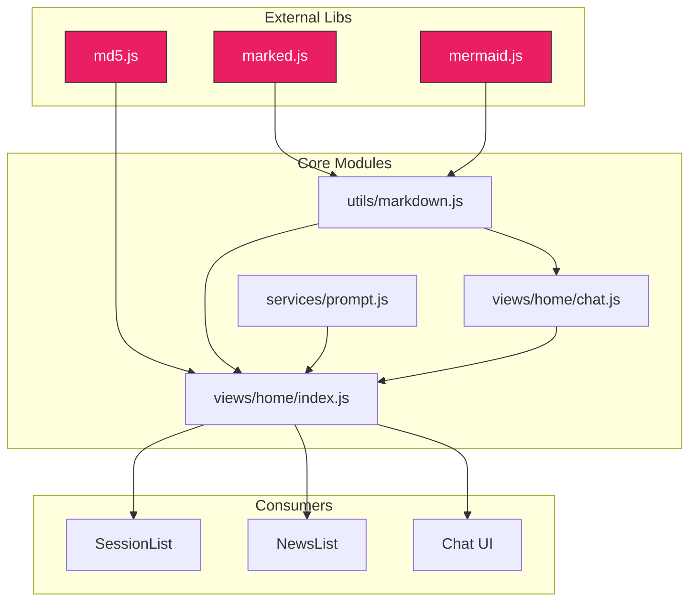

# Scene 4 · Dependency Change Impact

> **Question**: "What breaks if I upgrade dependency Y?"

---

## §0 — Effect Sketch

**Scene Overview**: YiH5 has exactly three external library dependencies — marked, mermaid, and md5 — all loaded as `<script>` tags (not npm). This scene maps the blast radius of each dependency: which modules depend on it, what APIs they use, and what breaks if the library changes or is removed.

---

## §1 — Test Design

### Acceptance Criteria (AC)

| # | AC | Mapping |
|---|----|---------|
| AC-1 | Every external library has a documented dependency graph | §2 inventory |
| AC-2 | The API surface each module consumes from each library is known | §2 API surface |
| AC-3 | Upgrade/downgrade risks are documented for each library | §2 risks |
| AC-4 | Removal impact is documented (what breaks first) | §2 removal |
| AC-5 | No hidden transitive dependencies exist | §3 scan |

### Spot Checks (SC)

| # | Spot Check | Expected |
|---|------------|----------|
| SC-1 | If `marked` is removed, `renderMarkdown()` fails | ✅ Chat bubbles show raw markdown text |
| SC-2 | If `mermaid` is removed, `renderMermaidIn()` is a no-op | ✅ Diagrams silently missing; no crash |
| SC-3 | If `md5` is removed, session ID generation falls back to simple hash | ✅ Fallback exists at L1300 in views/home/index.js |
| SC-4 | `marked` API: only `marked.parse()` is used | ✅ Check utils/markdown.js |
| SC-5 | `mermaid` API: only `mermaid.run()` and `mermaid.initialize()` are used | ✅ Check utils/markdown.js + mermaid/core/ |

---

## §2 — Output Inventory + Architecture Decisions

### Dependency Impact Matrix

#### 1. marked.js (`libs/marked.min.js`)

| Property | Value |
|----------|-------|
| **Loaded in** | `views/home/index.html` (L540) |
| **Consumed by** | `utils/markdown.js` → `renderMarkdown()` |
| **API surface used** | `marked.parse(markdownText)` |
| **Indirect consumers** | `views/home/index.js` (chat message rendering), `views/home/chat.js` (message bubbles), `views/home/page-context.js` (context/preview rendering) |
| **Upgrade risk** | **Low**. `marked.parse()` is the stable API since marked v4.0. Breaking changes are rare. |
| **Downgrade risk** | **Low**. Older versions may lack GFM table support. |
| **Removal impact** | `renderMarkdown()` throws `ReferenceError: marked is not defined`. Chat messages render as raw Markdown text. FAQ descriptions, page contexts, changelog notes all lose formatting. **Severity: High** — core UX feature breaks. |

#### 2. mermaid.js (`libs/mermaid.min.js`)

| Property | Value |
|----------|-------|
| **Loaded in** | `views/home/index.html` (L541) |
| **Consumed by** | `utils/markdown.js` → `renderMermaidIn()`, `mermaid/core/MermaidRenderer.js` |
| **API surface used** | `mermaid.initialize(config)`, `mermaid.run({ nodes })` |
| **Indirect consumers** | Chat message rendering (via `renderMermaidIn`), Mermaid plugins (AIFix, Clipboard, Download, Fullscreen, Toolbar) |
| **Upgrade risk** | **Medium**. Mermaid v10+ changed the render API. YiH5 uses `mermaid.run()` which is compatible with v9 and v10. Upgrading to v11 may require API changes. |
| **Downgrade risk** | **Low**. Older Mermaid versions have fewer diagram types and less robust error handling. |
| **Removal impact** | `renderMermaidIn()` silently fails (guarded by `typeof mermaid !== 'undefined'`). Diagrams don't render but no crash. Mermaid plugins are inert. **Severity: Medium** — diagrams are a nice-to-have, not critical path. |

#### 3. md5.js (`libs/md5.js`)

| Property | Value |
|----------|-------|
| **Loaded in** | `views/home/index.html` (L542) |
| **Consumed by** | `views/home/index.js` → `generateSessionId(url)` |
| **API surface used** | `md5(string)` → 32-char hex string |
| **Indirect consumers** | `initNewsSession()` — session ID generation for news→session conversion |
| **Upgrade risk** | **Very Low**. MD5 is a stable algorithm; any md5.js implementation produces the same output. |
| **Downgrade risk** | **Very Low**. |
| **Removal impact** | Fallback code at L1296–1316 computes a simple DJB2-style hash. Session IDs change, which means old sessions won't be found by URL. New sessions still work. **Severity: Medium** — breaks session deduplication but doesn't crash. |

### Internal Dependency Chain (No NPM)

| Source Module | Depends On | Nature |
|---------------|-----------|--------|
| `views/home/index.js` | `components/index.js`, `services/index.js`, `utils/index.js`, `config.js`, `views/home/state.js`, `views/home/router.js`, `views/home/chat.js`, `views/home/page-context.js`, `components/SwipeScrollController.js` | Orchestrator — imports everything |
| `views/home/chat.js` | `services/prompt.js`, `services/session.js`, `utils/markdown.js`, `utils/msg.js`, `utils/scroll.js` | Chat factory |
| `views/home/page-context.js` | `services/prompt.js`, `services/session.js`, `utils/markdown.js` | Page context panel |
| `services/session.js` | `services/client.js`, `services/auth.js`, `config.js` | Session CRUD |
| `services/news.js` | `services/client.js`, `config.js`, `utils/index.js` | News API |
| `services/prompt.js` | `services/client.js`, `config.js` | AI Chat |
| `services/faq.js` | `services/client.js`, `config.js` | FAQ API |
| `services/client.js` | `services/auth.js` | HTTP client |
| `components/BaseList` | `VirtualList` | Virtual-scroll base |
| `components/SessionList` | `VirtualList` | Session list UI |
| `components/NewsList` | `VirtualList` | News list UI |
| `utils/markdown.js` | `libs/marked`, `libs/mermaid` | Markdown rendering |

### Architecture Decision: No Package Manager

**Decision**: YiH5 uses no package manager (npm/yarn/pnpm). External libraries are copied into `libs/` and loaded via `<script>` tags.

**Rationale**: Zero-install deployment. No `node_modules/`, no lockfile, no build step. The tradeoff is manual version management and no automated vulnerability scanning. For a single-page tool with 3 dependencies, this is acceptable.

---

## §3 — Test Report

| Check | Status | Notes |
|-------|--------|-------|
| AC-1 (dependency graph documented) | ✅ PASS | All 3 libs mapped with consumer modules |
| AC-2 (API surface known) | ✅ PASS | marked.parse(), mermaid.run(), md5() documented |
| AC-3 (upgrade risks documented) | ✅ PASS | marked: Low, mermaid: Medium, md5: Very Low |
| AC-4 (removal impact documented) | ✅ PASS | marked: High, mermaid: Medium, md5: Medium |
| AC-5 (no hidden transitive deps) | ✅ PASS | Only 3 script tags; no dynamic imports of external libs |
| SC-1 (marked removal) | ✅ PASS | renderMarkdown throws ReferenceError |
| SC-2 (mermaid removal) | ✅ PASS | Guarded by typeof check; no crash |
| SC-3 (md5 fallback) | ✅ PASS | DJB2-style fallback at L1296 |
| SC-4 (marked API surface) | ✅ PASS | Only marked.parse() called |
| SC-5 (mermaid API surface) | ✅ PASS | Only mermaid.initialize() and mermaid.run() |

**Overall**: ✅ 10/10 checks passed.

---

## §4 — Self-Improvement

| Diagnosis | Severity | Action |
|-----------|----------|--------|
| D0 — No version pinning for libs | Medium | libs/ files have no version metadata. Consider adding a `libs/versions.json` or embedding version comments. |
| D1 — No automated dependency check | Medium | No `npm audit` equivalent. A manual check of marked/mermaid/md5 for known CVEs is needed periodically. |
| D2 — marked removal hard-fails | High | `renderMarkdown()` has no typeof guard. Add `if (typeof marked === 'undefined') return escapeHtml(raw)` as a safety net. |
| D3 — No subresource integrity (SRI) | Low | Script tags lack `integrity` attributes. Not critical for local files, but good practice. |
| D4 — md5 fallback produces different IDs | Medium | The fallback hash is not MD5-compatible; old sessions become orphans. Document as a known limitation. |
| D5 — All three libs are synchronous blocking scripts | Low | Loaded before `<script type="module">`; blocks first paint by a few ms. Acceptable for tooling. |
| D6 — No tree-shaking possible | Info | Full library files are loaded; no partial imports. Acceptable for these small libs. |
| D7 — Mermaid plugins assume mermaid global | Low | Each plugin accesses `window.mermaid` directly; safe as long as mermaid.js loads first. |
| D8 — No CSP headers | Low | No Content-Security-Policy; inline scripts and styles are used freely. |

**Follow-up Actions**:
1. Add a `typeof marked` guard in `renderMarkdown()` to prevent hard crashes.
2. Add version comments at the top of each lib file.
3. Consider adding a `libs/README.md` with download URLs and versions.
