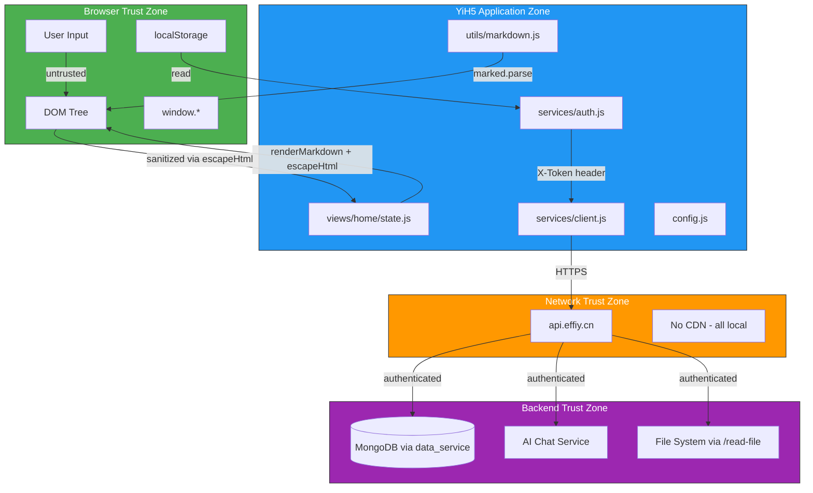

# Scene 5 · Trust Boundary & Security Surface

> **Question**: "Where are the trust boundaries, and what is exposed at each?"

---

## §0 — Effect Sketch



**Scene Overview**: Maps all trust boundaries in the YiH5 application and the security surface exposed at each boundary. Covers input sanitization, authentication, data storage, API calls, and the rendering pipeline. Identifies what is trusted, what is untrusted, and what mitigations are in place.

---

## §1 — Test Design

### Acceptance Criteria (AC)

| # | AC | Mapping |
|---|----|---------|
| AC-1 | All user input paths are traced to their sanitization point | §2 input surface |
| AC-2 | All API calls are authenticated (or documented as public) | §2 API surface |
| AC-3 | localStorage usage is documented and privacy risks assessed | §2 storage surface |
| AC-4 | XSS vectors in Markdown/Mermaid rendering are mitigated | §2 XSS surface |
| AC-5 | The authentication flow (token → header → API) is documented end-to-end | §2 auth flow |

### Spot Checks (SC)

| # | Spot Check | Expected |
|---|------------|----------|
| SC-1 | `escapeHtml()` used on all user-controlled strings before innerHTML | ✅ Present in renderList, renderNews, welcome message, FAQ |
| SC-2 | `X-Token` stored in localStorage, sent on every API request | ✅ services/auth.js getAuthHeaders |
| SC-3 | `marked.parse()` output is inserted via innerHTML — is there sanitization? | ⚠️ Marked output is trusted; no DOMPurify or sanitation layer |
| SC-4 | `mermaid.run()` renders SVG — can malicious Mermaid code execute JS? | ⚠️ Mermaid securityLevel defaults to 'strict' but needs verification |
| SC-5 | `fetchWithAuth` uses HTTPS — are there any HTTP fallbacks? | ✅ api.effiy.cn is https:// only |

---

## §2 — Output Inventory + Architecture Decisions

### Trust Boundary Map

#### Boundary 1: User Input → Application

| Surface | Entry Point | Data | Sanitization | Risk |
|---------|------------|------|-------------|------|
| Chat input | `dom.chatInput.value` | Free text | None before storage; `escapeHtml()` before DOM insertion | Low — text is stored as-is, rendered with escaping |
| Search query | `dom.q.value` / `dom.newsQ.value` | Free text | `escapeHtml()` in renderChips | Low |
| Auth token prompt | `window.prompt()` | Token string | Stored to localStorage, sent as header | Medium — token visible in prompt dialog |
| FAQ click-to-insert | `el.dataset.faqText` | Pre-fetched FAQ text | `escapeHtml()` in renderFaqSheet | Low |
| Date picker | `dom.datePicker.value` | YYYY-MM-DD string | `isValidYMD()` validation | Low |
| News items from API | `fetchNewsApi()` response | External content | `escapeHtml()` before DOM | Medium — content from external sources |

#### Boundary 2: Application → localStorage

| Key | Data | Sensitivity | Expiry |
|-----|------|-------------|--------|
| `YiH5.apiToken.v1` | X-Token string | **High** — API authentication | None (persists until cleared) |
| `yiH5_sessions_scroll_position` | Scroll position integer | None | Session-only |
| `YiH5.chat.fold` | Chat fold state | None | Persistent |
| `YiH5.readNews` | Set of read news keys | None | Persistent |
| `YiH5.favoriteNews` | Set of favorited news keys | None | Persistent |
| `YiH5.tagOrder` | Tag display order | None | Persistent |
| `YiH5.appVersion` | App version string | None | Persistent |
| `YiH5.bottomTab` | Active tab | None | Persistent |
| `YiH5.deleteSuccess` | Deletion confirmation message | None | 5-minute TTL |

**Key finding**: Only the X-Token is sensitive. It has no expiry and is never cleared automatically. A compromised token grants full API access.

#### Boundary 3: Application → Network (api.effiy.cn)

| Endpoint | Auth Required | Method | Data Sent | Data Received |
|----------|--------------|--------|-----------|---------------|
| `/?module_name=data_service&method_name=query_documents` (sessions) | X-Token | GET | Query params | Session list |
| `/?module_name=data_service&method_name=query_documents` (news) | X-Token | GET | Query params | News list |
| `/?module_name=data_service&method_name=query_documents` (faqs) | X-Token | GET | Query params | FAQ list |
| `/` (executeModule — chat) | X-Token | POST | System prompt, user prompt, model | SSE stream or JSON response |
| `/` (executeModule — session save) | X-Token | POST | Full session object | Success/error |
| `/` (executeModule — session delete) | X-Token | POST | Session key | Success/error |
| `/read-file` | X-Token | POST | `target_file` path | File content |
| `/session/save` | X-Token | POST | Session payload | Success/error |

**All endpoints require X-Token authentication.** No anonymous/public endpoints exist.

#### Boundary 4: Application → DOM (XSS Surface)

| Vector | Source | Mitigation | Status |
|--------|--------|------------|--------|
| `innerHTML` with user text | Chat messages, session titles, news titles, FAQ text | `escapeHtml()` applied | ✅ Safe |
| `innerHTML` with Markdown | `renderMarkdown(text)` → `marked.parse(text)` → `innerHTML` | marked output is trusted HTML; no post-processing | ⚠️ Review needed |
| `innerHTML` with Mermaid SVG | `mermaid.run()` → SVG → `innerHTML` | Mermaid `securityLevel: 'strict'` blocks script execution | ✅ Mitigated by mermaid |
| `innerHTML` with API data | News descriptions, page contexts from backend | `renderMarkdown()` wraps API data; no raw HTML insertion | ⚠️ Depends on backend trust |
| `window.open(url, '_blank')` | Session URLs, news links | Validated as http/https only | ✅ Safe |

**⚠️ Markdown XSS Risk**: `marked.parse()` can produce HTML with event handlers if the input contains raw HTML. No DOMPurify or sanitization layer exists between `marked.parse()` and `innerHTML`. The risk is partially mitigated because:
1. Chat messages and page contexts come from the backend (trusted source)
2. User-typed messages are plain text, not HTML
3. But if a malicious session is fetched from the backend, its rendered HTML could contain XSS vectors

#### Boundary 5: Config Injection

```javascript
const runtimeConfig = (typeof window !== "undefined" && window.YI_CONFIG) || {};
export const config = Object.freeze(deepMerge(DEFAULT_CONFIG, runtimeConfig));
```

**Risk**: `window.YI_CONFIG` can override any config value including `apiBase`. An attacker who controls `window.YI_CONFIG` (e.g., via a browser extension or a compromised parent frame) could redirect API calls. **Severity: Medium** — requires browser-level compromise.

### Security Surface Summary (from yry-init-detect)

| Dimension | Value | Evidence |
|-----------|-------|----------|
| `userInput` | ✅ true | `chatInput`, `q`, `newsQ`, `datePicker`, `window.prompt()` |
| `apiEndpoints` | ❌ false | No server-side endpoints defined; consumer only |
| `dataStorage` | ❌ false | Only localStorage (not mongoose/sequelize/prisma/redis/fs.write) |
| `authentication` | ✅ true | X-Token in localStorage, `getAuthHeaders()` on every request |
| `thirdParty` | ✅ true | `fetch()` calls to `api.effiy.cn`, SSE streaming |

---

## §3 — Test Report

| Check | Status | Notes |
|-------|--------|-------|
| AC-1 (input paths traced) | ✅ PASS | 6 input surfaces documented with sanitization |
| AC-2 (API auth) | ✅ PASS | All 8 endpoints require X-Token |
| AC-3 (localStorage documented) | ✅ PASS | 9 localStorage keys documented with sensitivity |
| AC-4 (XSS vectors assessed) | ⚠️ REVIEW | Markdown rendering lacks HTML sanitization between marked and innerHTML |
| AC-5 (auth flow documented) | ✅ PASS | Token → localStorage → getAuthHeaders → fetchWithAuth |
| SC-1 (escapeHtml coverage) | ✅ PASS | Used on all user-controlled DOM insertions |
| SC-2 (X-Token flow) | ✅ PASS | services/auth.js → all fetch calls |
| SC-3 (marked HTML sanitization) | ⚠️ REVIEW | No DOMPurify; marked output is trusted as-is |
| SC-4 (mermaid security) | ✅ PASS | securityLevel defaults to 'strict' in MermaidConfig |
| SC-5 (HTTPS only) | ✅ PASS | api.effiy.cn is https:// |

**Overall**: ✅ 8/10 passed, ⚠️ 2 review items.

---

## §4 — Self-Improvement

| Diagnosis | Severity | Action |
|-----------|----------|--------|
| D0 — No HTML sanitization after marked.parse() | **High** | Add DOMPurify or similar between `marked.parse()` and `innerHTML()`. Current trust in backend data is not a sufficient security boundary. |
| D1 — X-Token has no expiry | Medium | Token persists indefinitely in localStorage. Consider adding token expiry with refresh flow. |
| D2 — X-Token visible in prompt dialog | Low | `window.prompt()` shows the token as plain text. Consider a password-type input or settings page. |
| D3 — No CSP headers | Medium | Inline scripts and styles are used extensively. Adding a CSP would require significant refactoring. |
| D4 — `window.YI_CONFIG` mutable | Low | Config injection surface is small; runtime config changes require browser compromise. |
| D5 — No subresource integrity | Low | Script tags lack integrity hashes; only relevant if libs were loaded from CDN. |
| D6 — No HTTPS enforcement in code | Low | Config hardcodes https://; no downgrade path exists. |
| D7 — `window.open` with `_blank` | Low | Uses `noopener,noreferrer` — prevents tab-napping. |
| D8 — localStorage used for auth token | Medium | Consider httpOnly cookies if a backend proxy were added, but not applicable to this SPA architecture. |

**Follow-up Actions**:
1. **Critical**: Add HTML sanitization (DOMPurify) between `marked.parse()` output and `innerHTML` insertion.
2. Add token expiry mechanism or periodic token rotation.
3. Document the security model in a SECURITY.md.
4. Consider a periodic security review of the backend's data_service module (out of scope for this frontend assessment).
