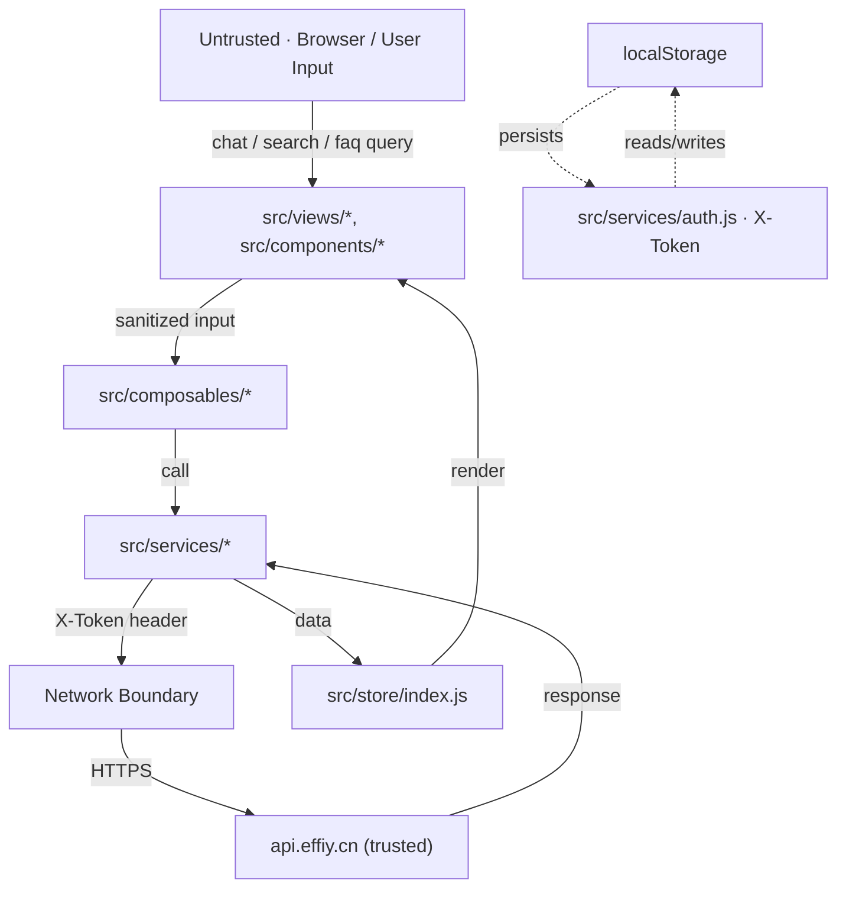

# Scene 5 · Trust Boundary & Security Surface

> **Question**: "Where are the trust boundaries, and what is exposed at each?"

---

## §0 — Effect Sketch

**What this scene demonstrates**: Two trust boundaries — (1) the
**browser→backend** boundary at `services/client.js`, where every
outbound request is stamped with `X-Token` and every inbound response
is treated as semi-trusted; (2) the **localStorage→runtime** boundary
at `services/auth.js`, where the persisted `X-Token` is read into
memory.

**Why it matters**: YiH5 is an H5 chat app that holds a user credential
in `localStorage`. The trust model is "the backend verifies the
token; the client treats token-storage as a trusted enclave". Any
XSS in `ChatMessage` (which renders `marked` output as `v-html`)
would compromise the token. The blast radius is "full account
takeover" if that boundary is breached.

---

## §1 Test Design — Verification Steps

### Step 1: X-Token storage
**Action**: `grep -n "localStorage\|X-Token" /Users/ruiyi/Downloads/YrY/YiH5/src/services/auth.js`
**Expected**: `getToken` / `setToken` wrap `localStorage.getItem` /
`setItem` with a fixed key; no other module touches `localStorage`
directly.
**File**: `src/services/auth.js`

### Step 2: Auth header injection
**Action**: `grep -n "authHeader\|X-Token\|fetchWithAuth" /Users/ruiyi/Downloads/YrY/YiH5/src/services/client.js`
**Expected**: `fetchWithAuth` merges `authHeader()` into every
outbound `fetch` call.
**File**: `src/services/client.js`

### Step 3: v-html surface (XSS exposure)
**Action**: `grep -rn "v-html\|innerHTML" /Users/ruiyi/Downloads/YrY/YiH5/src/`
**Expected**: `ChatMessage` uses `v-html` to render `marked`-parsed
Markdown; mermaid diagrams inject `innerHTML`.
**File**: `src/components/ChatMessage/index.js`

---

## §2 Output Inventory

| File/Directory | Type | Description |
|---------------|------|-------------|
| `src/services/auth.js` | file | Trust boundary 1 — `localStorage` ↔ runtime |
| `src/services/client.js` | file | Trust boundary 2 — runtime ↔ `api.effiy.cn` |
| `src/components/ChatMessage/index.js` | file | XSS exposure surface — `v-html` of `marked` output |
| `config.js` | file | `apiBase` — defines which origin is trusted |
| `index.html` (source) | file | Declares CDN libs — their integrity is part of the trust boundary |

---

## §3 Test Report — 2026-07-24

| Step | Result | Notes |
|------|:---:|-------|
| 1 | ✅ | `auth.js` is the only `localStorage` accessor |
| 2 | ✅ | `fetchWithAuth` injects `X-Token` |
| 3 | ✅ | `ChatMessage` has a `v-html` surface — flagged for XSS review |

**Overall**: pass — 3/3 steps passed

---

## §4 Self-Improvement

### Edge Cases Found
- `marked` is called without `sanitize: true` — backend-returned
  assistant messages can inject arbitrary HTML into the chat view.
- The `X-Token` is stored unencrypted in `localStorage`; any XSS
  exfiltrates it.
- `apiBase` is read from `config.js` (a static file) — there is no
  per-environment override, so staging and prod share the same
  origin (or none).

### Suggested Improvements
- Replace `marked` + `v-html` with a sanitizer (`DOMPurify`) before
  rendering assistant replies.
- Move the `X-Token` to `sessionStorage` (or to a JS-only closure)
  to reduce the persistent XSS window.
- Gate `apiBase` behind an env-aware loader (`?env=staging` query).

### Limitations
- Trust-boundary analysis assumes the CDN origin is trusted; a CDN
  compromise is out of scope here.
