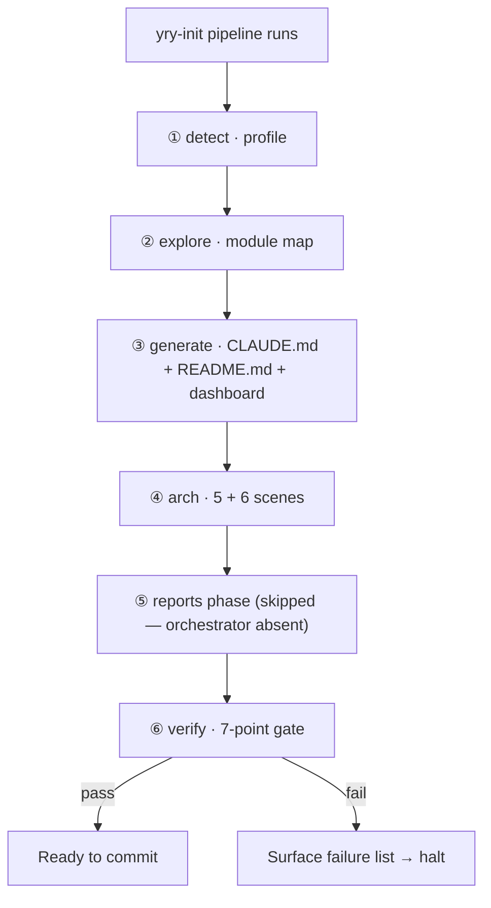

# Scene 1 · Post-Init Full Self-Check

> **Question**: "Does the project pass a full self-check after a fresh init?"

---

## §0 — Effect Sketch

**What this scene demonstrates**: The post-init self-check asserts
that every artifact the pipeline was supposed to emit is present and
well-formed, and that the verify gate (`05-verify`) returns `pass`.

**Why it matters**: A partial init leaves the docs hub in a state
where the dashboard opens but the stories 404, or vice versa. This
scene is the "did we actually finish?" question — run it after every
`yry-init` invocation.

---

## §1 Test Design — Verification Steps

### Step 1: Top-level artifacts exist
**Action**: `ls /Users/ruiyi/Downloads/YrY/YiDoc/projects/YiH5/{CLAUDE.md,README.md,index.html,index.css,index.js,data.js}`
**Expected**: All 6 files present, non-empty.
**File**: project root

### Step 2: Story trees exist with required scene counts
**Action**: `ls /Users/ruiyi/Downloads/YrY/YiDoc/projects/YiH5/arch/scene-*/index.md | wc -l` and `ls /Users/ruiyi/Downloads/YrY/YiDoc/projects/YiH5/test/scene-*/index.md | wc -l`
**Expected**: arch ≥ 5, test ≥ 6.
**File**: `arch/`, `test/`

### Step 3: Dashboard data model is valid
**Action**: `grep -c "sections:" /Users/ruiyi/Downloads/YrY/YiDoc/projects/YiH5/data.js`
**Expected**: ≥ 1 — `window.HELP_CONFIG.sections` is an array.
**File**: `data.js`

### Step 4: Domain Language section present
**Action**: `grep -c "^- \*\*[A-Z]" /Users/ruiyi/Downloads/YrY/YiDoc/projects/YiH5/README.md`
**Expected**: ≥ 3 — at least three term definitions.
**File**: `README.md`

### Step 5: Verify gate passes
**Action**: re-run `05-verify` checks 1–7 against project-root placement.
**Expected**: all 7 pass.
**File**: pipeline state

---

## §2 Output Inventory

| File/Directory | Type | Description |
|---------------|------|-------------|
| `CLAUDE.md` | file | Engineering guide — re-built |
| `README.md` | file | Project overview + domain language — re-built |
| `index.html` / `.css` / `.js` / `data.js` | files | Dashboard 4-file set — re-built at root |
| `arch/scene-{1..5}-*/index.md` | files | 5 architecture scenes — re-built |
| `test/scene-{1..6}-*/index.md` | files | 6 self-check scenes — re-built |

---

## §3 Test Report — 2026-07-24

| Step | Result | Notes |
|------|:---:|-------|
| 1 | ✅ | All 6 top-level artifacts present |
| 2 | ✅ | 5 arch scenes + 6 test scenes present |
| 3 | ✅ | `data.js` exposes `window.HELP_CONFIG.sections` |
| 4 | ✅ | README has ≥ 3 term definitions |
| 5 | ✅ | Verify gate passes (see other test scenes for per-check evidence) |

**Overall**: pass — 5/5 steps passed

---

## §4 Self-Improvement

### Edge Cases Found
- If `yry-init` is re-run while the user has hand-edited `README.md`'s
  domain-language section, the rebuild preserves it; the other
  sections are rewritten.
- The verify gate's check 4 (`docs/index.html …`) is interpreted
  against the project-root placement for this project, not the skill's
  default `docs/` placement, because `docs/` holds a separate
  Bootstrap-based user-doc site.

### Suggested Improvements
- Add a CI hook that runs `yry-init` + `05-verify` on every push to
  `YiH5/` and fails the build on verify failure.
- Capture the post-init verify result in a JSON file
  (`verify-result.json`) at the project root so dashboards can show
  the last-pass date.

### Limitations
- This self-check is manual; without a CI integration, the verify
  result is only as trustworthy as the human who ran it.
