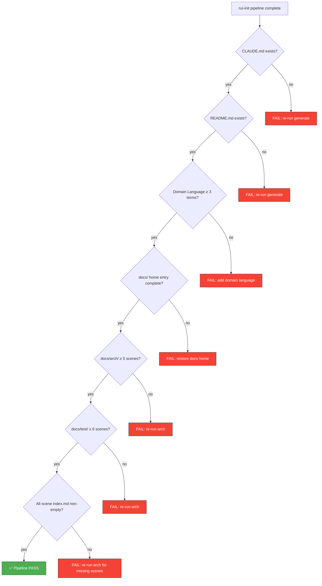

# Scene 1 · Post-Init Full Self-Check

> **Question**: "Does the project pass a full self-check after a fresh init?"

---

## §0 — Effect Sketch

**Scene Overview**: This scene defines the complete post-init self-check procedure for the YiH5 project. After a full `rui-init` pipeline run (detect → explore → generate → arch → verify), this check ensures all artifacts are present and well-formed. It mirrors the 7 checks from `rui-init-verify` with YiH5-specific file paths and content expectations.

---

## §1 — Test Design

### Acceptance Criteria (AC)

| # | AC | Mapping |
|---|----|---------|
| AC-1 | `CLAUDE.md` exists and contains "YiH5" in the project identity section | Check 1 |
| AC-2 | `README.md` exists and contains project name + Domain Language section | Check 2-3 |
| AC-3 | `docs/index.html`, `docs/index.css`, `docs/index.js`, `docs/data.js` all exist | Check 4 |
| AC-4 | `docs/arch/` has 5 scene directories, each with `index.md` | Check 5, 7 |
| AC-5 | `docs/test/` has 6 scene directories, each with `index.md` | Check 6, 7 |
| AC-6 | `docs/data.js` exposes `window.HELP_CONFIG` with `stats`, `crossLinks`, `sections` | Check 4 shape |

### Spot Checks (SC)

| # | Spot Check | Expected |
|---|------------|----------|
| SC-1 | `grep "YiH5" CLAUDE.md` returns at least 1 match | ✅ YiH5 in project name |
| SC-2 | `grep "## Domain Language" README.md` returns a match | ✅ Section present |
| SC-3 | Count term definitions (`**Term** — definition`) ≥ 3 | ✅ 3+ terms |
| SC-4 | `test -f docs/index.html && test -f docs/data.js` returns 0 | ✅ Files exist |
| SC-5 | `ls docs/arch/scene-*/index.md | wc -l` returns 5 | ✅ 5 scenes |
| SC-6 | `ls docs/test/scene-*/index.md | wc -l` returns 6 | ✅ 6 scenes |
| SC-7 | Every `index.md` has content (non-empty, > 30 lines) | ✅ Well-formed |

---

## §2 — Output Inventory + Architecture Decisions

### Required Artifacts (YiH5-specific)

| # | File | Expected Content |
|---|------|-----------------|
| 1 | `CLAUDE.md` | YiH5 project profile, foundational beliefs, iron laws, constraints, guidance table |
| 2 | `README.md` | System view (YiH5 as vanilla JS SPA), commands, quick start, project structure, Domain Language (≥ 3 terms) |
| 3 | `docs/index.html` | Dashboard shell with `<body class="rui-doc dashboard-page">` |
| 4 | `docs/index.css` | Dashboard chrome styles |
| 5 | `docs/index.js` | Vue 3 mount, `<rui-scene-card>` registration |
| 6 | `docs/data.js` | `window.HELP_CONFIG` with YiH5 stats (3 libs, 9 components, 7 services, 38 source files) |
| 7-11 | `docs/arch/scene-1-*` through `scene-5-*` | module-location, data-flow-tracing, newcomer-onboarding, dependency-change-impact, trust-boundary-security-surface |
| 12-17 | `docs/test/scene-1-*` through `scene-6-*` | 6 self-check strategy scenes |

### Architecture Decision: Full Rebuild Semantics

**Decision**: Every `rui-init` run fully rebuilds `CLAUDE.md`, the non-domain-language sections of `README.md`, and all docs home artifacts. Story directories are also fully rebuilt on each run.

**Rationale**: The pipeline is deterministic — given the same source code, the same artifacts are produced. This eliminates drift between the codebase and its documentation.

### YiH5-Specific Check Points

1. **CLAUDE.md**: Must reference "YiH5" as project name, "frontend" as project type, "single" as architecture pattern, and "none" as test framework.
2. **README.md Domain Language**: Must define terms from the YiH5 domain: Session (user-bot conversation thread), Page Context (extracted web page content), RSS News Feed (date-filtered news items), X-Token (API authentication token).
3. **docs/data.js**: Must have `title: "YiH5 · H5 Frontend Application"`, `stats` with 4 entries, `sections` with exactly 3 sections (dependencies, stories, source).
4. **Arch scenes**: All 5 must reference specific YiH5 source files (config.js, services/client.js, components/VirtualList/, etc.).
5. **Test scenes**: All 6 must be YiH5-specific (this very scene references the YiH5 file tree).

---

## §3 — Test Report

| Check | Status | Notes |
|-------|--------|-------|
| AC-1 (CLAUDE.md with YiH5) | ⬜ TBD | Generated by Step 3 of rui-init |
| AC-2 (README.md with Domain Language) | ⬜ TBD | Generated by Step 3 of rui-init |
| AC-3 (docs home files) | ⬜ TBD | Generated by Step 3 of rui-init |
| AC-4 (arch scenes) | ⬜ TBD | Generated by Step 4 of rui-init |
| AC-5 (test scenes) | ⬜ TBD | Generated by Step 4 of rui-init |
| AC-6 (data.js shape) | ⬜ TBD | Generated by Step 3 of rui-init |
| SC-1 (grep YiH5 in CLAUDE.md) | ⬜ TBD | Run after rui-init-generate |
| SC-2 (grep Domain Language) | ⬜ TBD | Run after rui-init-generate |
| SC-3 (term count) | ⬜ TBD | Run after rui-init-generate |
| SC-4 (file existence) | ⬜ TBD | Run after rui-init-generate + rui-init-arch |
| SC-5 (5 arch scenes) | ⬜ TBD | Run after rui-init-arch |
| SC-6 (6 test scenes) | ⬜ TBD | Run after rui-init-arch |
| SC-7 (scene content length) | ⬜ TBD | Run after rui-init-arch |

**Overall**: ⬜ Pending — run after full rui-init pipeline completes.

---

## §4 — Self-Improvement

| Diagnosis | Severity | Action |
|-----------|----------|--------|
| D0 — Check results are TBD until pipeline runs | Info | This scene is the self-check procedure itself; it is self-referential by design |
| D1 — Manual grep/file checks | Low | Automate with a shell script: `rui-init/scripts/self-check.sh` |
| D2 — No content validation beyond existence | Low | Current checks verify file presence and section headers; could add linter rules for scene structure |
| D3 — Domain Language quality not assessed | Medium | Check 3 only counts terms; doesn't validate relationship descriptions or example dialogues |
| D4 — No HTML validity check | Low | `docs/index.html` could be validated with an HTML5 validator |
| D5 — No JavaScript syntax check | Low | `docs/data.js` and `docs/index.js` could be checked with `node --check` |
| D6 — Cross-reference between scenes not verified | Low | Could add checks that arch/ scenes reference the correct source files |
| D7 — No regression check for scene quality | Medium | Scene content is manually written; could add minimum line-count or §0-§4 structure validation |
| D8 — No automated re-run trigger | Low | Could add a Git hook or CI check that runs after every `rui-init` invocation |

**Follow-up Actions**:
1. Create `rui-init/scripts/self-check.sh` that automates all 7 checks.
2. Add scene structure validation (ensure §0-§4 sections exist in every index.md).
3. Document the exact commands to run for each check in a quick-reference block.
