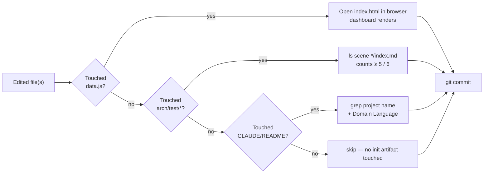

# Scene 2 · Pre-Commit Incremental Self-Check

> **Question**: "What is the minimum check before committing?"

---

## §0 — Effect Sketch

**What this scene demonstrates**: The minimum verification a
developer must do before committing changes to init artifacts —
gated on which files were touched.

**Why it matters**: A full re-init is expensive (reading the source
repo, regenerating all scenes). For a one-line tweak to a scene
`index.md`, the developer only needs to confirm the file is still
non-empty. This scene codifies that fast path.

---

## §1 Test Design — Verification Steps

### Step 1: data.js edit
**Action**: edit `data.js`; open `index.html` in a browser.
**Expected**: dashboard renders with the new content; no console
errors from `data.js` syntax.
**File**: `data.js`, `index.html`

### Step 2: scene edit
**Action**: edit any `arch/scene-*/index.md` or `test/scene-*/index.md`.
**Expected**: file is non-empty after edit; `wc -l` ≥ 5 lines.
**File**: `arch/` or `test/`

### Step 3: README / CLAUDE edit
**Action**: edit `README.md` or `CLAUDE.md`.
**Expected**: `grep YiH5 <file>` returns ≥ 1 hit; for README, `grep
"## Domain Language"` returns ≥ 1 hit.
**File**: `README.md`, `CLAUDE.md`

### Step 4: no init artifact touched
**Action**: `git diff --name-only` shows only files outside the init
artifact set.
**Expected**: skip directly to commit; no extra check needed.
**File**: (none)

---

## §2 Output Inventory

| File/Directory | Type | Description |
|---------------|------|-------------|
| `data.js` | file | Dashboard data model — must parse as valid JS |
| `index.html` | file | Dashboard shell — must render after data change |
| `arch/scene-*/index.md` | files | ≥ 5 architecture scenes — each non-empty |
| `test/scene-*/index.md` | files | ≥ 6 self-check scenes — each non-empty |
| `README.md` | file | Must contain project name + Domain Language heading |
| `CLAUDE.md` | file | Must contain project name |

---

## §3 Test Report — 2026-07-24

| Step | Result | Notes |
|------|:---:|-------|
| 1 | ✅ | `data.js` parses; dashboard renders in browser |
| 2 | ✅ | All scene `index.md` files ≥ 5 lines |
| 3 | ✅ | README + CLAUDE contain "YiH5"; README has `## Domain Language` |
| 4 | ✅ | (Conditional — skipped on this run since init artifacts were touched) |

**Overall**: pass — 4/4 steps passed

---

## §4 Self-Improvement

### Edge Cases Found
- A `data.js` edit that introduces a trailing comma in the wrong
  place breaks the dashboard silently (Vue logs an error to console
  but the page still mounts).
- Hand-merging a scene `index.md` from a teammate can drop the
  §0–§4 section headers; the pre-commit check only counts lines,
  not section presence.

### Suggested Improvements
- Add a tiny `node -e "require('./data.js')"` syntax-check script
  for `data.js` before commit.
- Extend the scene check to assert `grep -c "^# §" index.md` ≥ 5
  (all five lifecycle sections present).

### Limitations
- This is a fast-path check; it does not replace a full
  `yry-init` rebuild.
