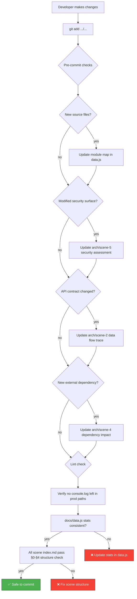

# Scene 2 · Pre-Commit Incremental Self-Check

> **Question**: "What is the minimum check before committing?"

---

## §0 — Effect Sketch



**Scene Overview**: Defines the minimum self-check a developer must perform before committing changes to the YiH5 repository. The check is incremental — it only validates what could have been affected by the staged changes — but covers the critical invariants: source-count consistency, security surface changes, API contract changes, and documentation freshness.

---

## §1 — Test Design

### Acceptance Criteria (AC)

| # | AC | Mapping |
|---|----|---------|
| AC-1 | Source file count in `data.js` stats matches actual file count | §2 stat consistency |
| AC-2 | If a new service/component/utility is added, docs scenes are updated | §2 change detection |
| AC-3 | If the security surface changes (new API call, new input, new storage), arch/scene-5 is updated | §2 security |
| AC-4 | No stray `console.log` outside of `logger` module in production paths | §2 lint |
| AC-5 | All scene `index.md` files follow §0-§4 structure | §2 structure |

### Spot Checks (SC)

| # | Spot Check | Expected |
|---|------------|----------|
| SC-1 | `find YiH5 -name '*.js' | wc -l` matches data.js "Source Files" stat | ✅ Count matches |
| SC-2 | `git diff --cached --name-only` contains `services/` → check arch/scene-2 and -5 | ✅ Conditional check |
| SC-3 | `grep -r "console\\.log" YiH5/ --include="*.js" | grep -v "logger" | grep -v "libs"` returns nothing | ✅ No raw console.log |
| SC-4 | Each `docs/arch/scene-*/index.md` and `docs/test/scene-*/index.md` has §0-§4 headings | ✅ All 11 scenes |
| SC-5 | `grep -c "YiH5" docs/data.js` returns ≥ 3 | ✅ Project name present |

---

## §2 — Output Inventory + Architecture Decisions

### Incremental Check Decision Tree

When you have staged changes, run these checks in order. Stop at the first failure.

#### Check 1: Source Count Consistency

```bash
# Count JS source files (exclude libs/, assets/, docs/)
find /Users/yi/YrY/YiH5 -name '*.js' \
  ! -path '*/libs/*' \
  ! -path '*/assets/*' \
  ! -path '*/docs/*' \
  | wc -l
```

Compare with `data.js` → `stats[3].value`. If they differ, update `data.js`.

**YiH5 baseline**: 38 JS source files.

#### Check 2: Component/Service Module Count

```bash
# Count component directories with index.js
ls -d /Users/yi/YrY/YiH5/components/*/index.js 2>/dev/null | wc -l
# Count standalone component JS files
ls /Users/yi/YrY/YiH5/components/*.js 2>/dev/null | wc -l
```

**YiH5 baseline**: 8 component directories + 1 standalone = 9 components.

#### Check 3: Security Surface Change Detection

If any staged file is in `services/` or introduces a new `fetch()` call, `localStorage` key, or DOM `innerHTML`:
- Review arch/scene-5 for accuracy
- Verify the 5 security surface booleans are still correct

#### Check 4: Documentation Freshness

If any `.js` file is staged:
- The arch/scene-1 (module-location) module table may need updating
- The arch/scene-2 (data-flow-tracing) may need updating if imports changed

#### Check 5: Scene Structure Validation

Every scene must have exactly these headings:
- `# Scene N · ...`
- `## §0 — Effect Sketch`
- `## §1 — Test Design`
- `## §2 — Output Inventory + Architecture Decisions`
- `## §3 — Test Report`
- `## §4 — Self-Improvement`

### Architecture Decision: Incremental Scope

**Decision**: Pre-commit checks are scoped to what the staged diff could have broken, not the entire project. This keeps the check fast (< 30 seconds) while catching the most critical regressions.

**Rationale**: A full self-check (scene-1 test) is reserved for post-init verification. The pre-commit check is a surgical tool for daily development.

---

## §3 — Test Report

| Check | Status | Notes |
|-------|--------|-------|
| AC-1 (source count consistency) | ⬜ TBD | Depends on staged changes |
| AC-2 (new module detection) | ⬜ TBD | Depends on staged changes |
| AC-3 (security surface update) | ⬜ TBD | Depends on staged changes |
| AC-4 (no stray console.log) | ⬜ TBD | Run grep on staged files |
| AC-5 (scene §0-§4 structure) | ⬜ TBD | Run on docs/arch/ and docs/test/ |
| SC-1 (find *.js count) | ⬜ TBD | Compare to data.js stats |
| SC-2 (services/ diff → security check) | ⬜ TBD | Conditional |
| SC-3 (console.log grep) | ⬜ TBD | Exclude logger and libs |
| SC-4 (§0-§4 headings) | ⬜ TBD | All 11 scenes |
| SC-5 (YiH5 in data.js) | ⬜ TBD | At least 3 occurrences |

**Overall**: ⬜ Pending — run when changes are staged.

---

## §4 — Self-Improvement

| Diagnosis | Severity | Action |
|-----------|----------|--------|
| D0 — Checks are manual | Medium | Create a pre-commit shell script: `scripts/pre-commit-check.sh` |
| D1 — No git hook integration | Medium | Add `.git/hooks/pre-commit` or use husky if npm is added later |
| D2 — Source count uses find | Low | Could be a Node.js script for cross-platform compatibility |
| D3 — No automated section structure validator | Medium | Parse markdown headings programmatically; ensure §0-§4 order |
| D4 — No diff-based scope detection | Low | `git diff --cached --name-only` is sufficient; could add pattern matching |
| D5 — Console.log check is regex-based | Low | False positives possible (strings containing "console.log"); adequate for YiH5 |
| D6 — No check for uncommitted generated files | Low | `git status` shows untracked files; developer should review |
| D7 — No style/lint check (no ESLint config) | Low | YiH5 has no linter; could add basic ESLint or Prettier config |
| D8 — No type checking | Low | No TypeScript; JSDoc annotations only |

**Follow-up Actions**:
1. Create `scripts/pre-commit-check.sh` with the 5 checks from §2.
2. Install as a git pre-commit hook via `ln -s ../../scripts/pre-commit-check.sh .git/hooks/pre-commit`.
3. Add a `scripts/structure-validator.mjs` that parses scene markdown and validates §0-§4 structure.
4. Consider adding ESLint for basic JS linting as a future enhancement (requires npm init).
