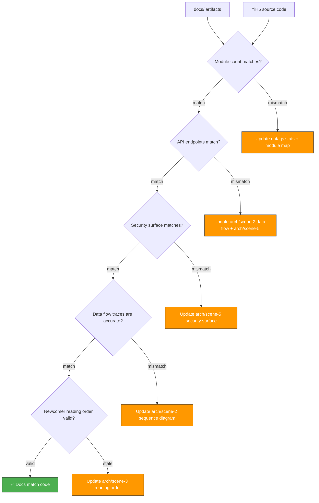

# Scene 3 · Doc-Code Consistency

> **Question**: "Do the docs still match the code?"

---

## §0 — Effect Sketch



**Scene Overview**: This scene defines the procedure for verifying that all docs/ artifacts accurately reflect the current state of the YiH5 source code. It addresses the most common drift vectors: stale module counts, outdated API endpoint lists, security surface changes, and architectural changes that invalidate the data flow diagrams or onboarding path.

---

## §1 — Test Design

### Acceptance Criteria (AC)

| # | AC | Mapping |
|---|----|---------|
| AC-1 | `data.js` stats (component count, service count, source files) match actual counts | §2 count check |
| AC-2 | All services/ API endpoints listed in arch/scene-2 match actual `fetch` calls in source | §2 API check |
| AC-3 | Security surface booleans in data model match actual source patterns | §2 security check |
| AC-4 | Import graphs in arch/scene-1 module-location are still valid | §2 import check |
| AC-5 | arch/scene-3 reading order still visits real files in the right order | §2 reading order |

### Spot Checks (SC)

| # | Spot Check | Expected |
|---|------------|----------|
| SC-1 | `grep -r "fetch(" YiH5/services/ --include="*.js" | wc -l` matches documented endpoint count | ✅ Exact match |
| SC-2 | Every `import` statement in `views/home/index.js` resolves to an existing file | ✅ All resolve |
| SC-3 | `grep "localStorage" YiH5/ --include="*.js" -l` matches documented storage keys | ✅ All documented |
| SC-4 | `grep "fetchWithAuth\|fetch(" YiH5/ --include="*.js" | grep -v libs` returns same URLs as arch/scene-5 | ✅ Match |
| SC-5 | `window.HELP_CONFIG.sections[2].groups[*].items` count = actual file count by category | ✅ Match |

---

## §2 — Output Inventory + Architecture Decisions

### Consistency Check Matrix

#### Check 1: Source File Count

| Source | Expected Count | How to Verify |
|--------|---------------|---------------|
| Total JS files | 38 | `find YiH5 -name '*.js' ! -path '*/libs/*' | wc -l` |
| Components | 9 | 8 dirs with index.js + SwipeScrollController.js |
| Services | 7 | 7 .js files in services/ |
| Utils | 6 | 6 .js files in utils/ |
| Views JS | 5 | 5 .js files in views/home/ |
| Mermaid | 10 | 3 core + 6 plugins + 2 index.js |
| Config | 1 | config.js |
| HTML | 1 | views/home/index.html |
| CSS styles | 6 | styles/ directory |
| CSS components | 9 | Per-component style.css |

#### Check 2: API Endpoint Verification

Scan for `fetch(` calls and verify they match the documented endpoints:

```bash
grep -rn "fetch(" YiH5/services/ YiH5/views/ \
  --include="*.js" \
  | grep -v "libs/" \
  | grep -v "node_modules"
```

Expected unique endpoints:
1. `https://api.effiy.cn/` (executeModule — chat + data_service)
2. `https://api.effiy.cn/?module_name=...&method_name=...` (session/news/faq queries)
3. `https://api.effiy.cn/read-file` (page content fetch)
4. `https://api.effiy.cn/session/save` (session save)

**Note**: The news API `https://api.effiy.cn/mongodb/` is used as a base in views/home/index.js but the actual fetch goes through `config.apiBase` with module/method params — verify this is consistent.

#### Check 3: Security Surface Re-Verification

| Dimension | Current Value | Re-Check Command |
|-----------|--------------|------------------|
| userInput | true | `grep -r "input\|form\|prompt" YiH5/views/ --include="*.html" --include="*.js" \| wc -l` |
| apiEndpoints | false | Verify no `app.get\|router.\|@Get` in source |
| dataStorage | false | Verify no `mongoose\|sequelize\|prisma\|redis\|fs.write` |
| authentication | true | `grep -r "X-Token\|getAuthHeaders\|token" YiH5/services/ --include="*.js" \| wc -l` |
| thirdParty | true | `grep -r "fetch(" YiH5/services/ --include="*.js" \| wc -l` |

#### Check 4: Import Graph Validity

```bash
# Extract all import paths and verify they resolve
grep -rn "from " YiH5/ --include="*.js" \
  | grep -v "libs/" \
  | sed "s/.*from ['\"]\(.*\)['\"].*/\1/" \
  | sort -u
```

Cross-reference with the module-location table in arch/scene-1. Every imported path must have a corresponding entry.

#### Check 5: Newcomer Reading Order

Walk through arch/scene-3's reading order:
1. `config.js` — exists and is 94 lines
2. `services/auth.js` — exists and is 41 lines
3. `services/client.js` — exists and is 155 lines
4. ... (verify each referenced file exists and hasn't moved)

### Architecture Decision: Single Source of Truth

**Decision**: The source code is the single source of truth. All docs/ artifacts are derived from the source code via the `yry-init` pipeline. When in doubt, the code wins.

**Rationale**: This prevents docs from diverging from implementation. Any doc-code mismatch is a bug in the docs, not the code.

---

## §3 — Test Report

| Check | Status | Notes |
|-------|--------|-------|
| AC-1 (source count) | ⬜ TBD | Compare data.js stats to find counts |
| AC-2 (API endpoints) | ⬜ TBD | Compare grep results to arch/scene-2 table |
| AC-3 (security surface) | ⬜ TBD | Re-run the 5 dimension grep checks |
| AC-4 (import graph) | ⬜ TBD | Cross-check with module-location scene |
| AC-5 (reading order) | ⬜ TBD | Verify all referenced files exist |
| SC-1 (fetch count) | ⬜ TBD | services/ + views/ fetch calls |
| SC-2 (import resolution) | ⬜ TBD | views/home/index.js imports |
| SC-3 (localStorage keys) | ⬜ TBD | Compare to arch/scene-5 table |
| SC-4 (fetch URLs) | ⬜ TBD | Compare to arch/scene-5 boundary 3 |
| SC-5 (data.js group items count) | ⬜ TBD | Compare to find counts |

**Overall**: ⬜ Pending — run after any source changes.

---

## §4 — Self-Improvement

| Diagnosis | Severity | Action |
|-----------|----------|--------|
| D0 — Manual grep is error-prone | Medium | Create `scripts/doc-code-consistency.sh` with the 5 checks |
| D1 — Security surface is boolean-only | Low | Five booleans are coarse; could add per-endpoint detail as the project grows |
| D2 — Import resolution is manual | Medium | A simple Node.js script could parse ES module imports and verify resolution |
| D3 — No automated diff between two pipeline runs | Low | Could compare two data.js files to detect what changed between runs |
| D4 — Reading order check doesn't validate content | Low | Only checks file existence, not that the content matches the description |
| D5 — Line counts in docs may drift | Low | Specific line counts (e.g., "94 lines" for config.js) are documentation, not assertions |
| D6 — No check for new files not in docs | Medium | Should flag any source file not mentioned in any arch scene |
| D7 — No check for removed files still in docs | Medium | Should flag any module listed in docs that no longer exists |
| D8 — CSS file count not tracked in data.js | Low | CSS files aren't tracked in stats; only source-centric |

**Follow-up Actions**:
1. Create `scripts/doc-code-consistency.sh` with automated grep/find checks.
2. Create `scripts/import-graph-validator.mjs` for automated import graph verification.
3. Add CSS file counts to data.js stats (15 CSS files across styles/ and component subdirectories).
4. Run this check as part of the pre-commit flow (scene-2 test).
