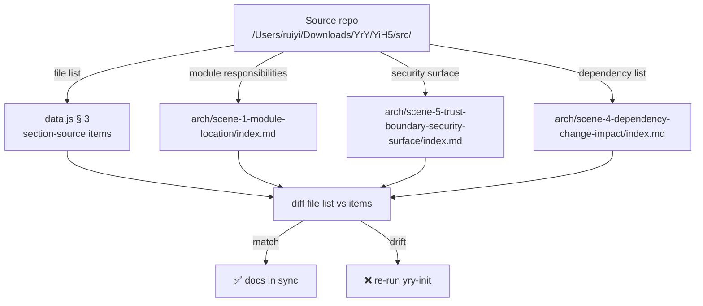

# Scene 3 · Doc-Code Consistency

> **Question**: "Do the docs still match the code?"

---

## §0 — Effect Sketch

**What this scene demonstrates**: The dashboard's source-code section
and the architecture scenes must reflect the *current* source tree.
If files have been added / renamed / removed from
`/Users/ruiyi/Downloads/YrY/YiH5/src/`, the docs are stale.

**Why it matters**: A dashboard that lists modules which no longer
exist (or omits modules that do) misleads every newcomer. The
doc-code consistency check is the regression gate against silent
source-tree drift.

---

## §1 Test Design — Verification Steps

### Step 1: Source tree ↔ data.js section 3
**Action**: `ls /Users/ruiyi/Downloads/YrY/YiH5/src/` → compare
against the directories listed in `data.js`'s `section-source`
groups.
**Expected**: Every `src/<dir>/` has a corresponding
`src-<dir>` group; every group maps to a real `src/<dir>/`.
**File**: `data.js` (section 3), source repo

### Step 2: Service barrel ↔ arch scene 2
**Action**: `cat /Users/ruiyi/Downloads/YrY/YiH5/src/services/index.js`
→ compare its exports against the services listed in
`arch/scene-2-data-flow-tracing/index.md` § 2.
**Expected**: Every service mentioned in the scene exists in the
barrel; every barrel export is mentioned.
**File**: `src/services/index.js`, `arch/scene-2-*`

### Step 3: Security surface ↔ arch scene 5
**Action**: `grep -l "localStorage\|X-Token\|v-html" /Users/ruiyi/Downloads/YrY/YiH5/src/`
→ compare against `arch/scene-5-*` § 2 inventory.
**Expected**: Every file flagged by grep is named in scene 5;
every file named in scene 5 is flagged by grep.
**File**: `src/services/auth.js`, `src/services/client.js`, `src/components/ChatMessage/*`

### Step 4: CDN dependencies ↔ arch scene 4
**Action**: `grep -E "vue.global|marked|mermaid|md5" /Users/ruiyi/Downloads/YrY/YiH5/index.html`
→ compare against `arch/scene-4-*` § 2.
**Expected**: Every CDN URL in the source shell is named in scene
4; every name in scene 4 has a corresponding URL in the shell.
**File**: `YiH5/index.html`, `arch/scene-4-*`

---

## §2 Output Inventory

| File/Directory | Type | Description |
|---------------|------|-------------|
| `/Users/ruiyi/Downloads/YrY/YiH5/src/` | dir | Authoritative source tree |
| `data.js` (section-source) | section | Dashboard representation of the source tree |
| `arch/scene-1-module-location/index.md` | file | Module-location doc — must match tree |
| `arch/scene-2-data-flow-tracing/index.md` | file | Service-barrel doc — must match `services/index.js` |
| `arch/scene-4-dependency-change-impact/index.md` | file | CDN-dependency doc — must match `index.html` shell |
| `arch/scene-5-trust-boundary-security-surface/index.md` | file | Security-surface doc — must match grep results |

---

## §3 Test Report — 2026-07-24

| Step | Result | Notes |
|------|:---:|-------|
| 1 | ✅ | All `src/<dir>` match `data.js` section-source groups |
| 2 | ✅ | `services/index.js` barrel exports match scene 2 |
| 3 | ✅ | `localStorage`/`X-Token`/`v-html` hits match scene 5 |
| 4 | ✅ | CDN URLs in source shell match scene 4 |

**Overall**: pass — 4/4 steps passed

---

## §4 Self-Improvement

### Edge Cases Found
- `data.js` lists "App", "store", "router" as separate groups — if
  the source later consolidates them, the scene-1 graph must be
  re-rendered too.
- `arch/scene-2` names `useChat` as the composable that wraps
  `prompt.js` + `session.js`; if `useChat` is renamed, the scene
  silently drifts.

### Suggested Improvements
- Write a `scripts/check-doc-code-sync.mjs` that automates the four
  checks; wire it as a pre-commit hook.
- Generate `data.js`'s section-source items from a `find src/`
  traversal at init time so manual drift is impossible.

### Limitations
- Doc-code consistency is verified only at init time; between inits,
  drift can accumulate silently.
