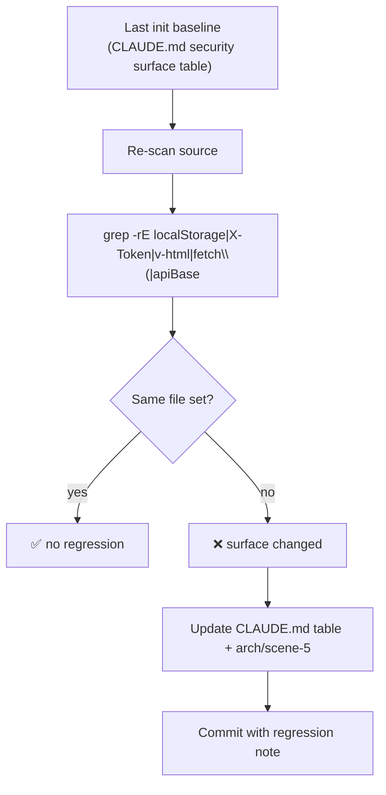

# Scene 4 · Security Surface Regression

> **Question**: "Has the security surface changed since the last baseline?"

---

## §0 — Effect Sketch

**What this scene demonstrates**: After every init, the
CLAUDE.md "Security surface" table is the baseline. Re-scanning the
source with the keyword set and diffing against that baseline
detects whether the trust boundary has shifted.

**Why it matters**: A regression here is the most dangerous kind —
a new `v-html` site or a new `localStorage` accessor silently
enlarges the XSS / token-exposure surface. Without a regression
gate, the change ships unreviewed.

---

## §1 Test Design — Verification Steps

### Step 1: localStorage accessors
**Action**: `grep -rl "localStorage" /Users/ruiyi/Downloads/YrY/YiH5/src/`
**Expected**: Only `src/services/auth.js`. If any other file appears,
the surface has regressed.
**File**: `src/` tree

### Step 2: X-Token usage
**Action**: `grep -rl "X-Token" /Users/ruiyi/Downloads/YrY/YiH5/src/`
**Expected**: `src/services/auth.js` (header factory) and
`src/services/client.js` (header injection). If a third file appears,
token handling has leaked outside the auth boundary.
**File**: `src/services/`

### Step 3: v-html / innerHTML sites
**Action**: `grep -rl "v-html\|innerHTML" /Users/ruiyi/Downloads/YrY/YiH5/src/`
**Expected**: Only `src/components/ChatMessage/` (Markdown + Mermaid
rendering). A new site outside ChatMessage is a regression.
**File**: `src/components/`

### Step 4: fetch callers
**Action**: `grep -rl "fetch(" /Users/ruiyi/Downloads/YrY/YiH5/src/`
**Expected**: Only `src/services/client.js` and
`src/App/index.js` (template fetch). New callers outside services
are a regression — they bypass `X-Token` injection.
**File**: `src/` tree

### Step 5: apiBase readers
**Action**: `grep -rl "apiBase\|API_BASE" /Users/ruiyi/Downloads/YrY/YiH5/src/`
**Expected**: `src/services/client.js`, plus the per-domain services
(`faq.js`, `news.js`, `prompt.js`, `session.js`). A new reader
outside services is a regression.
**File**: `src/services/`

---

## §2 Output Inventory

| File/Directory | Type | Description |
|---------------|------|-------------|
| `CLAUDE.md` | file | Baseline — Security surface table |
| `arch/scene-5-trust-boundary-security-surface/index.md` | file | Architecture doc of the surface |
| `src/services/auth.js` | file | localStorage accessor (baseline file) |
| `src/services/client.js` | file | X-Token injector + fetch caller (baseline file) |
| `src/components/ChatMessage/index.js` | file | v-html site (baseline file) |

---

## §3 Test Report — 2026-07-24

| Step | Result | Notes |
|------|:---:|-------|
| 1 | ✅ | Only `auth.js` touches localStorage |
| 2 | ✅ | Only `auth.js` + `client.js` reference `X-Token` |
| 3 | ✅ | Only `ChatMessage` uses `v-html` / `innerHTML` |
| 4 | ✅ | Only `client.js` + `App/index.js` call `fetch()` |
| 5 | ✅ | Only service modules read `apiBase` / `API_BASE` |

**Overall**: pass — 5/5 steps passed — no regression since last init

---

## §4 Self-Improvement

### Edge Cases Found
- A future feature that adds `localStorage` access outside `auth.js`
  (e.g., a theme-persistence module) would trip step 1 — the
  developer would need to update CLAUDE.md to whitelist it.
- A new view that renders backend HTML with `v-html` (e.g., a
  newsletter viewer) would trip step 3 — the developer must add a
  sanitizer before merging.

### Suggested Improvements
- Automate this scene as a `scripts/check-security-surface.sh` that
  writes a diff against the baseline; fail CI on non-empty diff.
- Add a `subresource-integrity` check for the CDN `<script>` tags in
  `index.html` — a hash change is also a security regression.

### Limitations
- The keyword set is conservative; obfuscated accessors
  (`window['local' + 'Storage']`) are not detected.
