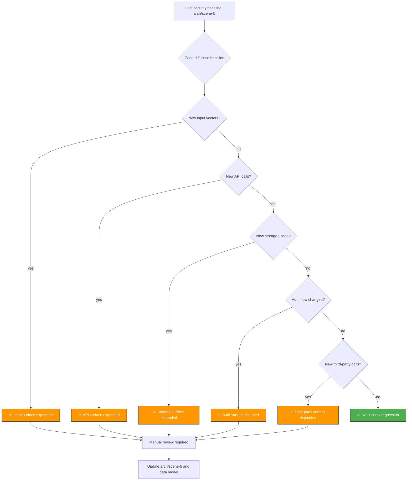

# Scene 4 · Security Surface Regression

> **Question**: "Has the security surface changed since the last baseline?"

---

## §0 — Effect Sketch



**Scene Overview**: This scene defines the regression detection procedure for YiH5's security surface. It compares the current source code against the documented security baseline in arch/scene-5 (trust-boundary-security-surface), identifying any new input vectors, API calls, storage patterns, authentication flows, or third-party integrations that expand the attack surface without corresponding documentation updates.

---

## §1 — Test Design

### Acceptance Criteria (AC)

| # | AC | Mapping |
|---|----|---------|
| AC-1 | No new `innerHTML` or `insertAdjacentHTML` calls without `escapeHtml()` | §2 XSS prevention |
| AC-2 | No new `fetch()` calls to domains not listed in the security surface | §2 API surface |
| AC-3 | No new `localStorage.setItem()` calls without corresponding audit | §2 storage surface |
| AC-4 | No new `window.open()` calls without `noopener,noreferrer` | §2 navigation safety |
| AC-5 | No new inline `<script>` or `eval()` calls | §2 code injection |

### Spot Checks (SC)

| # | Spot Check | Expected |
|---|------------|----------|
| SC-1 | `grep -rn "innerHTML\s*=" YiH5/ --include="*.js" \| grep -v "libs/"` returns only known innerHTML locations | ✅ Match arch/scene-5 boundary 4 |
| SC-2 | `grep -rn "fetch(" YiH5/ --include="*.js" \| grep -v "libs/" \| grep -v "node_modules"` returns only api.effiy.cn calls | ✅ Single domain |
| SC-3 | `grep -rn "localStorage" YiH5/ --include="*.js" \| grep -v "libs/"` returns exactly the keys in arch/scene-5 boundary 2 | ✅ 9 keys |
| SC-4 | `grep -rn "window.open" YiH5/ --include="*.js"` all include `noopener,noreferrer` | ✅ All safe |
| SC-5 | `grep -rn "eval(\|new Function(" YiH5/ --include="*.js" \| grep -v "libs/"` returns nothing | ✅ No eval |

---

## §2 — Output Inventory + Architecture Decisions

### Security Regression Detection Rules

#### Rule 1: DOM Manipulation Audit

YiH5 uses DOM manipulation extensively (it's a vanilla JS SPA). The security question is: when HTML is inserted, is it sanitized?

**Safe pattern** (already used):
```javascript
element.innerHTML = escapeHtml(value);  // ✅ Safe
```

**Pattern to flag**:
```javascript
element.innerHTML = dataFromApi;  // ⚠️ Flag — no sanitization
element.innerHTML = marked.parse(text);  // ⚠️ Flag — marked output not sanitized
element.insertAdjacentHTML('beforeend', userContent);  // ⚠️ Flag
```

**Current YiH5 innerHTML audit** (as of baseline):

| File | Line Context | Data Source | Sanitized? |
|------|-------------|-------------|------------|
| views/home/index.js | escapeHtml() wrapped | User/session data | ✅ Yes |
| views/home/index.js | createWelcomeMessageHtml() | Session.pageDescription via renderMarkdown() | ⚠️ Via marked |
| views/home/index.js | renderFaqSheet | FAQ text via escapeHtml() | ✅ Yes |
| views/home/index.js | renderChips | escapeHtml() wrapped | ✅ Yes |
| utils/markdown.js | renderMarkdown() | marked.parse() output | ⚠️ No DOMPurify |

#### Rule 2: New API Domain Detection

The baseline security surface documents a single API domain: `https://api.effiy.cn`. Any new domain is a security regression requiring review.

**Detection command**:
```bash
grep -rn "fetch(\|fetchWithAuth(" YiH5/ --include="*.js" \
  | grep -oP "(https?://[^'\"]+)" \
  | sort -u
```

#### Rule 3: New localStorage Keys

The baseline documents 9 localStorage keys. Any new key is a privacy/data-persistence concern.

**Detection command**:
```bash
grep -rn "localStorage\.\(setItem\|getItem\|removeItem\)" YiH5/ --include="*.js" \
  | grep -oP "['\"][A-Za-z0-9._-]+['\"]" \
  | sort -u
```

#### Rule 4: New window.open() Calls

**Detection command**:
```bash
grep -rn "window\.open" YiH5/ --include="*.js" \
  | grep -v "noopener" \
  | grep -v "libs/"
```

If any result lacks `noopener,noreferrer`, flag as a regression.

#### Rule 5: New Code Injection Vectors

```bash
# Check for eval, new Function, setTimeout/setInterval with string args
grep -rn "eval(\|new Function(\|setTimeout(\s*['\"]\|setInterval(\s*['\"]" \
  YiH5/ --include="*.js" | grep -v "libs/"
```

### Architecture Decision: Baseline-Locked Security Model

**Decision**: The security surface is documented as a baseline snapshot in arch/scene-5. Any change to the surface must be accompanied by an update to that scene. The pre-commit check (test/scene-2) enforces this by detecting security-relevant changes and prompting a review.

**Rationale**: YiH5 has a small security surface (one API domain, localStorage only, no server-side code). Keeping the surface small is itself a security strategy.

---

## §3 — Test Report

| Check | Status | Notes |
|-------|--------|-------|
| AC-1 (no unsanitized innerHTML) | ⬜ TBD | Audit innerHTML usage against baseline |
| AC-2 (no new API domains) | ⬜ TBD | Check fetch URL uniqueness |
| AC-3 (no new localStorage keys) | ⬜ TBD | Compare to 9 known keys |
| AC-4 (safe window.open) | ⬜ TBD | Verify noopener on all calls |
| AC-5 (no eval/Function) | ⬜ TBD | Grep for injection vectors |
| SC-1 (innerHTML audit) | ⬜ TBD | 2 known ⚠️ items (marked rendering) |
| SC-2 (fetch domains) | ⬜ TBD | Should be only api.effiy.cn |
| SC-3 (localStorage keys) | ⬜ TBD | Should be exactly 9 |
| SC-4 (window.open safety) | ⬜ TBD | All should use noopener,noreferrer |
| SC-5 (no eval) | ⬜ TBD | Should return empty |

**Overall**: ⬜ Pending — run against current source.

---

## §4 — Self-Improvement

| Diagnosis | Severity | Action |
|-----------|----------|--------|
| D0 — Manual grep is not regression-proof | High | Create `scripts/security-regression-check.sh` and run as pre-commit hook |
| D1 — Marked output unsanitized | High | Known issue from arch/scene-5 §4 D0; add DOMPurify before innerHTML |
| D2 — No Content-Security-Policy | Medium | Adding CSP headers would require refactoring inline scripts; captured in arch/scene-5 |
| D3 — localStorage token has no expiry | Medium | Captured in arch/scene-5 §4 D1 |
| D4 — No subresource integrity | Low | Only relevant if moving libs to CDN |
| D5 — No automated CVE scanning | Low | No npm, so no `npm audit` equivalent; manual review of marked/mermaid/md5 CVEs needed |
| D6 — Config injection via window.YI_CONFIG | Low | Medium severity per arch/scene-5; mitigated by requiring browser compromise |
| D7 — No HTTPS enforcement in code | Low | Config hardcodes https://, but no HSTS or upgrade-insecure-requests |
| D8 — No input validation on chat messages | Low | Free-text input with no length/character restrictions; acceptable for tooling |

**Follow-up Actions**:
1. Create `scripts/security-regression-check.sh` with the 5 rules from §2.
2. Address the marked HTML sanitization issue (add DOMPurify).
3. Run this check as part of pre-commit (test/scene-2).
4. Schedule quarterly manual reviews of the marked/mermaid/md5 CVEs.
