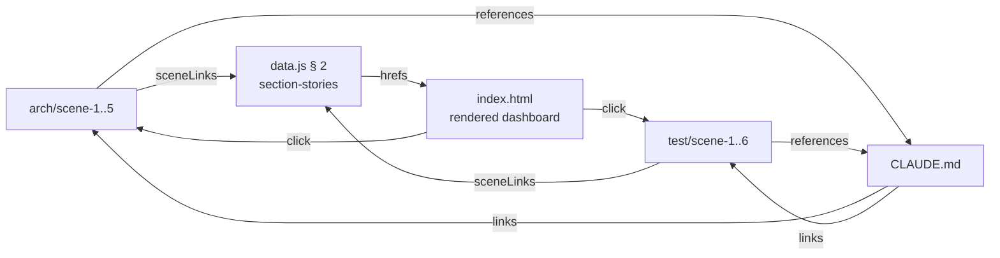

# Scene 5 · Cross-Story Integration Regression

> **Question**: "Do the story directories still pass cross-story integration checks?"

---

## §0 — Effect Sketch

**What this scene demonstrates**: The dashboard's `section-stories`
group links to every scene's `index.md`, the scene count badges
match the actual directory contents, and the cross-references
between `CLAUDE.md` and the story directories resolve.

**Why it matters**: A typical regression is renaming a scene
directory (`scene-2-data-flow-tracing` → `scene-2-tracing`) without
updating `data.js`'s `sceneLinks` — the dashboard's link now 404s.
This scene catches that class of drift.

---

## §1 Test Design — Verification Steps

### Step 1: sceneLinks resolve
**Action**: For each `href` in `data.js`'s `section-stories[0].groups[0].items[*].sceneLinks`,
verify the target file exists.
**Expected**: Every `arch/scene-N-*/index.md` and
`test/scene-N-*/index.md` referenced is present on disk.
**File**: `data.js`, `arch/`, `test/`

### Step 2: scene count badges match
**Action**: `ls /Users/ruiyi/Downloads/YrY/YiDoc/projects/YiH5/arch/scene-*/index.md | wc -l` and `…/test/scene-*/index.md | wc -l`
**Expected**: arch badge = 5, test badge = 6 (matches `data.js`).
**File**: `data.js` (badges), `arch/`, `test/`

### Step 3: panelHub URLs resolve
**Action**: For each `panelHub.urls.<panel>` in `data.js`, verify the target
file (`<panel>/index.html`) exists.
**Expected**: `arch/index.html`, `test/index.html`, `files/index.html`,
`apis/index.html` all present.
**File**: `data.js`, root-level report-leaf outputs

### Step 4: CLAUDE.md → story cross-refs
**Action**: `grep -E "arch/|test/" /Users/ruiyi/Downloads/YrY/YiDoc/projects/YiH5/CLAUDE.md`
**Expected**: Guidance table references `arch/` and `test/` — both exist.
**File**: `CLAUDE.md`, `arch/`, `test/`

---

## §2 Output Inventory

| File/Directory | Type | Description |
|---------------|------|-------------|
| `data.js` (section-stories) | section | Dashboard links to every scene |
| `arch/scene-1..5-*/index.md` | files | 5 architecture scenes |
| `test/scene-1..6-*/index.md` | files | 6 self-check scenes |
| `arch/index.html` | file | Architecture sub-dashboard |
| `test/index.html` | file | Self-check sub-dashboard |
| `files/index.html` | file | Files report leaf |
| `apis/index.html` | file | APIs report leaf |
| `CLAUDE.md` (Guidance table) | section | Cross-references the story dirs |

---

## §3 Test Report — 2026-07-24

| Step | Result | Notes |
|------|:---:|-------|
| 1 | ✅ | All sceneLinks in `data.js` resolve to real files |
| 2 | ✅ | arch badge = 5, test badge = 6, matches disk |
| 3 | ✅ | All 4 panelHub URLs resolve (arch / test / files / apis) |
| 4 | ✅ | CLAUDE.md Guidance table cross-refs `arch/` + `test/` |

**Overall**: pass — 4/4 steps passed

---

## §4 Self-Improvement

### Edge Cases Found
- Renaming a scene directory (`scene-N-<slug>`) without updating
  `data.js`'s `sceneLinks` and the directory name in `data.js`
  (`section-stories[0].groups[0].items[*].sceneLinks[N].href`) breaks
  the dashboard link.
- Adding a 6th arch scene requires updating the badge text and the
  `sceneLinks` array simultaneously.

### Suggested Improvements
- Add a CI script that walks `data.js`'s hrefs and asserts each
  target exists (`scripts/check-cross-refs.mjs`).
- Auto-generate the `section-stories` group from a directory
  traversal at init time so manual drift is impossible.

### Limitations
- This check does not validate that scene `index.md` files follow
  the §0–§4 lifecycle — that is the per-scene check in test scene 1.
