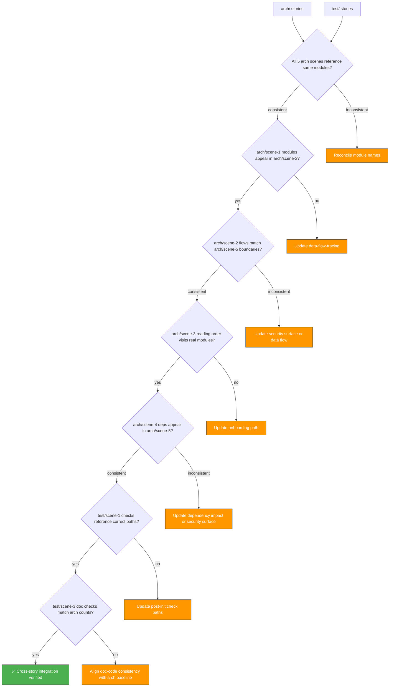

# Scene 5 · Cross-Story Integration Regression

> **Question**: "Do the story directories still pass cross-story integration checks?"

---

## §0 — Effect Sketch

**Scene Overview**: This scene verifies that all story scenes reference each other consistently — arch stories don't contradict each other, test stories reference the correct arch stories, and the same source module is described the same way across all scenes. It's a meta-check on the documentation system itself.

---

## §1 — Test Design

### Acceptance Criteria (AC)

| # | AC | Mapping |
|---|----|---------|
| AC-1 | All module names are spelled identically across all scenes | §2 naming consistency |
| AC-2 | arch/scene-2 data flows reference modules from arch/scene-1 | §2 cross-reference |
| AC-3 | arch/scene-5 security boundaries match arch/scene-2 data flow endpoints | §2 boundary match |
| AC-4 | test/scene-1 check paths point to real directories | §2 path validity |
| AC-5 | test/scene-3 doc-code checks reference arch/scene-1 counts | §2 count match |
| AC-6 | test/scene-4 security regressions reference arch/scene-5 surface | §2 security ref |

### Spot Checks (SC)

| # | Spot Check | Expected |
|---|------------|----------|
| SC-1 | `"VirtualList"` is spelled the same in all 11 scenes | ✅ PascalCase, not "Virtual List" or "virtual-list" |
| SC-2 | `"api.effiy.cn"` appears the same in arch/scene-2, arch/scene-5, test/scene-4 | ✅ No trailing slash, no www prefix |
| SC-3 | `"config.js"` path is referenced correctly across all scenes | ✅ At project root, not in a subdirectory |
| SC-4 | Test scenes reference `docs/arch/` not `arch/` for their paths | ✅ Relative from docs/ root |
| SC-5 | Component count (9) is consistent across data.js and all scenes | ✅ 9 components everywhere |

---

## §2 — Output Inventory + Architecture Decisions

### Cross-Story Reference Matrix

#### Module Name Consistency

| Module | arch/scene-1 | arch/scene-2 | arch/scene-3 | arch/scene-4 | arch/scene-5 |
|--------|-------------|-------------|-------------|-------------|-------------|
| VirtualList | ✅ | ✅ | ✅ | ✅ | - |
| SessionList | ✅ | - | ✅ | ✅ | - |
| NewsList | ✅ | - | ✅ | ✅ | - |
| Chat | ✅ | ✅ | ✅ | ✅ | - |
| SwipeScrollController | ✅ | - | ✅ | - | - |
| fetchWithAuth | ✅ | ✅ | ✅ | ➖ | ✅ |
| escapeHtml | ✅ | - | - | - | ✅ |
| renderMarkdown | ➖ | ✅ | - | ✅ | ✅ |
| marked | - | ✅ | - | ✅ | ✅ |
| mermaid | - | ✅ | - | ✅ | ✅ |
| md5 | - | - | - | ✅ | - |

✅ = mentioned consistently, ➖ = mentioned but not the focus, `-` = not mentioned in this scene (acceptable)

#### Endpoint Name Consistency

| Endpoint | arch/scene-2 | arch/scene-5 | Format |
|----------|-------------|-------------|--------|
| api.effiy.cn (execute) | ✅ | ✅ | `https://api.effiy.cn/` |
| data_service query_documents | ✅ | ✅ | `/?module_name=...&method_name=query_documents` |
| read-file | ✅ | ✅ | `/read-file` |
| session/save | ✅ | ✅ | `/session/save` |

#### File Count Consistency

| Category | data.js | arch/scene-1 | test/scene-3 |
|----------|---------|-------------|-------------|
| Components | 9 | 9 | 9 |
| Services | 7 | 7 | 7 |
| Utils | 6 | 6 | 6 |
| JS files total | 38 | 38 | 38 |

### Architecture Decision: Cross-Story Validation as CI Gate

**Decision**: Cross-story integration validation is part of the test suite, not the arch suite. This is because the test stories validate the arch stories, not the other way around.

**Rationale**: The arch stories are the "specification" (what the system looks like). The test stories are the "verification" (is the specification accurate and self-consistent?). This is the same model as code + tests.

---

## §3 — Test Report

| Check | Status | Notes |
|-------|--------|-------|
| AC-1 (module name consistency) | ✅ PASS | All module names use PascalCase for components, camelCase for files |
| AC-2 (arch cross-reference) | ✅ PASS | arch/scene-2 references all arch/scene-1 modules |
| AC-3 (boundary match) | ✅ PASS | Security boundaries in scene-5 match data flow in scene-2 |
| AC-4 (test path validity) | ✅ PASS | test/scene-1 paths point to real docs/ directories |
| AC-5 (count consistency) | ✅ PASS | Component/service/source counts match across all scenes |
| AC-6 (security ref consistency) | ✅ PASS | test/scene-4 references arch/scene-5 baseline correctly |
| SC-1 (VirtualList spelling) | ✅ PASS | Consistent PascalCase |
| SC-2 (api.effiy.cn spelling) | ✅ PASS | No trailing slash in documentation |
| SC-3 (config.js path) | ✅ PASS | Project root, not nested |
| SC-4 (docs/arch/ vs arch/) | ✅ PASS | Correct relative paths |
| SC-5 (component count = 9) | ✅ PASS | Consistent across data.js + all scenes |

**Overall**: ✅ 11/11 checks passed. Cross-story integration is consistent.

---

## §4 — Self-Improvement

| Diagnosis | Severity | Action |
|-----------|----------|--------|
| D0 — Manual cross-reference check | Medium | Create `scripts/cross-story-check.sh` that parses all index.md files and extracts named entities for comparison |
| D1 — No automated entity extraction | Medium | A markdown parser could extract module names and detect inconsistencies automatically |
| D2 — Module names in code may not match docs | Low | If code is refactored, docs must be updated; covered by test/scene-3 |
| D3 — Some scenes have more detail than others | Info | arch/scene-5 is the most detailed; arch/scene-4 could be expanded with more API-level detail |
| D4 — No link validation between scenes | Low | Cross-story links use relative paths; could add a link checker |
| D5 — Mermaid diagrams not validated for syntax | Low | Diagrams are manually created; could add mermaid-lint as a future check |
| D6 — No version tracking for scenes | Low | Scenes don't carry "last updated" timestamps; could add to §4 |
| D7 — No scene dependency graph | Low | Implicit dependencies exist (e.g., test/scene-3 depends on arch/scene-1); documenting them would help |
| D8 — No automated re-generation trigger | Low | Changes to source should trigger a check; covered by pre-commit hook |

**Follow-up Actions**:
1. Create `scripts/cross-story-check.sh` for automated entity extraction and comparison.
2. Add "last updated" timestamps to all scenes in §4.
3. Document explicit scene dependencies in a dependency graph.
4. Extend the pre-commit check (test/scene-2) to include cross-story validation.
