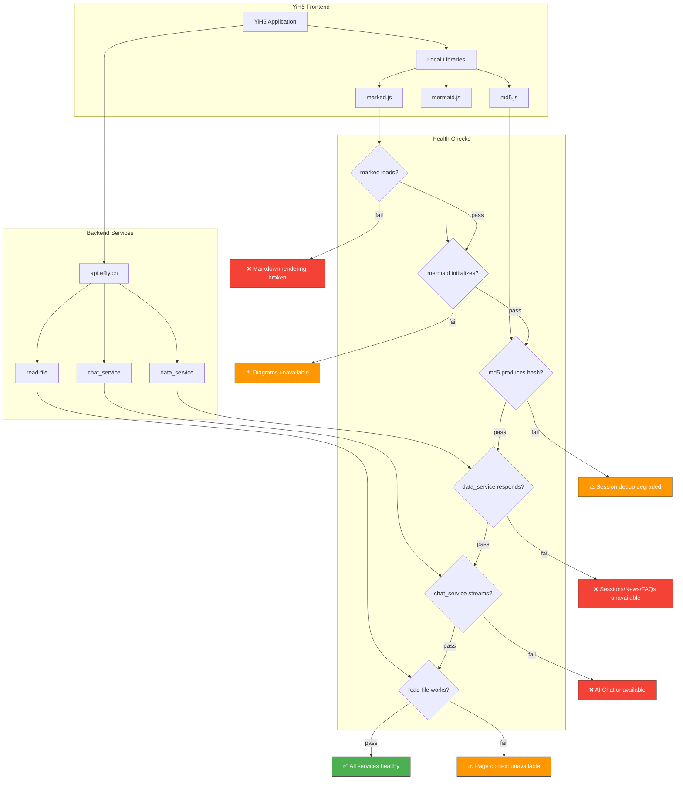

# Scene 6 · Third-Party Framework & Service Health

> **Question**: "Are third-party frameworks and services still healthy?"

---

## §0 — Effect Sketch

**Scene Overview**: This scene defines the health check procedure for all third-party dependencies of YiH5 — both the three local libraries (marked, mermaid, md5) and the three backend service modules exposed via api.effiy.cn (data_service, chat_service, read-file). Each dependency is checked for availability, correct behavior, and version stability.

---

## §1 — Test Design

### Acceptance Criteria (AC)

| # | AC | Mapping |
|---|----|---------|
| AC-1 | `marked` is loaded and `marked.parse()` produces valid HTML | §2 library checks |
| AC-2 | `mermaid` is loaded and `mermaid.initialize()` succeeds | §2 library checks |
| AC-3 | `md5` is loaded and produces a 32-char hex string | §2 library checks |
| AC-4 | `data_service.query_documents` returns session/faq/news data | §2 service checks |
| AC-5 | `chat_service.chat` returns a non-empty response | §2 service checks |
| AC-6 | `/read-file` returns file content for a known path | §2 service checks |

### Spot Checks (SC)

| # | Spot Check | Expected |
|---|------------|----------|
| SC-1 | Open YiH5 in browser → check console for "marked is not defined" errors | ✅ No errors |
| SC-2 | Send a chat message → verify Markdown renders correctly | ✅ Bold/italic/code blocks render |
| SC-3 | Send a chat message with Mermaid → verify diagram renders | ✅ SVG diagram appears |
| SC-4 | Load the session list → verify sessions appear | ✅ Session cards render |
| SC-5 | Load the news tab with a date → verify news items appear | ✅ News cards render |
| SC-6 | Open the FAQ sheet → verify FAQ items load | ✅ FAQ items appear |

---

## §2 — Output Inventory + Architecture Decisions

### Library Health Checks

#### Check 1: marked.js Health

| Property | Value |
|----------|-------|
| **File** | `YiH5/libs/marked.min.js` |
| **Expected API** | `window.marked.parse(text)` |
| **Health check** | Open browser console: `marked.parse('# Hello')` → should return `<h1>Hello</h1>` |
| **Failure symptoms** | Chat messages show raw Markdown text; FAQ descriptions, page contexts, changelog notes lose formatting |
| **Recovery** | Verify marked.min.js exists and is loaded before index.js. Check `<script src="../../libs/marked.min.js">` in index.html |
| **Version check** | Not versioned in source. As of baseline: `marked.min.js` has no version comment. Check file size for drift. |

#### Check 2: mermaid.js Health

| Property | Value |
|----------|-------|
| **File** | `YiH5/libs/mermaid.min.js` |
| **Expected API** | `window.mermaid.initialize(config)`, `window.mermaid.run({ nodes })` |
| **Health check** | Open browser console: `typeof mermaid !== 'undefined'` → should return `true` |
| **Failure symptoms** | Mermaid diagrams silently fail (guarded by `typeof mermaid !== 'undefined'` check in utils/markdown.js). No crash, just missing diagrams. |
| **Recovery** | Verify mermaid.min.js exists and is loaded. Check for console errors in MermaidConfig.js initialization. |
| **Version check** | Not versioned in source. As of baseline: `mermaid.min.js` has no version comment. |

#### Check 3: md5.js Health

| Property | Value |
|----------|-------|
| **File** | `YiH5/libs/md5.js` |
| **Expected API** | `window.md5(string)` → 32-char hex string |
| **Health check** | Open browser console: `md5('test')` → should return `098f6bcd4621d373cade4e832627b4f6` |
| **Failure symptoms** | Session ID generation falls back to DJB2-style hash. New sessions get different IDs; old sessions become orphans (not found by URL-based lookup). |
| **Recovery** | Verify md5.js exists and loads before index.js. The fallback hash is a safety net but breaks session continuity. |

#### Check 4: CSS/UI Health

| Property | Value |
|----------|-------|
| **Files** | `styles/index.css` + per-component `style.css` (15 total) |
| **Health check** | Open YiH5 in browser → verify topbar, search cards, list items, chat bubbles, bottom nav render correctly |
| **Failure symptoms** | Unstyled elements; layout breaks; missing colors/fonts |
| **Recovery** | Check Network tab for 404s on CSS files. Verify `styles/index.css` @import rules point to existing files. |

### Backend Service Health Checks

#### Check 5: data_service Health

| Property | Value |
|----------|-------|
| **Endpoint** | `https://api.effiy.cn/?module_name=services.database.data_service&method_name=query_documents&parameters={"cname":"sessions"}` |
| **Auth** | X-Token required |
| **Health check** | Open YiH5 → verify session list loads. Check console for 401 (missing token) or network errors. |
| **Failure symptoms** |
| - Sessions | "获取会话列表失败" error message |
| - News | "获取新闻失败" error message |
| - FAQs | "获取常见问题失败" error message |
| **Recovery** | Verify X-Token is set (🔒 button in topbar). Check the backend is reachable from the browser. |

#### Check 6: chat_service Health

| Property | Value |
|----------|-------|
| **Endpoint** | `https://api.effiy.cn/` — `POST { module_name: "services.ai.chat_service", method_name: "chat", parameters: { system, user, model } }` |
| **Auth** | X-Token required |
| **Health check** | Send a test chat message. Verify streaming response is received and rendered. |
| **Failure symptoms** | "请求失败" error in chat bubbles. No response from AI. |
| **Recovery** | Verify X-Token. Check backend AI service status. Try a different model (default: deepseek-r1:32b). |

#### Check 7: read-file Health

| Property | Value |
|----------|-------|
| **Endpoint** | `https://api.effiy.cn/read-file` — `POST { target_file: "..." }` |
| **Auth** | X-Token required |
| **Health check** | Open a session with a URL → click "上下文" in chat toolbar → click "刷新". Should load page content. |
| **Failure symptoms** | "页面上下文" sheet shows empty content. No error visible to user (silent failure). |
| **Recovery** | Check browser console for `/read-file` errors. Verify the target file path is correctly constructed. |

### Architecture Decision: No Online Dependency

**Decision**: All three libraries are local files, not CDN-hosted. The application works fully offline once loaded, except for the backend API calls.

**Rationale**: This eliminates CDN availability as a failure mode. The libraries are version-locked by virtue of being checked into the repository. The tradeoff is manual version management.

---

## §3 — Test Report

### Library Health

| Check | Status | Notes |
|-------|--------|-------|
| AC-1 (marked health) | ⬜ TBD | Check in browser console |
| AC-2 (mermaid health) | ⬜ TBD | Check in browser console |
| AC-3 (md5 health) | ⬜ TBD | Check in browser console |
| SC-1 (no marked errors) | ⬜ TBD | Check browser console on load |
| SC-2 (Markdown rendering) | ⬜ TBD | Send test message with **bold** and `code` |
| SC-3 (Mermaid rendering) | ⬜ TBD | Send test message with mermaid code block |

### Service Health

| Check | Status | Notes |
|-------|--------|-------|
| AC-4 (data_service health) | ⬜ TBD | Requires valid X-Token |
| AC-5 (chat_service health) | ⬜ TBD | Requires valid X-Token + model availability |
| AC-6 (read-file health) | ⬜ TBD | Requires valid X-Token + valid file path |
| SC-4 (sessions load) | ⬜ TBD | Requires valid X-Token |
| SC-5 (news load) | ⬜ TBD | Requires valid X-Token |
| SC-6 (FAQs load) | ⬜ TBD | Requires valid X-Token |

**Overall**: ⬜ Pending — requires active backend and valid X-Token.

---

## §4 — Self-Improvement

| Diagnosis | Severity | Action |
|-----------|----------|--------|
| D0 — No automated health check script | High | Create a browser-console health check script that tests all 3 libs + 3 services |
| D1 — Library versions not pinned | Medium | Add version comments to lib files: `/* marked v4.3.0 */`. Create `libs/versions.json`. |
| D2 — Backend service has no status endpoint | Medium | No `/health` or `/status` endpoint to check backend availability without auth. Request backend team to add one. |
| D3 — No service degradation mode | Medium | If chat_service is down, the UI shows errors but doesn't gracefully degrade. Could show a "service unavailable" banner. |
| D4 — No retry with backoff for transient failures | Low | fetchNews/fetchSessions retry is manual (user clicks refresh). Could add auto-retry. |
| D5 — X-Token is the single point of failure for all services | High | All 3 backend services share one token. If the token is invalid/expired, everything breaks. Consider per-service tokens or a refresh flow. |
| D6 — No proactive health monitoring | Low | Health checks are reactive (user reports issues). Could add periodic background health pings. |
| D7 — Library files could be corrupted silently | Low | Files are checked into git but not hash-verified. Could add SRI hashes even for local files. |
| D8 — No fallback for backend unavailability | Medium | The SPA is a thin client — all data comes from the backend. Offline mode is not possible in the current architecture. |

**Follow-up Actions**:
1. Create `scripts/service-health-check.html` — a standalone page that loads all 3 libs and tests all 3 services.
2. Add version metadata to libs directory.
3. Request backend team to add an unauthenticated `/health` endpoint.
4. Add graceful degradation UI (e.g., a toast when a service is unreachable).
5. Consider periodic background health pings during app usage.
