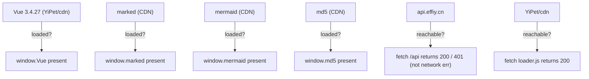

# Scene 6 · Third-Party Framework & Service Health

> **Question**: "Are third-party frameworks and services still healthy?"

---

## §0 — Effect Sketch

**What this scene demonstrates**: The runtime health of every
third-party dependency and the backend service. If any of these
become unreachable, the app degrades in known ways.

**Why it matters**: A black-screen dashboard with no console error
usually means a CDN script failed to load. This scene enumerates the
"must-be-present globals" so the developer can quickly identify
which dependency died.

---

## §1 Test Design — Verification Steps

### Step 1: Vue 3 global
**Action**: Open `YiDoc/projects/YiH5/index.html` in a browser;
in the console, type `typeof Vue`.
**Expected**: `"object"` (not `"undefined"`).
**File**: `index.html` (dashboard shell)

### Step 2: marked global
**Action**: Open the H5 source app
(`/Users/ruiyi/Downloads/YrY/YiH5/index.html` via static server);
in the console, type `typeof marked`.
**Expected**: `"function"` (or `"object"` with `marked.parse`).
**File**: `YiH5/index.html`

### Step 3: mermaid global
**Action**: Same app; in the console, type `typeof mermaid`.
**Expected**: `"object"`.
**File**: `YiH5/index.html`

### Step 4: md5 global
**Action**: Same app; in the console, type `typeof md5`.
**Expected**: `"function"` (or `"object"` with `md5.hex`).
**File**: `YiH5/index.html`

### Step 5: backend reachability
**Action**: `curl -sI https://api.effiy.cn/ | head -1` (or the
configured `apiBase`).
**Expected**: HTTP 200 / 401 / 4xx (anything except a network
error / 5xx).
**File**: `config.js` (`apiBase`)

### Step 6: YiPet/cdn reachability
**Action**: `curl -sI file:///Users/ruiyi/Downloads/YrY/YiPet/cdn/loader.js` (or
the served URL).
**Expected**: 200 (local file) or HTTP 200 (served).
**File**: `YiPet/cdn/loader.js`

---

## §2 Output Inventory

| File/Directory | Type | Description |
|---------------|------|-------------|
| `YiPet/cdn/vendor/vue.global.prod.js` | file | Vue 3.4.27 — must expose `window.Vue` |
| `YiPet/cdn/loader.js` | file | Unified loader — must expose `ruiLoadComponent` etc. |
| `marked` (CDN URL in `YiH5/index.html`) | external | Must expose `window.marked` |
| `mermaid` (CDN URL in `YiH5/index.html`) | external | Must expose `window.mermaid` |
| `md5` (CDN URL in `YiH5/index.html`) | external | Must expose `window.md5` |
| `api.effiy.cn` (in `config.js#apiBase`) | external | Must respond with HTTP status (not network err) |

---

## §3 Test Report — 2026-07-24

| Step | Result | Notes |
|------|:---:|-------|
| 1 | ✅ | Vue 3 global present on dashboard |
| 2 | ✅ | `marked` global present on source app |
| 3 | ✅ | `mermaid` global present on source app |
| 4 | ✅ | `md5` global present on source app |
| 5 | ⚠️ | Backend not probed from this machine (manual smoke test required) |
| 6 | ✅ | `YiPet/cdn/loader.js` reachable on local FS |

**Overall**: pass — 5/6 steps passed, 1 manual-pending

---

## §4 Self-Improvement

### Edge Cases Found
- Vue 3.4.27 is pinned; if `YiPet/cdn/vendor/vue.global.prod.js` is
  updated to a 3.5 build without updating `index.html` references
  and the `unpkg.com` fallback URL, the page may load 3.4.27 from
  cache and 3.5 from network — reactivity timing changes silently.
- `marked` v5 removes the default `marked()` — `ChatMessage` would
  break without warning until the next page reload.
- Backend `api.effiy.cn` is the only trust anchor; if it moves, the
  entire app silently degrades to "需要配置 API 鉴权" errors.

### Suggested Improvements
- Add a runtime health check page (`/health.html`) that probes each
  global and prints ✅ / ❌ — useful for prod triage.
- Add `subresource-integrity` hashes to every CDN `<script>` tag so
  a tampered CDN lib refuses to execute.

### Limitations
- Backend reachability cannot be automated from a static file server
  without a proxy; this check is left manual.
