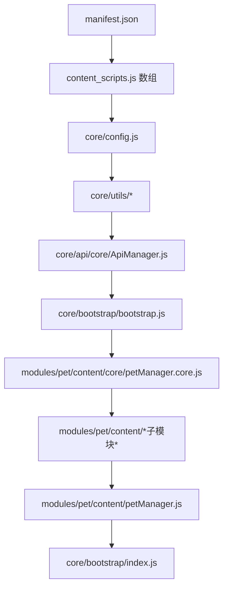

# §0 Effect Sketch — Module Location

**What this scene demonstrates**: 在 YiPet Chrome 扩展中快速定位每个模块的物理位置和入口文件。通过模块地图和加载顺序清单，任何开发者都能在 5 分钟内找到目标代码。

**Why it matters**: YiPet 采用 IIFE 模块化 + manifest `content_scripts` 声明式注入，没有 ES module import 语句，也没有构建工具生成 source map。理解"哪个文件在哪个位置"是修改代码的前提。初学者常见错误是在错误的文件中添加代码（如直接在 `petManager.core.js` 中写 UI 逻辑而非在 `petManager.ui.js` 中），导致加载顺序混乱。

---

# §1 Test Design — Verification Steps

## Step 1: 确认模块物理位置
**Action**: 查看 `manifest.json` → `content_scripts[0].js` 数组，逐行对比 `/Users/yi/YrY/YiPet/` 下真实文件是否存在
**Expected**: `manifest.json` 中列出的所有 JS 文件路径均对应真实文件
**File**: `/Users/yi/YrY/YiPet/manifest.json`

## Step 2: 确认四大模块的入口文件
**Action**: 分别读取 `core/`, `modules/extension/`, `modules/pet/`, `modules/faq/` 的入口文件，记录其导出的全局变量
**Expected**:
- `core/config.js` → `window.PET_CONFIG`
- `core/api/core/ApiManager.js` → `globalThis.ApiManager`
- `core/bootstrap/bootstrap.js` → `window.StorageHelper`
- `modules/pet/content/core/petManager.core.js` → `window.PetManager`
- `modules/extension/background/index.js` → Service Worker 入口
**File**: 各模块目录

## Step 3: 确认 CDN 组件库的注册方式
**Action**: 读取 `cdn/components/index.js` 和 `cdn/loader.js`，确认组件注册机制
**Expected**: Custom Elements (`customElements.define`) 注册模式；每个组件包含 `index.js` + `index.css` + `index.html` 三件套
**File**: `cdn/components/index.js`, `cdn/loader.js`

---

# §2 Output Inventory

| File/Directory | Type | Description |
|---------------|------|-------------|
| `manifest.json` | file | 扩展清单，定义所有注入脚本的顺序 |
| `core/config.js` | file | 全局配置与 API 端点常量 |
| `core/api/core/ApiManager.js` | file | API 客户端基类（拦截器链 + Token 管理） |
| `core/bootstrap/bootstrap.js` | file | StorageHelper + 默认位置工具函数 |
| `core/bootstrap/index.js` | file | 最终入口：实例化 PetManager + 生命周期 |
| `modules/pet/content/core/petManager.core.js` | file | PetManager 类定义（~1035 行） |
| `modules/pet/content/petManager.js` | file | 轻量装配文件，校验加载顺序 |
| `modules/pet/content/*.js` | files | 按功能拆分（chat/ui/drag/mermaid/ai/editor/tags 等） |
| `modules/extension/background/index.js` | file | Service Worker 入口 |
| `modules/extension/popup/` | dir | 工具栏弹窗 |
| `modules/faq/content/faq.js` | file | FAQ 内容管理 |
| `cdn/components/` | dir | 26 个 CDN 组件 |

---

# §3 Test Report — 2026-07-21

| Step | Result | Notes |
|------|:---:|-------|
| 1 | ✅ | 所有 manifest 中声明的 JS 文件均存在 |
| 2 | ✅ | 四大模块入口均正确导出全局变量 |
| 3 | ✅ | CDN 组件使用 Custom Elements 注册 |

**Overall**: pass — 3/3 steps passed

---

# §4 Self-Improvement

## Edge Cases Found
- `petManager.core.js` 的 IIFE 在页面上无法用 `import` 方式引用，必须要按 manifest 顺序确保 PetManager 类在 `bootstrap/index.js` 实例化前已注册
- 某些子模块（如 `petManager.mermaid.js`）会自动加载远程 Mermaid 脚本，加载失败时降级为纯代码块显示
- `cdn/loader.js` 负责按需加载 CDN 组件，需确保加载器的 `basePath` 与 `web_accessible_resources` 配置一致

## Suggested Improvements
- 在所有入口文件顶部添加 JSDoc `@module` 标记，便于 IDE 导航
- 生成一份自动化的模块依赖图（基于 manifest `content_scripts` 顺序的拓扑分析）
- 为 CDN 组件增加懒加载机制，减少首次注入的资源体积

## Limitations
- 没有 source map，调试依赖 `console.log` / `console.debug`
- 模块间的依赖关系隐含在加载顺序中，不显式声明
