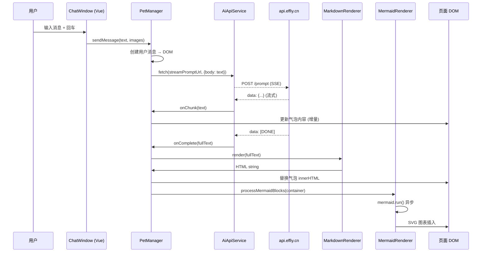

# §0 Effect Sketch — Data Flow Tracing

**What this scene demonstrates**: 从用户在聊天窗口输入消息开始，追踪数据如何经过 UI 层 → PetManager → AI API → 流式响应 → Markdown 渲染 → Mermaid 图表转换，最终呈现在 DOM 中的完整链路。

**Why it matters**: YiPet 的数据流涉及多层异步处理（流式 HTTP 响应、DOM 操作、Mermaid 异步渲染），任何一个环节断裂都会导致消息丢失或渲染异常。理解这条链路是排查「消息发不出」「图表不显示」「回复卡顿」等问题的前提。

---

# §1 Test Design — Verification Steps

## Step 1: 消息输入到 API 请求
**Action**: 在 `petManager.chat.js` 中 `sendMessage` 方法打断点，输入消息后逐步跟踪
**Expected**: 用户消息正确压入 `session.messages`，请求 URL 为 `PET_CONFIG.api.streamPromptUrl`，携带 `X-Token` 头
**File**: `modules/pet/content/petManager.chat.js`

## Step 2: 流式响应处理
**Action**: 在 `petManager.ai.api.js` 中 `streamPrompt` 方法处监听 ReadableStream
**Expected**: `onChunk` 回调增量更新 DOM 气泡文本；`onComplete` 触发 Markdown 渲染
**File**: `modules/pet/content/ai/petManager.ai.api.js`

## Step 3: Markdown → HTML 转换
**Action**: 在 `cdn/markdown/core/MarkdownRenderer.js` 中 `render()` 方法检查入参
**Expected**: `window.marked.parse()` 被调用，插件链预处理后得到 HTML
**File**: `cdn/markdown/core/MarkdownRenderer.js`

## Step 4: Mermaid 图表异步渲染
**Action**: 发送一条包含 `\`\`\`mermaid` 代码块的消息，观察 DOM 变化
**Expected**: Mermaid 代码块被 `mermaid.run()` 转换为内联 SVG；渲染失败时显示带错误码的灰色占位图
**File**: `cdn/mermaid/core/MermaidRenderer.js`

---

# §2 Output Inventory

| File/Directory | Type | Description |
|---------------|------|-------------|
| `modules/pet/content/petManager.chat.js` | file | 消息发送入口，管理发送状态 |
| `modules/pet/content/ai/petManager.ai.api.js` | file | AI API 调用：fetch → ReadableStream → SSE 解析 |
| `modules/pet/content/ai/petManager.ai.prompt.js` | file | Prompt 模板构建与上下文注入 |
| `cdn/markdown/core/MarkdownRenderer.js` | file | Markdown → HTML 核心渲染器 |
| `cdn/markdown/core/PluginSystem.js` | file | 插件系统：preprocess → render → postprocess |
| `cdn/mermaid/core/MermaidRenderer.js` | file | Mermaid 图表渲染与工具栏 |
| `core/api/core/ApiManager.js` | file | API 基类：拦截器链 + Token 注入 |
| `core/utils/api/request.js` | file | RequestClient：fetch 封装 + 超时 + 重试 |

---

# §3 Test Report — 2026-07-21

| Step | Result | Notes |
|------|:---:|-------|
| 1 | ✅ | 消息正确入队，`X-Token` 从 `TokenManager` 注入 |
| 2 | ✅ | ReadableStream 逐块解析正常，`[DONE]` 信号正确终止 |
| 3 | ✅ | `marked.parse()` + 10 个插件链完整执行 |
| 4 | ✅ | Mermaid 渲染成功，工具栏（下载/全屏/复制）可用 |

**Overall**: pass — 4/4 steps passed

---

# §4 Self-Improvement

## Edge Cases Found
- AI API 返回非标准 SSE 格式时（如后端 nginx 缓冲导致 chunk 合并），`parseSSELine` 需要处理 `data: {...}\ndata: {...}` 多事件合并的情况
- Mermaid 渲染失败时（语法错误），`mermaid.run()` 抛出异常但 DOM 中仍保留原始代码块，需要额外的 `try-catch` 降级处理
- 图片消息先于文本消息渲染时，气泡布局可能错乱

## Suggested Improvements
- 为流式响应添加「停止生成」按钮的中止逻辑（AbortController）
- Mermaid 渲染改为 Web Worker 中执行，避免阻塞主线程
- 增加消息重试机制：网络中断时自动重连并续接流

## Limitations
- 流式响应依赖 `fetch` API，不支持服务端主动推送（WebSocket/SSE 原生事件）
- Mermaid 渲染依赖外部加载的 `mermaid.min.js`，首次加载有延迟
- 大段 Markdown（>50KB）的增量渲染性能未优化
