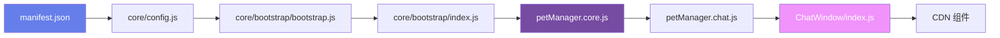

# §0 Effect Sketch — Newcomer Onboarding

**What this scene demonstrates**: 从零开始理解 YiPet 项目的推荐阅读路线——从外部清单到核心类再到 UI 组件，帮助新加入的开发者快速建立心智模型并完成首次代码修改。

**Why it matters**: YiPet 没有 `package.json`、没有构建工具、没有 ES module import，这对习惯现代前端工程化的开发者来说是陌生的。IIFE + 全局变量 + manifest 声明式注入的模式虽简单，但缺乏 IDE 导航支持。本场景提供结构化的 onboarding 路径。

---

# §1 Test Design — Verification Steps

## Step 1: 理解项目入口和加载顺序
**Action**: 打开 `manifest.json`，找到 `content_scripts[0].js` 数组，标注每个文件的职责；打开 `core/config.js` 了解 `PET_CONFIG` 结构
**Expected**: 能说出加载顺序的四个阶段：core → libs → modules → bootstrap
**File**: `manifest.json`, `core/config.js`

## Step 2: 理解核心类 PetManager
**Action**: 读取 `modules/pet/content/core/petManager.core.js`，找到构造函数 `_initPetState()` `_initSessionState()` 等方法
**Expected**: 能说出 PetManager 管理的六大状态域（Pet/Session/Filter/Api/Save/Update）
**File**: `modules/pet/content/core/petManager.core.js`

## Step 3: 理解 UI 组件结构
**Action**: 读取 `modules/pet/components/chat/ChatWindow/index.js`，理解 hooks 模式的 Vue 组件
**Expected**: 能说出 ChatWindow 的三个 hooks：`useStore` / `useComputed` / `useMethods`
**File**: `modules/pet/components/chat/ChatWindow/`

## Step 4: 完成首次代码修改
**Action**: 修改 `core/config.js` 中的 `DEFAULTS.PET_ROLE` 为 `'甜品师'`，重新加载扩展，观察宠物角色图标的变化
**Expected**: 宠物初始角色变为甜品师，对应 `assets/images/甜品师/icon.png`
**File**: `core/config.js` → `constants.DEFAULTS.PET_ROLE`

---

# §2 Output Inventory

| File/Directory | Type | Description |
|---------------|------|-------------|
| `manifest.json` | file | 扩展清单：权限、注入脚本、可访问资源 |
| `core/config.js` | file | 全局配置：327 行，含 api/ui/storage/constants 五大域 |
| `core/bootstrap/bootstrap.js` | file | StorageHelper + 默认位置工具 |
| `core/bootstrap/index.js` | file | 入口：实例化 PetManager，绑定 beforeunload/visibilitychange |
| `modules/pet/content/core/petManager.core.js` | file | PetManager 核心类（~1035 行） |
| `modules/pet/components/chat/ChatWindow/index.js` | file | 聊天窗口 Vue 组件 |
| `modules/pet/content/petManager.js` | file | 装配文件：校验 core 加载状态 |
| `assets/images/` | dir | 角色图片（教师/医生/警察/甜品师） |

---

# §3 Test Report — 2026-07-21

| Step | Result | Notes |
|------|:---:|-------|
| 1 | ✅ | 加载顺序四阶段清晰可辨 |
| 2 | ✅ | PetManager 六大状态域：PetState/SessionState/FilterState/SessionApiState/StateSaveState/SessionUpdateState |
| 3 | ✅ | ChatWindow 三 hook 模式 |
| 4 | ✅ | 角色切换成功，图标路径正确 |

**Overall**: pass — 4/4 steps passed

---

# §4 Self-Improvement

## Edge Cases Found
- 新开发者可能误以为项目依赖 `npm install`，需明确指出这是零构建依赖的 Chrome 扩展
- `PET_CONFIG` 在 Service Worker 和 Content Script 两个上下文中均可访问，但存储机制不同（`chrome.storage.local` vs `localStorage`）
- 修改 `core/config.js` 后需要完全重新加载扩展（不只是刷新页面），因为 content script 仅在首次匹配时注入

## Suggested Improvements
- 创建 `.vscode/launch.json` 配置 Chrome 扩展调试
- 为关键函数添加 JSDoc 类型注释（虽然不需要 TypeScript 编译）
- 编写「修改 FAQ 并观察变化」的第二个 onboarding 实践

## Limitations
- 没有热重载机制，每次修改需要手动「重新加载扩展」
- 没有类型系统，PetManager 的公共 API 需要查代码才能确认参数格式
- IIFE 模式导致代码折叠和导航困难
