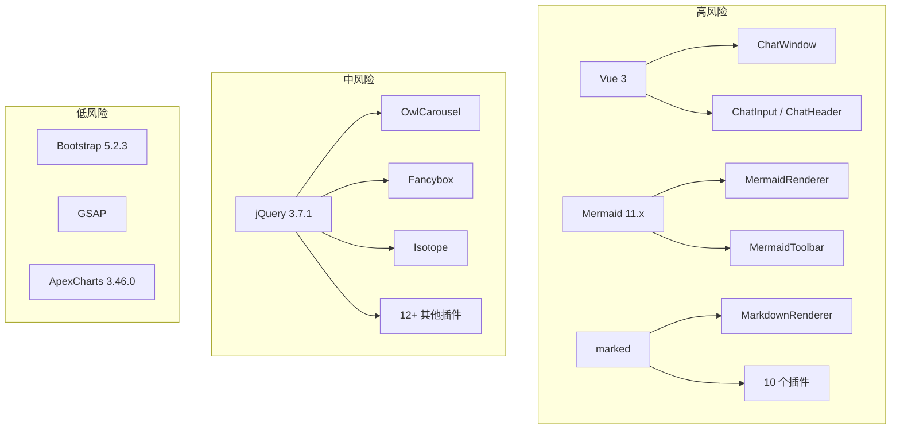

# §0 Effect Sketch — Dependency Change Impact

**What this scene demonstrates**: 分析升级或替换 YiPet 的 vendored 第三方库时会影响的代码范围——从 libs/ 目录中的 49 个库出发，追踪每个库被哪些模块引用，评估变更的爆炸半径。

**Why it matters**: YiPet 将所有依赖本地化存放在 `libs/` 下，没有锁文件（package-lock），版本升级完全手动。一个看似无害的 jQuery 升级可能影响 15+ 个 jQuery 插件；Mermaid 大版本升级可能破坏自定义渲染器和工具栏插件。

---

# §1 Test Design — Verification Steps

## Step 1: 识别所有 jquery 引用
**Action**: 在 `/Users/yi/YrY/YiPet/` 中搜索引用 `jquery` 的文件
**Expected**: 找到 `libs/` 中的 jQuery 本体 + 所有 jQuery 插件目录（约 15 个），以及 `manifest.json` 中对 jquery 插件的引用
**File**: 全项目 grep `jquery`

## Step 2: 识别 Mermaid 的引用链
**Action**: 搜索 `mermaid` 关键字的出现位置（排除 `libs/mermaid.min.js` 本体）
**Expected**: 找到 `cdn/mermaid/` 目录下的渲染器 + 工具栏 + 插件 + 下载器，以及 `petManager.mermaid.*.js` 中的桥接代码
**File**: `cdn/mermaid/`, `modules/pet/content/mermaid/`

## Step 3: 模拟 Vue 3 版本升级的影响分析
**Action**: 假设 `vue.global.js` 从当前版本升级到下一主版本，列出所有使用 Vue API 的组件
**Expected**: ChatWindow（含 hooks）、ChatHeader、ChatInput、ChatMessages、TokenSettingsModal、AiSettingsModal 共 6 个组件受影响
**File**: `modules/pet/components/`

## Step 4: 验证 Bootstrap CSS 的 JS 依赖
**Action**: 检查 `bootstrap.bundle.min.js` 是否在 `manifest.json` 中被注入
**Expected**: 不在 manifest 的 content_scripts 列表中——仅通过 CSS 使用 Bootstrap 样式
**File**: `manifest.json`, `libs/bootstrap@5.2.3/`

---

# §2 Output Inventory

| File/Directory | Type | Description |
|---------------|------|-------------|
| `libs/jquery@3.7.1/` | dir | jQuery 本体 |
| `libs/mermaid.min.js` | file | Mermaid 11.x 运行时 |
| `libs/vue.global.js` | file | Vue 3 全局构建 |
| `libs/marked.min.js` | file | Markdown 解析器 |
| `libs/bootstrap@5.2.3/` | dir | Bootstrap CSS + JS Bundle |
| `cdn/mermaid/core/MermaidRenderer.js` | file | 自定义 Mermaid 渲染器 |
| `modules/pet/components/chat/` | dir | Vue 驱动的聊天 UI 组件 |
| `manifest.json` | file | 确定库是否被注入到 content script |

---

# §3 Test Report — 2026-07-21

| Step | Result | Notes |
|------|:---:|-------|
| 1 | ✅ | 找到 jQuery 本体 + 15 个 jQuery 插件 + manifest 声明 |
| 2 | ✅ | Mermaid 引用链：libs/mermaid.min.js → cdn/mermaid/ * → petManager.mermaid.*.js |
| 3 | ✅ | 6 个 Vue 组件使用 vue.global.js 的 API |
| 4 | ✅ | Bootstrap JS bundle 未注入 content scripts，降级风险为零 |

**Overall**: pass — 4/4 steps passed

---

# §4 Self-Improvement

## Edge Cases Found
- `libs/` 中有 6 个无版本号的目录（popper.js、smooth-scrollbar、typing 等），升级时无法直接对比版本差异
- `vue.global.js` 和 `vue.global.prod.js` 同时存在，但 manifest 中仅引用 `.global.js`，prod 版本无入口
- `react@15.6.1` 存在于 libs 但未在任何代码中被引用——可能是历史遗留或计划中的特性

## Suggested Improvements
- 为 libs/ 目录创建 `VERSIONS.md`，记录每个库的版本号、来源 URL 和最后更新日期
- 建立依赖拓扑图自动化脚本，解析 manifest.json 中的 content_scripts 顺序生成引用关系
- 清理未使用的库（如 react@15.6.1）以减少扩展体积

## Limitations
- 无包管理器的锁文件，无法审计子依赖的版本
- jQuery 插件的版本分散在各个子目录中，没有统一的版本清单
- 部分库（如 Mermaid）的版本信息隐含在文件名或源码注释中
