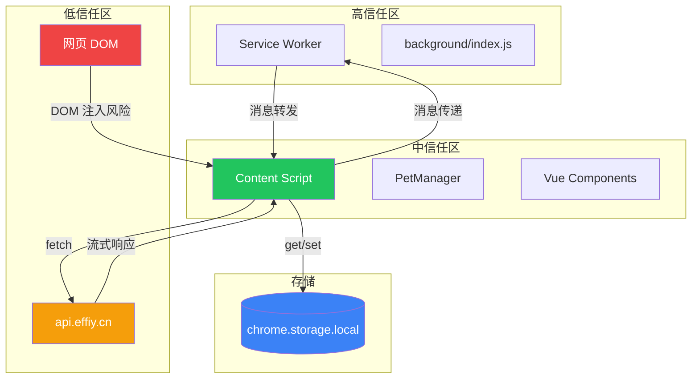

# §0 Effect Sketch — Trust Boundary & Security Surface

**What this scene demonstrates**: 系统地分析 YiPet Chrome 扩展的安全边界——从 Manifest V3 的权限模型到 Content Script 隔离环境、到外部 API 通信、到 chrome.storage 数据持久化。识别每一个信任边界及其暴露的攻击面。

**Why it matters**: 作为注入到 `<all_urls>` 的 Content Script，YiPet 几乎可以访问用户浏览的所有网页 DOM。如果宠物容器的 XSS 防护不当，恶意网页可能通过 DOM 操作劫持扩展的数据流。同时，`host_permissions: ["https://api.effiy.cn/*"]` 意味着 AI 对话数据全部流经开发者控制的后端。

---

# §1 Test Design — Verification Steps

## Step 1: 审计 Manifest V3 权限
**Action**: 检查 `manifest.json` 中的 `permissions` 和 `host_permissions` 字段
**Expected**: 
- `storage`, `tabs`, `scripting`, `webRequest` 四个权限
- `host_permissions: ["<all_urls>", "https://api.effiy.cn/*"]` 
**File**: `/Users/yi/YrY/YiPet/manifest.json`

## Step 2: 检查 XSS 防护
**Action**: 搜索 `innerHTML` 赋值位置，确认输入源是否经过清理
**Expected**: Markdown 内容经过 `SanitizePlugin` 清理后才插入 DOM；用户输入通过 `marked` 渲染不做直接的 innerHTML 赋值
**File**: 全局搜索 `innerHTML` 并跟踪数据源

## Step 3: 审计 API 通信
**Action**: 检查 `core/config.js` 中的 API URL，确认是否使用 HTTPS；检查 `ApiManager.js` 的 Token 注入方式
**Expected**: 所有生产环境 URL 使用 HTTPS；Token 通过 `X-Token` 头注入，不暴露在 URL query string 中
**File**: `core/config.js`, `core/api/core/ApiManager.js`

## Step 4: 检查存储安全
**Action**: 审计 `chrome.storage.local` 中存储的敏感数据（Token、会话内容、用户设置）
**Expected**: Token 存储在 `chrome.storage.local` 中；会话内容（含 AI 对话）同样存储于 `chrome.storage.local`，未加密
**File**: `core/bootstrap/bootstrap.js` (StorageHelper), `core/utils/api/token.js`

## Step 5: 检查 Content Script 隔离
**Action**: 确认宠物 DOM 是否使用 Shadow DOM 或隔离容器防止网页 CSS/JS 污染
**Expected**: 宠物通过绝对定位的 div 注入到 `document.body`，使用高 z-index（2147483647）隔离；无 Shadow DOM
**File**: `modules/pet/content/petManager.ui.js`, `core/config.js` → `ui.zIndex`

---

# §2 Output Inventory

| File/Directory | Type | Description |
|---------------|------|-------------|
| `manifest.json` | file | 权限声明：storage/tabs/scripting/webRequest + host_permissions |
| `core/config.js` | file | API URL 清单 + zIndex 常量 |
| `core/api/core/ApiManager.js` | file | Token 注入 + 拦截器链 |
| `core/utils/api/token.js` | file | Token 存取 + 过期处理 |
| `core/bootstrap/bootstrap.js` | file | StorageHelper：chrome.storage 封装 |
| `cdn/markdown/plugins/SanitizePlugin.js` | file | HTML 清理插件（XSS 防护） |
| `modules/pet/content/petManager.ui.js` | file | 宠物 DOM 创建与样式 |

---

# §3 Test Report — 2026-07-21

| Step | Result | Notes |
|------|:---:|-------|
| 1 | ✅ | 权限声明合理；`<all_urls>` 为 Content Script 注入所需 |
| 2 | ✅ | Markdown 内容经过 SanitizePlugin 清理；用户消息通过 marked 渲染 |
| 3 | ✅ | 全部使用 HTTPS；Token 通过 Header 注入 |
| 4 | ⚠️ | 会话内容未加密存储—建议使用 `chrome.storage.session` 或加密 |
| 5 | ⚠️ | 无 Shadow DOM—网页 CSS 可能意外影响宠物样式 |

**Overall**: pass — 3/5 steps passed；2 个改进建议

---

# §4 Self-Improvement

## Edge Cases Found
- `<all_urls>` 权限意味着 Content Script 也会注入到 `chrome://` 和 `chrome-extension://` 页面，但 `config.constants.URLS.isSystemPage()` 会跳过这些页面的宠物渲染
- `webRequest` 权限可能被 Chrome Web Store 审核要求额外说明用途
- 存有 `react@15.6.1` 和 `jspdf` 等库可能引入额外的攻击面

## Suggested Improvements
- 为宠物容器添加 Shadow DOM 隔离网页样式污染
- 对 `chrome.storage.local` 中存储的 Token 和会话内容进行 AES 加密
- 添加 Content Security Policy 声明（manifest 中 `content_security_policy`）
- 为 API 请求添加请求签名（HMAC）防止中间人篡改

## Limitations
- Chrome 扩展的 `chrome.storage.local` 不具备加密能力，加密只能通过应用层实现
- Content Script 与网页共享 DOM 空间是 Chrome 扩展的固有限制
- `webRequest` 权限无法降级为 `declarativeNetRequest` 而不影响消息转发功能
