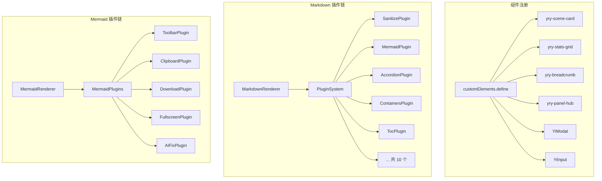

# §0 Effect Sketch — CDN Component Lifecycle

**What this scene demonstrates**: YiPet 自建 CDN 组件库的完整生命周期——从 `cdn/components/index.js` 的 Custom Elements 注册，到 Markdown 渲染引擎的插件系统，到 Mermaid 工具链的插件机制。理解 CDN 组件如何被加载、初始化、更新和销毁。

**Why it matters**: YiPet 的 26 个 CDN 组件（12 个 yry-*、10 个 Yi*、4 个 business）构成了项目的 UI 基础设施。Markdown 渲染器（10 个插件）和 Mermaid 渲染器（5 个插件）都采用了可扩展的插件架构。不理解这套体系，就无法正确地新增或修改 UI 组件。

---

# §1 Test Design — Verification Steps

## Step 1: 验证组件注册
**Action**: 检查 `cdn/components/index.js` 中所有 `customElements.define()` 调用
**Expected**: 每个 yry-* / Yi* 组件都有对应的 custom element 定义，且继承自 `HTMLElement`
**File**: `cdn/components/index.js`

## Step 2: 验证组件三件套完整性
**Action**: 遍历 `cdn/components/` 下所有子目录，确认每个组件包含 `index.js` + `index.css` + `index.html` 三个文件（`yry-loader` 例外，仅 `index.js`）
**Expected**: 25/26 组件满足三件套结构，`yry-loader` 为纯 JS 组件
**File**: `cdn/components/`

## Step 3: 验证 Markdown 插件注册链
**Action**: 读取 `cdn/markdown/core/PluginSystem.js`，确认 `use()` 方法模式；读取 `cdn/markdown/plugins/index.js`，列出所有插件
**Expected**: PluginManager 支持 `preprocess` / `extendRenderer` / `postprocess` / `onAfterRender` 四个钩子；共 10 个插件
**File**: `cdn/markdown/core/PluginSystem.js`, `cdn/markdown/plugins/`

## Step 4: 验证 Mermaid 插件工具链
**Action**: 读取 `cdn/mermaid/core/MermaidRenderer.js` 和 `cdn/mermaid/plugins/index.js`
**Expected**: MermaidRenderer 在渲染完成后调用工具栏插件创建下载/全屏/复制按钮；AIFixPlugin 自动修正常见 Mermaid 语法错误
**File**: `cdn/mermaid/core/MermaidRenderer.js`, `cdn/mermaid/plugins/`

---

# §2 Output Inventory

| File/Directory | Type | Description |
|---------------|------|-------------|
| `cdn/components/index.js` | file | Custom Elements 统一注册入口 |
| `cdn/components/yry-*/` | dirs | 12 个 yry-* 组件（dashboard UI 套件） |
| `cdn/components/common/` | dir | 10 个通用 Yi* 组件 |
| `cdn/components/business/` | dir | 4 个业务组件 |
| `cdn/loader.js` | file | CDN 组件按需加载器 |
| `cdn/markdown/core/PluginSystem.js` | file | Markdown 插件系统 |
| `cdn/markdown/plugins/` | dir | 10 个 Markdown 插件 |
| `cdn/mermaid/core/MermaidRenderer.js` | file | Mermaid 渲染器 |
| `cdn/mermaid/plugins/` | dir | 5 个 Mermaid 工具插件 |
| `cdn/shared.js` | file | CDN 共享工具函数 |
| `cdn/shared.css` | file | CDN 共享样式 |

---

# §3 Test Report — 2026-07-21

| Step | Result | Notes |
|------|:---:|-------|
| 1 | ✅ | 所有组件通过 customElements.define 注册 |
| 2 | ✅ | 三件套结构完整（yry-loader 为纯 JS 例外） |
| 3 | ✅ | PluginSystem 四钩子设计 + 10 插件完整 |
| 4 | ✅ | Mermaid 五插件工具链正常 |

**Overall**: pass — 4/4 steps passed

---

# §4 Self-Improvement

## Edge Cases Found
- `cdn/loader.js` 按需加载组件时，如果 HTML/CSS/JS 中的任何一个加载失败，组件会静默失败而不报错
- Markdown 插件之间可能存在顺序依赖（如 `SanitizePlugin` 应在 `MermaidPlugin` 之前执行），当前依赖数组顺序隐式定义
- `yry-loader` 不遵循三件套结构，是唯一的纯 JS 组件——需要在文档中注明

## Suggested Improvements
- 为 CDN 组件添加加载失败的回退 UI（错误占位符）
- 为 PluginSystem 添加显式的 `dependsOn: []` 声明，防止插件顺序错误
- 统一组件的 props/attrs 接口文档，当前需要查看源码才能确认每个组件接受的属性
- 为 Markdown 插件和 Mermaid 插件建立单元测试（当前无测试覆盖）

## Limitations
- CDN 组件使用 Custom Elements v1，不支持 IE11（但 Chrome 扩展始终在最新 Chrome 运行，此限制无影响）
- 组件不支持服务端渲染（SSR），但在 Chrome 扩展场景下此限制不相关
- Markdown 插件系统没有热加载能力，新增插件需修改 `plugins/index.js`
