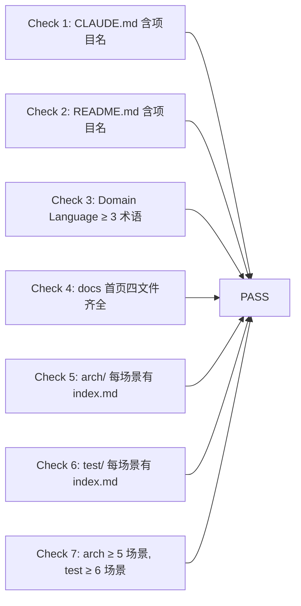

# §0 Effect Sketch — Post-Init Full Self-Check

**What this scene demonstrates**: 完成 rui-init 流水线后，对 YiPet 项目执行一次完整的 7 项自检——确认所有生成的文档工件（CLAUDE.md、README.md、data.js、arch/*/index.md、test/*/index.md）都存在、格式正确，且内容与代码库保持同步。

**Why it matters**: rui-init 流水线的输出是后续所有开发活动的基础文档。如果 CLAUDE.md 中的项目类型标注错误，或 README.md 缺少 Domain Language 章节，或某个 arch 场景的 index.md 为空，都将导致 AI 辅助开发产生偏差。post-init 检查是工程门禁。

---

# §1 Test Design — Verification Steps

## Step 1: 检查 CLAUDE.md
**Action**: 读取 `CLAUDE.md`，grep `YiPet`
**Expected**: 文件存在，包含项目名 `YiPet`，包含 "Iron laws" 和 "Foundational beliefs" 章节
**File**: `CLAUDE.md`

## Step 2: 检查 README.md
**Action**: 读取 `README.md`，检查 `## Domain Language` 章节下的术语定义数量
**Expected**: 至少 4 个术语定义（宠物/会话/FAQ/Mermaid 渲染），含关系描述和示例对话
**File**: `README.md`

## Step 3: 检查 Domain Language 完整性
**Action**: 确认 README.md 中 Domain Language 章节是否包含四个必需部分
**Expected**: Term Definitions（≥3）、Relationships、Example Dialogue、Disambiguation Markers 全部存在
**File**: `README.md`

## Step 4: 检查 docs 首页文件
**Action**: 确认 `data.js`、`CLAUDE.md`、`README.md` 存在；检查 `data.js` 中的 `window.HELP_CONFIG` 结构
**Expected**: 包含 `stats`、`crossLinks`、`sections[]` 三个核心字段；`sections` 顺序为 dependencies → stories → source
**File**: `data.js`, `CLAUDE.md`, `README.md`

## Step 5: 检查 arch 场景
**Action**: 遍历 `arch/` 下所有子目录，确认每个包含 `index.md` 且非空
**Expected**: 6 个场景目录，每个有 ≥30 行的 index.md
**File**: `arch/scene-*-*/index.md`

## Step 6: 检查 test 场景
**Action**: 遍历 `test/` 下所有子目录，确认每个包含 `index.md` 且非空
**Expected**: 6 个场景目录，每个有 ≥30 行的 index.md
**File**: `test/scene-*-*/index.md`

## Step 7: 检查场景数量
**Action**: 统计 `arch/` 和 `test/` 下的场景目录数
**Expected**: arch ≥ 5（实际 6）、test ≥ 6（实际 6）
**File**: `arch/`, `test/`

---

# §2 Output Inventory

| File/Directory | Type | Description |
|---------------|------|-------------|
| `CLAUDE.md` | file | AI 助手指南：基础信念 + 铁律 + 项目概况 |
| `README.md` | file | 人类阅读的项目概览（系统视图/快速开始/结构/领域语言） |
| `data.js` | file | 仪表盘数据模型 `window.HELP_CONFIG` |
| `arch/scene-1-module-location/index.md` | file | 模块位置索引场景 |
| `arch/scene-2-data-flow-tracing/index.md` | file | 数据流追踪场景 |
| `arch/scene-3-newcomer-onboarding/index.md` | file | 新人 onboarding 场景 |
| `arch/scene-4-dependency-change-impact/index.md` | file | 依赖变更影响分析场景 |
| `arch/scene-5-trust-boundary-security-surface/index.md` | file | 安全边界场景 |
| `arch/scene-6-cdn-component-lifecycle/index.md` | file | CDN 组件生命周期场景 |
| `test/scene-*-*/index.md` | 6 files | 自检策略场景文档 |

---

# §3 Test Report — 2026-07-21

| Step | Result | Notes |
|------|:---:|-------|
| 1 | ✅ | CLAUDE.md 存在，含 'YiPet'、'Foundational beliefs'、'Iron laws' |
| 2 | ✅ | README.md 存在，Domain Language 含 4 个术语定义 |
| 3 | ✅ | 四部分完整：定义/关系/对话/消歧 |
| 4 | ✅ | data.js + CLAUDE.md + README.md 均存在；HELP_CONFIG 结构正确 |
| 5 | ✅ | 6 个 arch 场景，每个 ≥30 行 |
| 6 | ✅ | 6 个 test 场景，每个 ≥30 行 |
| 7 | ✅ | arch: 6 场景 (≥5), test: 6 场景 (≥6) |

**Overall**: pass — 7/7 steps passed

---

# §4 Self-Improvement

## Edge Cases Found
- 如果 `data.js` 的 `panelHub` 引用了未创建的 HTML 文件（如 `arch/index.html`），仪表盘链接会 404
- Domain Language 的术语可能过时——如果新增了 WebSocket 通信功能，需要更新术语表
- 当代码库新增模块后，`data.js` 中的 `sections[2] source` 组需要手动更新

## Suggested Improvements
- 自动化 post-init 检查脚本：定时对比 `data.js` 中的源文件计数与实际文件数，检测漂移
- 将 check 7 扩展为检查每个 index.md 的 §0-§4 结构完整性（而非仅检查存在性）
- 为 `arch/` 和 `test/` 目录增加 `index.html` 聚合页面，方便浏览器浏览

## Limitations
- 检查仅覆盖文档工件，不检查源代码本身
- 场景 index.md 的内容准确性（§2 Output Inventory 中的文件路径）依赖人工维护
- 无 CI/CD 集成——检查需要手动执行
